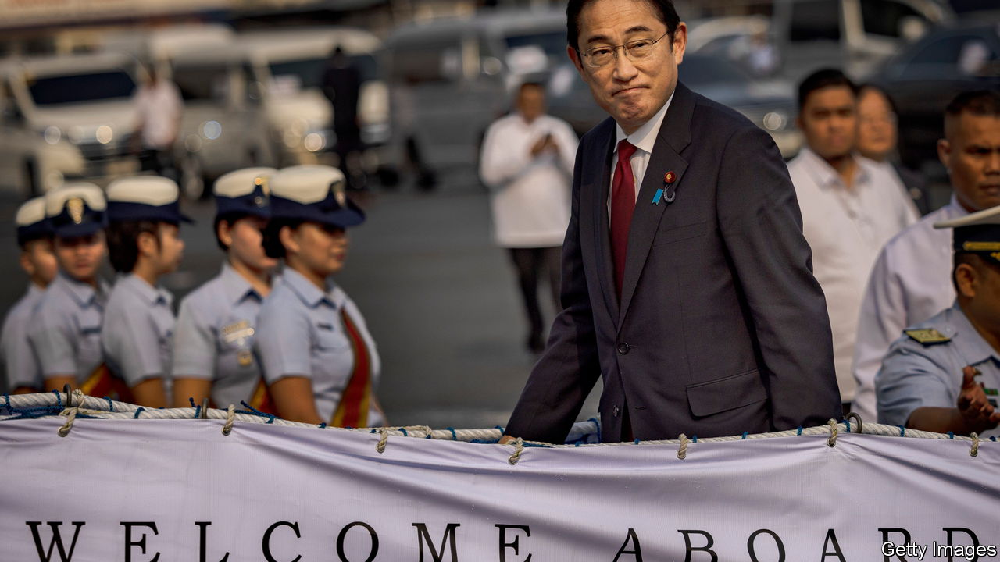

###### Links in the Chain

# China’s aggression brings Japan and the Philippines closer 

##### America is thrilled to see two allies collaborate on security 

 

> Nov 9th 2023 

Kishida fumio, Japan’s prime minister, appeared to be brimming with enthusiasm on November 4th as he toured the , the largest vessel in the Philippine coastguard’s fleet. Never mind that the ship is named after a revolutionary leader known in part for resisting Japanese occupiers during the second world war. These days, Japan and the Philippines are increasingly collaborating to resist China. The vessel, which was launched last year, was built by Japanese shipbuilders with loans from Japan’s government.

On his visit to Manila on November 3rd and 4th, Mr Kishida promised more such aid to boost the Philippines’ defences. He and his Philippine counterpart, Ferdinand “Bongbong” Marcos, also agreed to start formal talks on a new pact to improve bilateral security co-operation. During an address to the Philippine congress, the first by a Japanese leader, Mr Kishida declared that ties between the two countries had entered a “golden age”. 

The Philippines and Japan have long enjoyed warm relations. For decades, Japanese official aid and private investment have helped fuel the Philippines’ growth and upgrade its infrastructure. Yet they are being drawn more tightly together by three factors, starting with their mutual fear of China (see Chaguan), which has brought them much closer on security. Both are on the front line of resistance to Chinese expansionism, as members of the so-called “First Island Chain”, an arc of archipelagoes running from Japan to Malaysia that divides China from the Pacific Ocean. The Philippine coastguard vies with the Chinese coastguard and maritime militia for mastery over disputed parts of the South China Sea. Similarly, Japan faces constant pressure from Chinese ships around disputed islands in the East China Sea. Both are increasingly concerned about Chinese aggression towards Taiwan.

A second factor is Mr Marcos’s rise to power, following an election last year. His predecessor, Rodrigo Duterte, was also friendly towards Japan. Yet he had a strong anti-American streak which complicated the countries’ efforts to work together alongside their shared treaty ally. Mr Marcos has taken a different tack, reviving a deal to give America access to bases in his country. That has also opened the way to greater trilateral co-operation with Japan. This June, the three countries’ coastguards held their first joint drills. The same month, their national security advisers met in Tokyo and agreed that their governments would hold regular three-way talks.

Finally, Japan has gradually reformed its defence policies to allow for a greater role in regional security. The Philippines has been the biggest beneficiary. Since 2016 Japan has provided a dozen ships to the Philippine coastguard, including the . On the eve of Mr Kishida’s arrival in Manila, Mitsubishi Electric, a Japanese firm, announced the delivery of the first of four air-surveillance radars to the Philippines. This is Japan’s first overseas arms-sale since it loosened restrictions on defence exports in 2014. The Philippines will also be the first country to receive aid through a new Japanese programme of “Official Security Assistance” announced last December, in the form of $4m-worth of coastal surveillance radars. Such equipment should help the Philippines counter China’s grey-zone activities.

The pact that the leaders began formally negotiating this week, known as a Reciprocal Access Agreement, would cement the countries’ ties by creating a legal framework for their armed forces to operate in and around each others’ territories. While far from sealing a formal alliance, it would facilitate more frequent joint and realistic training, an important step. Japan has similar agreements with Australia and Britain; the Philippines would be its first such partner in south-east Asia. 

On the day Mr Kishida and Mr Marcos met in Manila, an opinion article in the , a Chinese Communist Party mouthpiece, raged against the budding Japanese-Philippine security co-operation: “It is clear their goal is to suppress China.” It seems the government in Beijing has got the message.■

