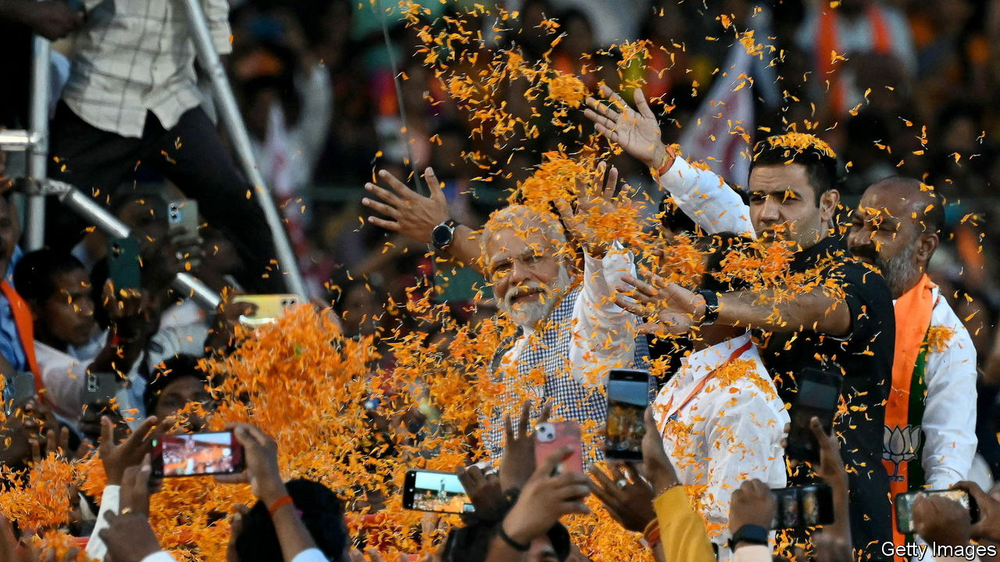

###### Grainy season

# Narendra Modi and the art of claiming credit 

##### The prime minister graciously gives poor Indians what they are entitled to 

 

> Nov 8th 2023 

IF IT’S ELECTION season in India, it’s time for giveaways. At a rally on November 4th in Chhattisgarh, one of five states holding elections this month, Narendra Modi, the prime minister, announced that a pandemic-era scheme to provide 5kg of free grain a month to 800m of India’s poorest people would continue for the next five years. As someone who had grown up in poverty, Mr Modi said, it was his sacred duty to care for the poor. 

No doubt. But it was also his legal obligation. The National Food Security Act (NFSA), passed by the previous, Congress-led, government in 2013, entitles poor Indians to monthly rations of 5kg of wheat and rice at subsidised rates of 2-3 rupees (2-4 cents) per kilo. Mr Modi’s “announcement” was pretty much a restatement of that legal reality. This provides a good llustratrion of his political method. He and his Bharatiya Janata Party (BJP) are  for things, justifiably or otherwise.

The ploy in this case began in March 2020, when Mr Modi declared a nationwide lockdown to combat covid-19. Two days later he announced that NFSA beneficiaries would get an extra five kilos of grain at no cost. This top-up, named “Prime minister’s grain welfare scheme for the poor”, may have saved millions from starving. It was a “really substantial intervention”, says Reetika Khera, an economist at the Indian Institute of Technology in Delhi.

The top-up was repeated several times. But in late 2022 the government reverted to providing just 5kg of grain as required by the NFSA—only without the nominal payments and with the prime-ministerial branding. That Modi-fied entitlement is what the government notionally extended this week. “There is nothing significant in this,” says Siraj Hussain, a former agriculture secretary. Mr Modi had no other option, without breaking or changing the law, except to have made the scheme slightly less generous by restoring its fees. And with five state polls and next year a general election looming, that was not likely. The grain giveaways in 2021 were credited with helping the BJP retain power soon after in the massive state of Uttar Pradesh. 

Politics aside, the effects of Mr Modi’s announcement look marginal. His government is running a fiscal deficit, excluding states, of 5.9% of GDP, in part because of a vast welfare bill. Food subsidies alone cost around 2trn rupees ($24bn) a year. By contrast, the annual cost of keeping NFSA grain free is just 150bn rupees. And the scheme is not having much impact on global food markets, despite the export bans India recently slapped on wheat and rice. It produces more than enough of both crops to feed its people. The bans were intended to curb inflation on the open market, not to safeguard food supplies for the poor. 

That does not make the scheme good policy. Many of its 800m beneficiaries may not need free grain, says Mr Hussain. He would prefer better-targeted cash transfers, to help the needy procure a more varied diet. Sadly there is no correlation between ideal policy and electoral success.■

