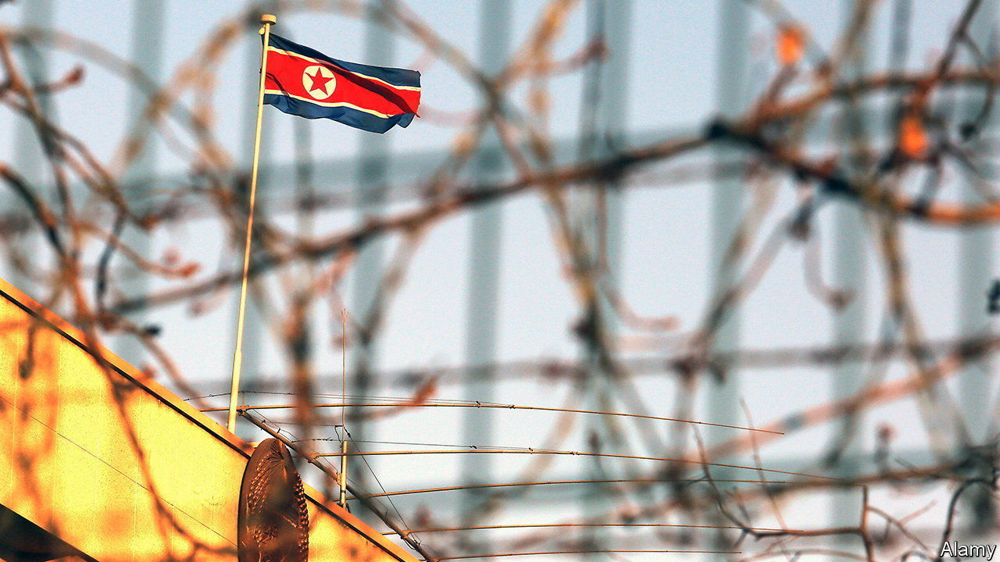

###### Diplomatic baggage

# North Korea is shutting embassies 

##### China and Russia are the only friends it needs 

 

> Nov 9th 2023 

The Agostinho Neto Mausoleum, a brutalist multipronged spear taller than the Statue of Liberty, looms over Luanda, the capital of Angola. Built by a North Korean construction firm, the concrete monument is a reminder of the two countries’ historic ties. Some 3,000 North Korean troops fought in the terrible civil war that engulfed Angola in the 1970s and 80s. In North Korea’s version of history, Neto, Angola’s first president, learned the ways of anti-colonial struggle from the North Korean supreme leader, Kim Il Sung.

Yet on October 27th North Korea closed its embassy in Luanda. Its missions in Uganda, Spain and Hong Kong are also being shut down. According to the , a Japanese newspaper, more than a dozen North Korean embassies in all, about a quarter of the total, could soon close. The country’s foreign ministry says this is a routine reshuffling of resources designed to promote North Korea’s “national interests” in a changing world. Yet the closures point to two big shifts.

The first is economic. Embassies have long played an important role in North Korea’s illicit trade in arms, narcotics and pretty much anything worth smuggling. Like mid-level mobsters, North Korean diplomats must support themselves (few understand the country’s ideology of , or “self-reliance”, better than they) and also kick up cash to their bosses in Pyongyang. Before the imposition of a punitive round of UN sanctions in 2016, it was estimated that North Korea’s embassies generated $50m-100m a year.

Diplomatic privileges can provide lots of opportunities for mischief. North Koreans stationed abroad have procured illicit goods for the regime, ranging from gold and rhino horn for its pampered elite to military and dual-use technology for its weapons programmes. North Korean arms dealers have sometimes been accredited as diplomats. Yet something appears to have gone awry with this model.

The closures suggest the embassies concerned were unable to cover their costs and that the regime was unwilling to make up the difference, says Tae Yong-ho, a former North Korean diplomat who was posted to Denmark, Sweden and Britain. A similar mass closure happened in the 1990s, after the Soviet Union’s demise led to a loss of backing for and subsequent collapse of the North Korean economy. Mr Tae suggests the closures are evidence that the “UN sanctions are working effectively”. 

The fact that Angola and Uganda expelled North Korean diplomats in 2017 for minor sanctions violations might seem to support that. Yet the embassies’ closure does not necessarily mean the dodgy activities they facilitated will end, says Daniel Salisbury of the Royal United Services Institute, a think-tank in London. Some North Korean sanctions-breakers might find it easier to work away from the scrutiny that embassies attract. Moreover, new sources of illicit revenue for the hermit kingdom, including cryptocurrency theft and North Korea’s recent large weapons sale to Russia, may have made its traditional income streams less important. 

This points to the other shift, which is geopolitical. China’s and Russia’s estrangement from the West has increased North Korea’s utility to them. China, which has long propped up Kim Jong Un’s pariah regime, is now likelier to view it as a nuclear-armed buffer against American troops in South Korea. Mr Kim, North Korea’s current dictator, is meanwhile getting chummy with his Russian counterpart, Vladimir Putin. This means North Korea can expend less energy and hard currency dealing with smaller countries such as Angola.

After all, even if North Korea’s embassies can cover their costs, they represent liabilities. North Korean diplomats have recently defected from embassies in Italy and Kuwait. Mr Tae absconded from the country’s embassy in Britain for South Korea in 2016. As regime insiders, such diplomats tend to have more compromising information than most North Korean defectors. If the regime can get cash and support elsewhere, why bother with them? ■

