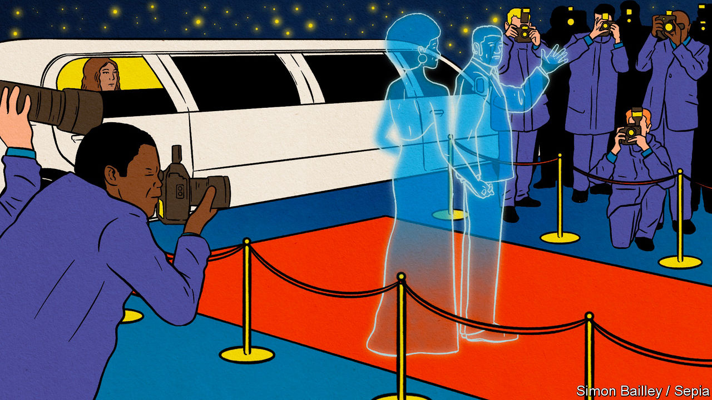
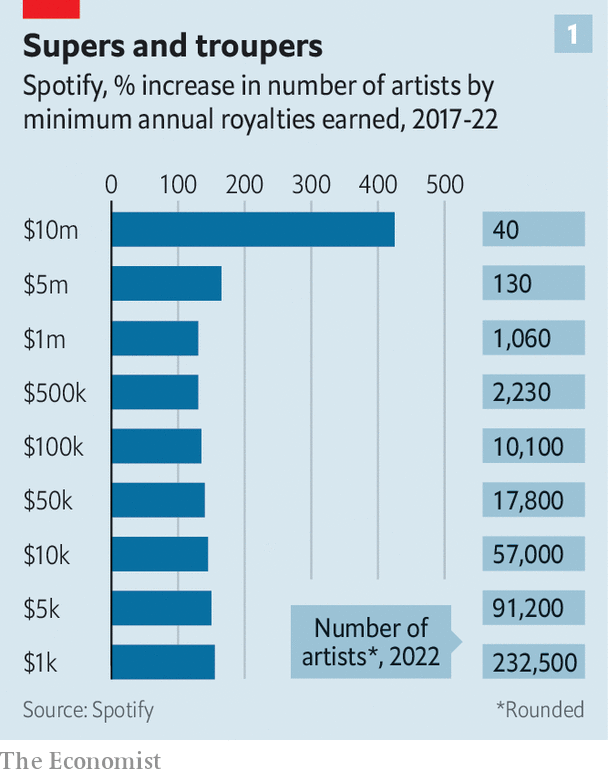
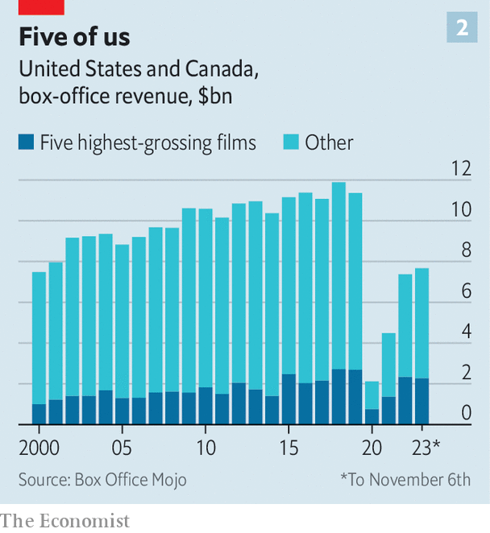
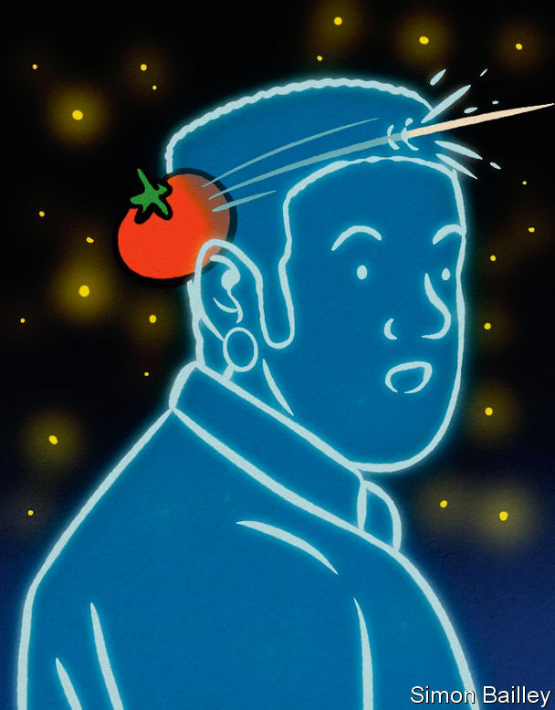

###### AI did it my way

# Now AI can write, sing and act, is it still possible to be a star? 

##### The deal that ended the Hollywood actors’ strike reflects a fear of the technology 

 

> Nov 9th 2023 

Noisy crowds of beautiful people gathered outside Hollywood’s film studios every weekday for the past six months, shouting slogans and marching in the sun. America’s screenwriters and actors were striking, in part over fears that artificial intelligence (AI) will soon be writing scripts or even bagging roles. “You go for a job and they you,” said a background actress, who worried that her face will be used over and over in crowd scenes. The technology is “disgusting”, said another, who considered its use “an infringement of yourself, of your career”. The deal actors struck on November 8th to end their strike included protections from their artificial rivals.

Five thousand miles away another animated crowd can regularly be found chattering about AI, usually in gloomier weather but brighter spirits. Outside a purpose-built stadium in east London, giddy groups of all ages, some in fancy dress, gather seven times a week to watch ABBA Voyage, a performance in which a septuagenarian pop group plays an energetic 90-minute set via virtual avatars, generated with the help of AI. The show, launched in 2022, played to 1m people in its first year and still almost sells out on most nights, bringing in a reported $2m a week while ABBA’s four members put their feet up.

Will AI leave talent impoverished, as Hollywood’s protesting actors and writers fear, or further enrich them, as ABBA has found? It is easy to see why stars are nervous. Over the years technology has automated away many routine jobs in entertainment, but the creative work at the heart of the business has been protected. No longer. Generative AI is hoovering up copyrighted work and churning out remixed literature, music and video of all varieties, increasingly competing with humans in quality and already far outpacing them in quantity. In a world of infinite AI-generated content, is it even possible to be a star?

The talent are mobilising unions, lawyers and politicians to protect themselves. Hollywood’s screenwriters, who ended their five-month strike in September, won a promise from studios to employ a minimum number of human writers on films and TV shows. The studios have retained the right to use AI to generate or polish scripts, but the AI will not be recognised as an author, so human writers’ royalties will not be diluted. Writers, for their part, have kept the right to use AI in their own work. (Although they dislike it, many consider AI “the best writing partner they’ve ever had”, concedes a Hollywood agent.)

The details of the actors’ deal with studios and streaming services had not been released as  went to press, but the Screen Actors Guild, their union, said that it included “unprecedented provisions for consent and compensation that will protect members from the threat of AI”. This is likely to mean that actors will at least be notified and paid if their likeness or voice is to be digitally reanimated.

I sue, I sue, I sue, I sue, I sue

The stars’ second line of defence is legal. A group of authors including John Grisham (of “The Firm” and dozens more thrillers) and George R.R. Martin (of “Game of Thrones”) have filed a class-action lawsuit against OpenAI, the Microsoft-backed company behind ChatGPT, arguing that it ingested their work without permission or payment. Another complaint by parties including Universal Music Group, the world’s biggest record company, accuses Anthropic, an Amazon- and Google-backed AI firm, of doing something similar with song lyrics.

 


The tech firms argue that “training” an AI model on copyrighted work amounts to fair use. In the words of Matthew Sag of Emory University, AI does not copy a book “like a scribe in a monastery” so much as learn from it like a student. Pieces of training data, whether novels or songs, usually play such a small role in the model’s output as to be barely traceable. But not always. “If you say, ‘Write in the style of Dan Brown [of “The Da Vinci Code”],’ of course it will pull from Dan Brown’s books,” declares Mary Rasenberger, head of the Authors Guild, which represents writers.

As the courts grind into action, governments are also getting involved. On October 30th Joe Biden, America’s president, issued an executive order setting out basic rules for AI development. The US Copyright Office is running an inquiry into AI, which will close to comments later this month.

There is a risk that governments will compete to create the most “permissive” regulatory environment, to attract AI firms, warns a music-industry insider. Others, citing past waves of tech-driven disruption, see room for compromise. When music-streaming arrived, “We got very defensive, and only defensive,” admits another senior record-company executive. It took a decade for the labels to realise that the technology was good for business, and do a deal with the streaming platforms. Negotiations with AI companies will take less than half that time, he predicts. “It’s co-existence that’s required.”

When the law is settled, who will win and lose from the technology? On the face of it, the biggest stars seem most vulnerable. AI helps ordinary people narrow the gap with the most gifted. Less glamorous industries have already witnessed this. In April a working paper by Erik Brynjolfsson of Stanford University and others found that novice customer-support agents were 35% more productive when given access to a chatbot, whereas experienced agents hardly benefited.

Something similar is happening in show business. Even before AI, tools like autotune were helping ordinary mortals to sound more like their idols. The next generation of technology promises to make such features more powerful. TikTok’s parent company, ByteDance, is trialling an app called Ripple which takes any melody that users sing into their phone and turns it into a polished song. Boomy, an American startup, lets amateur composers generate original tunes with a few clicks and upload them to earn royalties on streaming platforms such as Spotify.

Frumpy actors can vie with gorgeous ones thanks to the digital facelifts of tools such as Vanity AI, which are used in productions like “Stranger Things” and “The Walking Dead” to make actors look prettier or scarier, as required. Dull writers can get inspiration from apps such as Sudowrite, which suggests new ideas and edits. It bills itself pithily as “the non-judgmental, always-there-to-read-one-more-draft, never-runs-out-of-ideas-even-at-3am AI writing partner you always wanted”.

Not much AI-made work is good, let alone dazzling enough to compete with the stars at the top of the talent tree. But it is starting to have an impact through sheer scale. Boomy claims to have generated nearly 18m songs (for comparison, Spotify’s entire catalogue is a little over 100m). Spotify now adds more than 100,000 new tracks every day, many of them AI-made. Sir Lucian Grainge, the head of Universal Music, has warned that real music could drown in a “sea of noise” as streaming platforms fill up with amateur tracks. Professional artists’ share of listening is indeed sinking. In 2017 artists signed to record labels accounted for 87% of the streams on Spotify. Last year their share was only 75%.

 


AI struggles to make real hits, but is good at churning out the kind of music that people have on in the background while working or going to sleep. Those tracks are played for long hours and so earn big returns under the payment model used by streamers. Some in the industry suspect that the streaming platforms welcome the rise of amateur artists, who have less bargaining power than the big labels. The idea that streamers might nudge listeners towards this content is “absolutely a concern”, says another record-company executive. He thinks the only thing stopping them is the risk of annoying listeners. The streamers retort that it is hardly in their interest to promote bad music. Earlier this year Spotify purged lots of AI-made songs and is said to be rejigging its rules to make low-quality wallpaper music less profitable; Deezer and Tidal, two smaller rivals, have taken similar measures.

The publishing world has similar complaints. Producing entire books by AI is so quick and easy that, in September, Amazon banned authors from self-publishing more than three e-books a day on its Kindle platform and required publishers to clearly label books by robot writers. Most AI texts are full of cliché and waffle (which makes them competitive in the management genre, an agent quips). But some are taking sales away from human authors by deception: the Authors Guild has spotted a tendency for AI-made biographies to land just before real memoirs are published, for instance. “Click farms” have also been deployed to manipulate Amazon’s rankings. The guild says that, at one point this summer, 40 of the top 100 young-adult romance books on Kindle were AI-written.

The winner makes it all

Yet far from sinking in this sea of AI-made entertainment, the biggest stars of all seem to be more buoyant than ever. As record labels worry about robot composers, Taylor Swift is halfway through what will probably be the highest-earning concert tour in history, with projected sales of $1.4bn or more (no previous tour has breached $1bn). An accompanying film has made an additional $230m at the box office. Colleen Hoover, a writer of romantic young-adult fiction, crushed the robot writers last year to bag eight places on the top-25 bestseller list in America, selling 14m copies, according to , a trade title.

One of the paradoxes of the internet age is that, amid an explosion in online content on platforms from YouTube to TikTok, fans have flocked as never before to the biggest acts. It has been a good time to be an amateur creator, but an even better time to be a superstar. Data from Spotify show that between 2017 and 2022, as the platform was flooded with tens of millions of amateur tracks, the number of artists making at least $1,000 a year in royalties increased by 155%. At the same time, the number making $5m or more increased by 165%, and the handful of headliners making $10m or more increased by 425% (see chart 1 on previous page). Those who have done least well are middling-to-big artists, who face more competition from entertainment’s long tail but have been unable to break into the elite group at the top.

Similar patterns can be seen across the entertainment world. Better and cheaper technology has democratised filmmaking. The number of movies released each year in America more than doubled during the first two decades of the 21st century, but the audience-share of the biggest blockbusters has grown, not shrunk. In 2019 (the last year before the pandemic) America’s five biggest films took a quarter of the domestic box office, nearly double the share they took in the less crowded market of 2000 (see chart 2). Meanwhile, the ten bestselling authors have accounted for a steady 2-3% of book sales in Britain over the past decade, according to Nielsen, a data company, even though 2m more books are self-published each year.

Lay all your likes on me

“Hits will persist in an infinite-content world,” argues Doug Shapiro, a former media executive. The bewildering variety makes it hard for consumers to pick, so they rely more on recommendations, whether from friends or algorithms. Rather than browse, people seek out what they have already heard of, says Ms Rasenberger of the Authors Guild. “Known writers are selling. And everyone else is having a much harder time.”

AI also helps superstars shine brighter by creating opportunities for their admirers to become superfans. Followers of a music act used to express themselves chiefly through “records, T-shirts and mix-tapes”, says an industry executive. Now the internet offers “mix-tapes on steroids”. Fans can duet with their idols or dance to their music on social media. Games like “Fortnite” have provided a venue for interactive experiences: Ariana Grande held a concert-game hybrid on the platform in 2021, attracting 27m participants.

AI-powered technology promises to allow the biggest stars to be in even more places, gratifying even more fans. The producers of ABBA Voyage are in talks to bring the show to cities in North America, South-East Asia and Australasia, according to Per Sundin, head of Pophouse, a Swedish entertainment company that is the biggest investor in the enterprise. Other artists have been in touch, looking to “cement and elevate their legacies” with similar shows, he says. “We now have a proven template.”

Stars do not need to build their own arena like ABBA to use ai to be in more places at once. Spotify is working with OpenAI to translate podcasts into different languages, allowing broadcasters to be heard in more markets, in their own voice. Other firms such as HeyGen provide dubbing services for video, using AI to change the movement of the actor’s lips to match what they are saying. HeyGen recently created a viral video of Ms Swift appearing to speak fluent Chinese. Such platforms can adapt content in other ways, too, for instance by toning down strong language for a broader audience. Technology like this will allow stars to reach more viewers—and presents a problem to the lowlier actors who specialise in dubbing.

Stars are also using ai to travel in time. John Lennon re-entered the charts on November 2nd with “Now and Then”, old recordings of his voice having been salvaged using AI. (“I hope someone does this to all my crap demos after I’m dead—make them into hit songs,” said his late fellow Beatle, George Harrison, of an earlier attempt to resurrect Lennon’s work.) James Earl Jones, who is 92 and first voiced Darth Vader almost 50 years ago, has sold Disney the right to replicate his gravelly tones artificially. A virtual Darth appeared in Disney’s “Obi-Wan Kenobi” last year.

Some artists are experimenting with licensing their voice or image more widely. In April Grimes, a Canadian singer, invited amateur composers to clone her voice for use in their songs, provided they share any royalties with her. In September Meta launched 28 chatbot characters, played by celebrities. Snoop Dogg, Paris Hilton and Charlie D’Amelio are among the B-listers to be botified, with one reportedly being paid $5m over two years. Mark Zuckerberg, Meta’s boss, invites stars to “build an AI version of yourself…to help people fulfil this desire to interact with you and your desire to build a community.”

 


A-listers remain wary: “Their voice is their career,” says a record executive. But even if they do not license their voice or likeness, others may still borrow them. A company called Socialdraft sells $5 “prompts” to make chatbots take on the personality of celebrities ranging from Tom Cruise to Josef Stalin, who do not appear to have given their permission. It is named in a legal complaint by a group of authors including Mr Grisham, whom it also impersonates. (Socialdraft denies wrongdoing. Antonio Evans, its chief executive, says, “The interplay between AI, copyright and individual rights is a thrilling narrative we are all part of.”)

Some unauthorised clones have become hits. In April an anonymous amateur composer released a song called “Heart On My Sleeve”, using the AI-replicated voices of two rappers, Drake and The Weeknd. The song was streamed 20m times before Universal, which represents the two artists, demanded it be taken down.

The track caused alarm, but it also demonstrated how cloning can work in artists’ favour. Analysis by Will Page, author of “Pivot” and a former chief economist at Spotify, suggests that being cloned can help stars sell genuine music. He calculates that after David Guetta, a French DJ, posted a clip of an AI-generated rap in the style of Eminem in February, streams of real Eminem tracks rose by about a fifth. 

Yet antipathy to AI remains fierce. A group of actors, writers and directors has set up an outfit called Credo23 to certify films and TV shows made without AI (it has yet to take off). Many singers, burned by digital piracy in the past, are also hostile. Sir Cliff Richard, an 83-year-old crooner, recently declared that his singing “didn’t use artificial insemination”.

Others fear that AI will simply make entertainment derivative and boring. Three-quarters of Americans tell YouGov, a pollster, that they worry AI will sap human creativity. The process of ingesting everything and then spitting out an average may lead to a stylistic and conceptual regression to the mean, says a literary agent, who sees similarities with the algorithms on social media that help propagate the most pedestrian views. Sir Lucian, at Universal, has said that AI “will always lack the essential spark that drives the most talented artists to do their best work, which is intention”.

Everything depends on whether audiences embrace artificial performances. “Is the next generation of moviegoers going to want to see a different actor in James Bond, as an example? Or are they going to want to see Sean Connery come back?” asks a Hollywood agent. AI-generated performances may prove to be most successful for the biggest stars, whose uncritical superfans cannot get enough of them. As Liam Gallagher, a former Oasis frontman and John Lennon devotee, replied when asked on social media what he thought of the remastered “Now and Then”: “The Beatles could shit in my hand bag I’d still hide my polo mints in there.” ■


