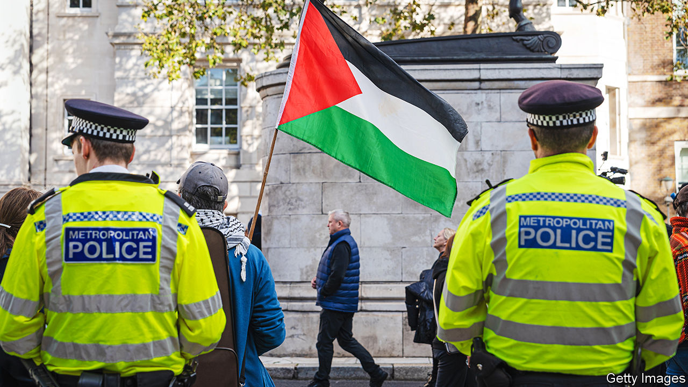

###### Divide and rue

# Suella Braverman uses a pro-Palestinian march to sow discord 

##### The right to protest is fundamental—as is an independent police force 

 

> Nov 8th 2023 

Armistice day commemorates several things, none of which means that protests against Israel’s bombardment of Gaza should not take place on that day—and some of which suggest they should. Held every year on the anniversary of the truce that ended the first world war on November 11th 1918, Armistice Day remembers those who have died in service since 1914. It also celebrates a victory over forces that would have denied Britons vital freedoms, including the right to protest. 

Suella Braverman, the home secretary, nonetheless wants to stop a pro-Palestine march due to take place in London on November 11th. She has described it as a “hate march” that displays “thuggish intimidation and extremism”. If her words were intended to foment division, they have succeeded. Some far-right agitators have in recent days urged supporters to “defend” the Cenotaph, a monument to the war dead in central London. That may have prompted the Metropolitan Police to urge organisers of the march to cancel it. 

Yet on November 7th Sir Mark Rowley, the Met’s commissioner, also made it clear he would not bow to political pressure. The march did not pose enough of a threat of serious public disorder for him to seek a ban under the Public Order Act of 1986, he said. He stressed the importance of an “independent police service…focused simply on the law and the facts in front of us”. 

Sir Mark pointed out that the planned march’s route goes nowhere near the Cenotaph: it will begin at Hyde Park, about a mile away, and end at the American embassy in Vauxhall, south of the Thames. Armistice Day this year takes place a day before Remembrance Sunday, the main commemoration of Britain’s war dead, when a ceremony is held at the Cenotaph itself. One of the chief organisers of the march, the Palestine Solidarity Campaign (psc), which was established in 1982 and has held largely peaceful marches for the past four Saturdays, has scheduled the demonstration to begin two hours after the two-minute silence on the morning of November 11th. The psc has also had regular meetings with the Met to discuss security. 

There are genuine concerns about rising anti-Semitism in Britain, as elsewhere. In London posters of hostages taken by Hamas on October 7th, when the terrorist group murdered 1,400 people, have been torn down. Some of the chants of those protesting against Israel’s bombing of Gaza are brazenly anti-Semitic. They include “From the river to the sea”, which is a call for the destruction of Israel, whether all those who repeat it understand that or not.

The police do have powers to deal with hate-fuelled protesters. In addition to allowing the police to ask the government to ban a march, the Public Order Act also allows police to detain anyone who causes “harassment, alarm or distress”. The Met has already arrested several apparent supporters of Hamas, the political wing of which was proscribed as a terrorist organisation by the government in 2021 (the military wing was proscribed in 2001). But Sir Mark has previously suggested that, although the law is clear on terrorism offences, there is “scope to be much sharper” on extremism. That was “creating a gap”.

Looking to see whether laws need tightening up is reasonable. But curbing the right to protest is a mistake. Israel’s bombardment of Gaza has killed more than 10,000 Palestinians. Ms Braverman’s incendiary language has not been echoed by others in government. Alex Chalk, the justice secretary, said that the right to protest is “what makes us a fair and free country”. 

Yet he and other Tories have also urged the march not to go ahead. Rishi Sunak, the prime minister, has said that Sir Mark would be held accountable for his decision. More conflict lies ahead. Pro-Palestinian activists seem unlikely to let up on protests. And in a piece for the  this week, the home secretary doubled down, again branding demonstrators as “hate marchers” and accusing the police of being softer on protesters “favoured by the left”. The police have a hard enough job without Ms Braverman stirring the pot. ■


