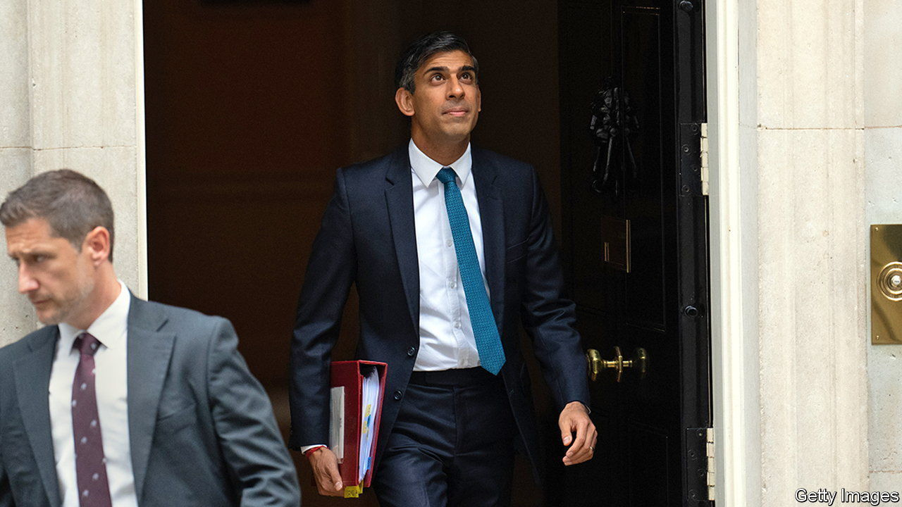

###### Something will turn up

# When should Rishi Sunak call the next British election? 

##### The economic signs suggest the prime minister has no good options 

 

> Nov 3rd 2023 

For someone who values fiscal prudence, Rishi Sunak bears a strong resemblance to Charles Dickens’s Wilkins Micawber. During his tenure as chancellor of the exchequer (and largely owing to the pandemic) public debt ballooned, from 84.5% of GDP to 96%. As prime minister, Mr Sunak’s political strategy seems to be almost pure Micawberism—a hope that something will turn up. Whatever turns up insofar as the economy is concerned is unlikely to be good for the Tories.

The latest date that the next general election can be held is in January 2025. But campaigning over the Christmas holidays next year is unlikely to endear the government to voters. Two other options are seen as much more likely. One is to call an election in the autumn of 2024; another is to hold one on the same day as local elections due in early May. The conventional wisdom in Westminster holds that Mr Sunak will want to wait until the autumn, so that the economy has more time to recover and .

Yet the forecasts for the remaining 15 months of this Parliament do not suggest that there would be a big economic pay-off to delay. The annual inflation rate, an uncomfortably high 6.7% in September, is expected to fall sharply in the months ahead as the impact of 2022’s surge in energy prices drops out of the figures. The Bank of England’s median forecast for inflation by the second quarter of 2024—and a May election—is 3.7%; come the final quarter it would have fallen only a bit more, to 3.4%.

And although the public may welcome lower inflation, they do not like the mechanism which is helping to bring it about: . On November 2nd the Bank of England held interest rates steady, at 5.25%, just as it had at its previous meeting, in September. But this pause followed 14 consecutive hikes. And because changes in interest rates take time to have an effect, the bulk of the pain from that tightening, the fastest in several decades, has yet to be felt by households. 

Swati Dhingra, a member of the rate-setting monetary policy committee, argued in October that only 20-25% of the tightening since December 2021, when interest rates were just 0.1%, has been absorbed so far. According to UK Finance, a trade body, 1.6m fixed-rate mortgages in Britain are due to expire in 2024. For each month that the next general election is delayed an average of around 133,000 additional households will experience a nasty interest-rate increase. Mortgage brokers estimate that the typical remortgage will cost households £288 ($351) more each month than they are paying now.

The rise in interest rates will also gradually lead to higher unemployment. The bank expects unemployment to be 4.5% in the second quarter of next year, up from 4.3% now, and to reach 4.7% by the final quarter. In the 1960s Arthur Okun, an American economist, devised the “misery index”, which adds together the rate of inflation and the level of unemployment, to measure public unhappiness at the state of the economy. More recent research by economists indicates that people typically value low unemployment almost twice as much as they do lower price growth. Waiting a few months so that inflation is 0.3 percentage points lower and unemployment is 0.2 percentage points higher is unlikely to make voters much happier.

Mr Sunak faces a tough choice, in other words. Going for an early election when the Conservative Party is more than 20 percentage points behind Labour in the polls would seem foolhardy. But each month that he delays the inevitable, more mortgage-holders—a traditional bedrock of Tory support—will get clobbered by higher rates. Things eventually ended well for Mr Micawber, who was able to see out his days in sunny, English-speaking Australia. Mr Sunak is known to like California. ■


