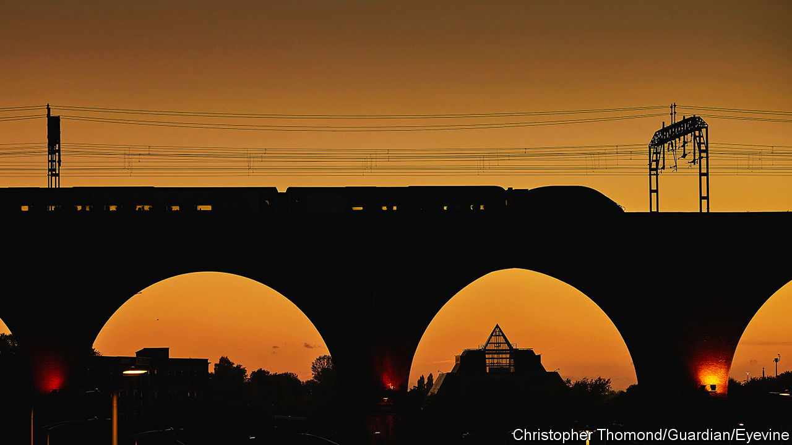

###### Circuit fudge

# Why rail electrification is so slow in Britain 

##### Scotland is an honourable exception 

 

> Nov 9th 2023 

Arrivals at New Street station in Birmingham are greeted by a striking 24-metre-high atrium, a shopping complex and the fumes of diesel trains. The smell is an unpleasant reminder that just 38% of Britain’s railway network is electrified, compared with 60% on average in the EU.

That is nowhere near enough for the country’s . The Railway Industry Association (RIA), a trade body, warned in 2021 that 448km of track must be electrified each year if all trains are to be green by 2050. That feat has been achieved only once since 1990. 

Britain’s reliance on diesel is not just bad for the environment. Electric trains have more seats, and can accelerate and stop more quickly than their diesel cousins, speeding up journeys and increasing capacity on the network. They make travel cheaper due to lower maintenance and energy costs. A study by the RIA found that an electric train costs up to £3m ($3.7m) less than a diesel one over its lifetime, and is 300% more reliable on suburban lines.

Two reasons explain this failure. The first, according to Tom Forth of the Data City, a startup that analyses the economy, is a spectacular lack of political will. Britain is the only big country in Europe that has no long-term electrification plan. Instead, the number of newly electrified kilometres fluctuates wildly as ministers’ interest ebbs and flows. In Germany, where more than three-fifths of the network is electric, the government steadily electrified around 200km of track each year in the 40 years to 2019. The equivalent figure in Britain last year was 23km. 

The absence of an official plan pushes up already high capital costs, because workers cannot acquire the experience needed to manage . Without the guarantee that expensive equipment will be reused the following year, construction companies often end up renting machines. “It’s extremely ineffective,” complains Noel Dolphin, head of UK projects at Furrer+Frey, a railway-electrification company. “We are very constrained by that boom-and-bust cycle.” 

The second reason why Britain struggles is that its railways are the oldest in the world. Costs are higher than elsewhere in Europe because tunnels and bridges often need repairs before overhead wires can be installed. During the electrification of the main route between south Wales and London, Network Rail, the publicly owned operator of railway infrastructure, spent about £20m, 7% of the project’s cost, repairing a then 133-year-old tunnel.

There is one exception to this gloomy picture—Scotland. The country is on track to decarbonise all passenger trains by 2035, largely because the devolved government has a long-term plan. “It’s possible to electrify Victorian railways at a reasonable cost, as long as it’s done with a rolling programme of electrification,” says Alex Hynes of Scotland’s Railway, a partnership between Network Rail Scotland and the main train-operating company there. 

Progress in England is unlikely to accelerate soon. Many decisions have been put on hold until the creation of Great British Railways, a proposed state-owned body that will oversee all rail transport and absorb Network Rail. The people who run Birmingham’s New Street station are not holding their breath: air purifiers are due to be tried out this year. ■


