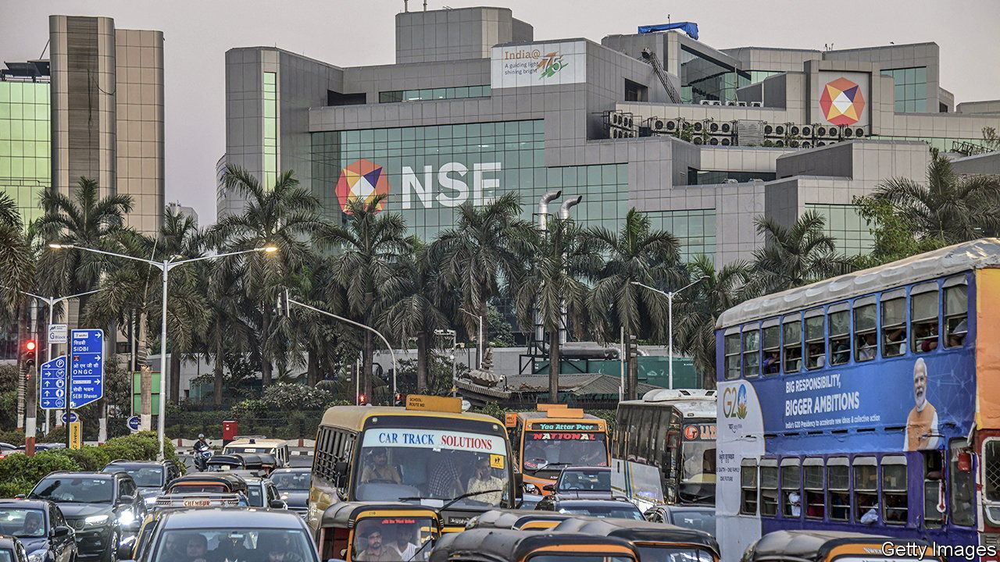
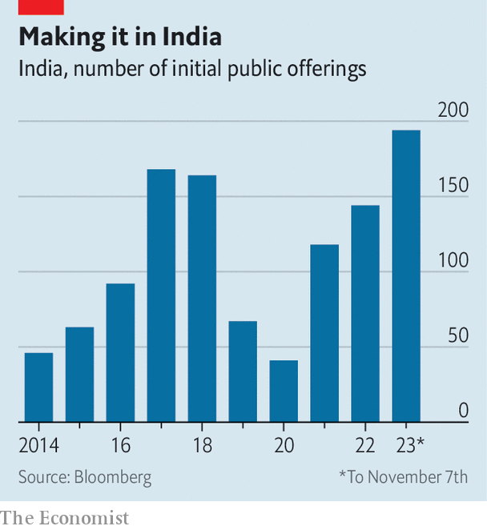

###### From tycoons to tiffin boxes

# India is in the midst of an unusual IPO boom 

##### Extraordinary economic growth makes even ordinary companies look good 

 

> Nov 9th 2023 

Investors looking to cash in on India’s growth have typically focused their attention either on the sprawling conglomerates run by the country’s tycoons or the buzzy tech firms transforming the way Indians shop, learn or move around. How, then, to explain the excitement over Cello World, a 61-year-old company of middling size that listed its shares on the two local bourses on November 6th? It produces the “tiffin” boxes Indians use to carry their lunch to school or work, along with inexpensive pens and moulded furniture—hardly exciting stuff. Yet on the first day of trading its shares soared by 29%, sending its market value above $2bn. That is nearly 60 times the net profit it made in the last fiscal year. Its initial public offering (IPO) was roughly 40 times oversubscribed.

Cello World does not have bold plans for reinvesting the $230m raised in the offering; all of it will go back to the family that controls the firm, which still owns 81% of the equity. Nor is the business unique. At the end of last month another company making pens, Flair Writing Industries, received approval for its IPO. Several furniture companies are lined up to offer shares in the near future, too. Cello World is, in short, rather boring.

Few venture capitalists would line up for a stake in such a business. Foreign portfolio managers, many of whom have settled on a strategy of entering India through slivers of holdings in the country’s mightiest conglomerates, would probably pass it over, too. Recent months, however, have shown that one of the most appealing corners of the Indian economy may be the companies like Cello World, which are benefiting from the country’s growth story without trying to write it.

Beginning late last year, valuations in India’s private markets collapsed as investors lost patience with loss-making startups such as OYO, a hotel chain, and Byju’s, an online-learning business. Public markets sagged, too. Shares in Delhivery, a logistics startup that listed to much fanfare early in 2022, tumbled. In January this year a report by Hindenburg, a short-seller, into the accounting practices of the business empire of Gautam Adani, an Indian tycoon, rocked the confidence of foreign investors and brought attention to the anaemic profitability of a number of the country’s conglomerates. (The Adani Group denied any wrongdoing.)

The first hint of a shift in mood came in April with the listing of Mankind Pharma, a manufacturer of condoms and pregnancy tests. The firm lured investors with its steady revenue growth, from roughly $750m in 2020 to $1bn in 2022, and healthy profits. It quickly became apparent that attractive opportunities abounded in ordinary areas of an economy experiencing extraordinary growth.

 


A flood of listings followed. As of early November, 194 companies had gone public this year, up from 144 for all of 2022 (see chart). Jefferies, an investment bank, calculates that 72% of recent Indian IPOs have been at least ten times oversubscribed. Alongside consumer-goods companies like Cello World and Mankind Pharma, investors also snapped up the shares of newly listed companies in other usually uninspiring industries, such as construction, steel and electrical components. Though not at the technological frontier, many of these firms are benefiting from the Indian government’s efforts to bolster the domestic manufacturing sector (at China’s expense) and improve the country’s infrastructure. RR Kabel, a maker of cables that listed in September, is one such firm. On November 6th it reported that profits in its quarter from July to September had doubled year on year.

The listings boom shows no signs of slowing down. A further 29 applications for public offerings have been approved by India’s securities regulator, and an additional 46 are currently under consideration. Among the companies in the process of offering shares are a producer of sledgehammers and a maker of car parts. All hope to go public before India’s general elections next May. Nipun Goel of IIFL Securities, an investment bank that helped finance many of this year’s listings, notes that the pipeline of IPOs for the next 12 to 24 months is looking strong; he is betting that the boom could continue for five to seven years. Indeed in October, in anticipation of all this, his firm moved to new offices with three times the space. ■


