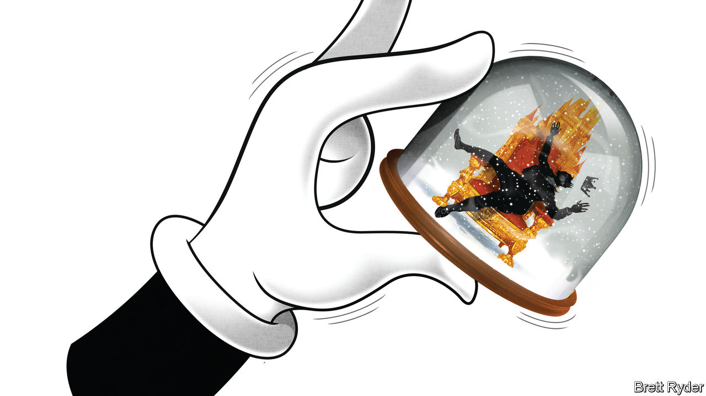

###### Schumpeter

# The Bob Iger v Nelson Peltz rematch 

##### Disney’s problems are as much about leadership as strategy 

 

> Nov 9th 2023 

The letter to Disney’s top brass, when it came, was devastating. It referred to failure in the television business, low morale, mismanagement, underinvestment in theme parks and “your consistent refusal to establish a clear succession plan”. It demanded that the chief executive resign. That might sound like just the sort of missive Nelson Peltz, an activist investor, would send Bob Iger, Disney’s chief executive officer (CEO), having secured control of a stake worth about $2.5bn in the entertainment giant. But it isn’t. It is the letter, quoted in Mr Iger’s autobiography, that Roy Disney, Walt Disney’s nephew, sent to Michael Eisner, Mr Iger’s predecessor, almost 20 years ago, which led to Mr Eisner’s downfall and elevated Mr Iger to the Magic Kingdom’s throne. He, of all people, should know how lethal such messages can be.

Call it Disney’s “Nightmare before Christmas”. Nine months after Mr Peltz, the 81-year-old co-founder of Trian Fund Management, gave Mr Iger a badly needed breather by ending a proxy battle for a board seat at Disney, the Brooklyn-born billionaire is back on the warpath. If anything, he is better armed than before. Adding his shares to Trian’s is Isaac “Ike” Perlmutter, an 80-year-old former Israeli soldier who sold his company, Marvel Entertainment, to Mr Iger for $4bn in 2009, making him one of Disney’s biggest investors and a frequent thorn in the CEO’s side. (Mr Iger, in turn, has portrayed Mr Perlmutter as a paranoid penny-pincher with little interest in the creative side of entertainment.) 

Mr Peltz and Mr Perlmutter, who live near each other in Palm Beach, Florida, have what is understood to be just shy of 2% of Disney’s shares, which they argue have serially underperformed the stockmarket, not just since Mr Iger’s second coming as CEO almost a year ago, but since midway through his first 15-year stint, which ended in 2020. They want a shareholder-focused shake up, as well as several seats on the board. The 72-year-old Mr Iger is working against the clock to find the right strategic direction for Disney, as well as a potential successor to himself. On November 8th the firm reported better-than-expected profits in the quarter from July to September, and announced that it would raise its cost-cutting target. Mr Iger declared that the firm was ready to “move beyond this period of fixing and begin building our businesses again”. Whether Mr Peltz agrees remains to be seen.

Mr Iger is already shoring up his anti-Trian defences. On November 6th Disney announced the appointment of Hugh Johnston as chief financial officer, luring him away from PepsiCo, where he has been CFO for 13 years. During that time Mr Johnston helped defeat a two-year attempt by Mr Peltz to split up the beverage-and-snack behemoth, giving him first-hand experience of the activist’s tactics. Mr Iger may also consider the new hire to be a potential candidate to replace him when his contract expires in 2026, potentially resolving a nagging question hanging over his legacy.

The battle will not solely be about the future, though. If Mr Peltz issues one of his famous “white papers” spelling out his concerns about Disney, it may well focus on Mr Iger’s recent leadership lapses, as well as the governance of a company whose board, from the chairman on down, appears to be in thrall to him. “A CEO-centric board is a perfect target for a successful proxy fight,” says Charles Elson, founder of the Weinberg Centre for Corporate Governance in Newark, Delaware. “It’s a smart move.”

Mr Iger started to dig a hole for himself during his first turn as ceo, for part of which he was also chairman. He pushed back his retirement several times, then clashed repeatedly with his replacement, Bob Chapek, before reclaiming the CEO role two years later. The current chairman, Mark Parker, who took the job in April, first joined the board under Mr Iger’s leadership in 2016, making him, along with six other serving board members appointed before 2020, partly responsible for Mr Iger’s succession-planning fiasco. Moreover, Mr Parker is executive chairman of Nike, a sports-shoe retailer, meaning he runs two S&amp;P 500 boards at the same time. Unless he is a Marvel character himself, that seems like too much responsibility for one man to shoulder.

Many of the current board members were at Disney in 2019 when Mr Iger led the $71bn acquisition of 21st Century Fox, a film company, which saddled Disney with debt. They also blessed vast amounts of spending on content when the company launched Disney+, its loss-making streaming service. This year the board appears to have done little to help clarify Mr Iger’s thinking, either. He has three strategic quandaries to resolve. The first is to decide the future of Disney’s TV businesses, including ESPN, the sports channel, which were once the company’s cash cow but are now suffering from the slow demise of the cable bundle. Even the future of Star India, a former jewel with broadcast rights to cricket on the subcontinent, is under review. The second is to stem losses at Disney+, as well as agreeing with Comcast, a cable company, on a fair price for the rest of Hulu, another streaming service, that Disney part-owns with its competitor. The third is to reinvest in the parks business, including Disneyland, which Mr Peltz has accused Disney of milking to support its media business. So far this year, Mr Iger has blown hot and cold over the sale of TV assets and expressed reluctance about buying Hulu before changing his mind. As for parks, he recently announced a $60bn investment—but that is over ten years, and much of it may be earmarked to be spent after the end of his expected tenure.

Ear! Ear! 

Mr Peltz may not be the answer to Disney’s problems. He does not always win battles, but loses them too. Besides PepsiCo, where Trian at least benefited from a rising share price, his investment in GE, a conglomerate, was a big failure. He does not carry Disney in his blood, as Roy did, nor does he necessarily know how to fix the company. But making the board more accountable to shareholders than it is to Mr Iger is the right place to start. ■


