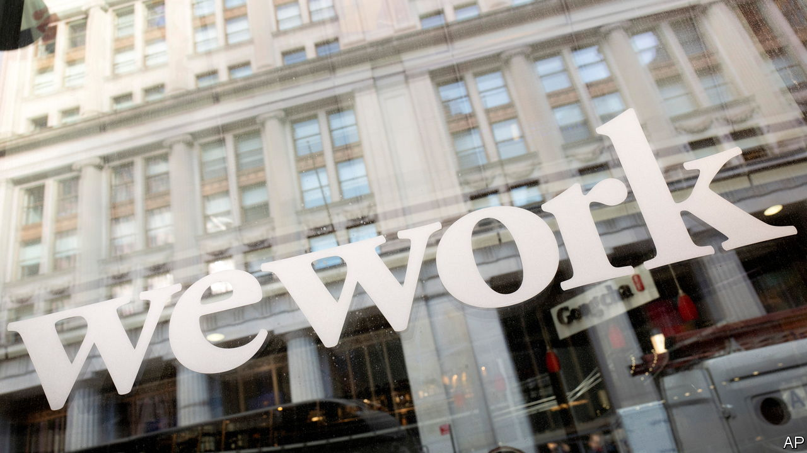

###### Caving in

# The fall of WeWork shows the deepening cracks in property 

##### Empires are crumbling on both sides of the Atlantic 

 

> Nov 7th 2023 

Since it was founded in 2010, WeWork has not once turned a profit. For years its cash-torching ways went unchallenged, thanks to the reality-distorting powers of its flamboyant founder, Adam Neumann, who succeeded in convincing investors, most notably SoftBank, that it was not an office-rental business but a zippy tech firm on a mission to “elevate the world’s consciousness”. Its slick office spaces, complete with free beer and table football, sprung up around the world. At the height of the silliness in early 2019, in the lead-up to an initial public offering (IPO), the company was valued at $47bn.

The unravelling began soon after, as outside investors balked at its frothy valuation and questioned an unorthodox governance arrangement that gave Mr Neumann an iron grip on the company. The IPO was shelved, and Mr Neumann was offered $1.7bn to leave. Sandeep Mathrani, a real-estate veteran brought in to run the company, did his best to right the ship by cutting costs and renegotiating leases. In 2021 he listed the firm on the New York Stock Exchange through a special-purpose acquisition company, at a valuation of $9bn. Yet his efforts were undone by the slump in the office market brought on by the pandemic and an enduring shift towards remote working. On November 6th WeWork, which leases offices in 777 locations across 39 countries, filed for bankruptcy. Its equity will probably be wiped out.

WeWork is not the only property business in turmoil. Days earlier, on the other side of the Atlantic, René Benko, a once celebrated Austrian property magnate, was ousted from Signa, the €23bn ($25bn) real-estate empire that he had built over the past two decades. Its portfolio includes icons such as the Chrysler Building in New York; the KaDeWe, a posh department store in Berlin; and a stake in Selfridges, another ritzy temple of consumption in London. It also includes luxury hotels, such as the Park Hyatt in Vienna; high-end developments, including the Elbtower, a 65-floor skyscraper in Hamburg; and a grab-bag of other retail companies. Many luminaries of European business hold shares in Mr Benko’s property group, among them Ernst Tanner, the chairman of Lindt &amp; Sprüngli, a chocolate-maker, Hans Peter Haselsteiner, a construction entrepreneur, and Arthur Eugster, a coffee magnate.

The two cases are not identical. Unlike WeWork, Signa has not declared bankruptcy, though it faces a liquidity crunch, and has brought in a prominent German insolvency expert, Arndt Geiwitz, to take the reins. Unlike Mr Neumann, Mr Benko, a self-made high-school dropout who started his career converting attics into penthouses in his home town of Innsbruck, was involved with Signa right up until his ousting. After a conviction for bribery in 2012, he stepped back from day-to-day operational duties, but later took over as chairman of the company’s advisory board. He gave his blessing to the appointment of Mr Geiwitz, who helped steer Lufthansa, Germany’s national airline, through insolvency, and formally handed over chairmanship of the advisory board to him on November 8th. The Benko family foundation will remain a major shareholder in the group. Mr Neumann, meanwhile, has been reduced to sniping at WeWork’s collapse from the sidelines, complaining that the company “failed to take advantage of a product that is more relevant today than ever before”.

Yet the rise and fall of the two empires share similarities. For one, both relied on risky bets that went sour in a world of higher interest rates and slumping property markets. As he built his empire, Mr Benko accumulated a mountain of debt in order to purchase new assets while maintaining juicy dividends. That model worked only as long as interest rates were low and the value of prime property continued to rise. In WeWork’s case, the risk stemmed from a model of taking out lengthy leases on properties, sometimes for as long as 20 years, splashing out on snazzy refurbishments, then renting the space for periods as brief as a month at a time. When the office market turned, the company was stuck paying for leases that cost far in excess of what it could charge tenants, given the cheaper alternatives on offer.

Nonetheless, both empires could just come out the other side stronger. Leonhard Dobusch of Innsbruck University reckons Mr Geiwitz will break up the sprawling Signa portfolio, selling off assets to bring in cash and pay down debts. The privately held business, comprised of hundreds of holding companies, could do with simplification. WeWork, for its part, has already gained backing from most of its creditors to convert its debt pile of $3bn into equity, giving its balance-sheet something close to a fresh start. It will also use its bankruptcy to break more than 60 leases in America and renegotiate others. David Tolley, WeWork’s new boss, has said he thinks it will remain in bankruptcy for less than seven months. Mr Neumann and Mr Benko are gone, but what they built may endure. ■


