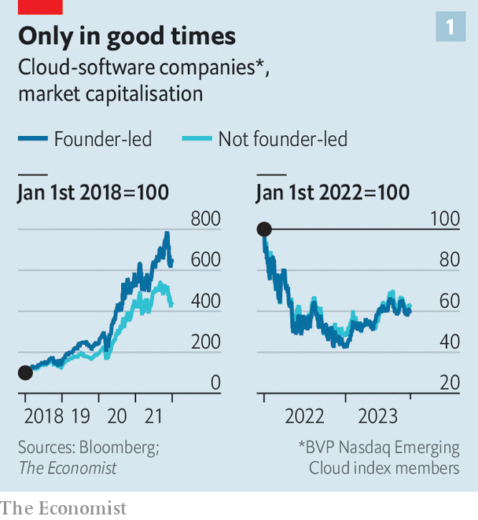
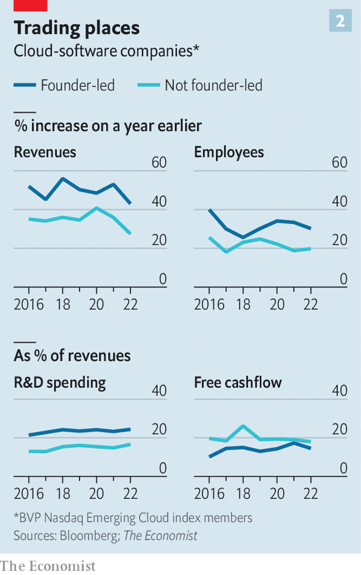

###### An innovator’s dilemma

# When should a founder step down? 

##### With investors prizing profits over growth, new skills are required of bosses 

 

> Nov 9th 2023 

“I’m an entrepreneur. I’m a founder. That’s the way my mind and brain works,” mused Whitney Wolfe Herd in an interview with  magazine on November 6th, the day she announced she would be stepping down as chief executive of Bumble, a dating app she founded in 2014. Ms Wolfe Herd, who had previously co-founded Tinder, a rival app, confessed to her lack of enthusiasm for the drudgery of running a public company. She will move to the role of executive chairwoman, where she will spend her time “looking at the future of love and connection”. 

Into her place will step Lidiane Jones, who currently runs Slack, a chat platform bought by Salesforce, a tech giant, in 2021. Slack’s own founder, Stewart Butterfield, stepped down as its boss at the start of the year. Investors will be hoping that Ms Jones will spend less of her time looking at the future and more at the present; shares in Bumble have lost 82% of their value since the company listed on the stockmarket in 2021. Ms Wolfe Herd’s grand vision of turning Bumble into a wider platform for women to make friends and professional connections has been a flop. Meanwhile, it has been caught in a tussle for growth with arch-rival Match Group, which owns Tinder and various other dating apps including Hinge. Costs have risen. 

Investors have long found merit in founder-led companies. Indeed, Bumble’s share price dropped by 4% on the day Ms Wolfe Herd announced the reshuffle. Ben Horowitz, a venture-capital (VC) titan, believes that founder-bosses can spot shifts in technology better than imported ones. And since the company is their life’s work, they are often able to take a longer-term view and bet on innovative ideas that may take years to pay off.

 


Yet there are signs that the so-called “founder premium” may be waning in a world in which capital is no longer cheap and investors prefer jam today to jam tomorrow.  has analysed the performance of the publicly listed software firms in the Nasdaq Emerging Cloud index produced by Bessemer Venture Partners, a VC outfit. From 2018 until the end of 2021, the share prices of founder-led firms in the index outperformed the rest by a half (see chart 1). Beginning in 2022, however, that gap disappeared.

To understand why, consider that founder-bosses in the index invest more money in research and development, expand their teams faster, deliver higher revenue growth—but generate less cash (see chart 2). During the tech boom of the past decade, a founder’s success depended chiefly on their ability to set a bold vision, raise funding from venture capitalists, gobble up talent and get a head start on possible rivals. Investors now demand greater attention to costs and a speedier path to profits.

 


What are founders to do? One option is to temper their lofty ambitions and reinvent themselves as fastidious stewards of capital. After incurring the wrath of investors, Mark Zuckerberg, the founder of Meta, a tech titan, toned down his grandiose plan to build a metaverse, declaring in February that 2023 would be the jolly-sounding “year of efficiency”. Its shares have regained most of the value they lost last year. 

On November 2nd Shopify, an e-commerce platform, reported its results for the quarter from July to September. Investors were cheered by a return to profitability; its share price rose by 22% on the day. In May the firm cut its workforce by 20% and offloaded its logistics arm. Tobias Lütke, its co-founder and boss, admitted that the company had become distracted by “side quests” and grew too quickly during the pandemic. Salesforce, run by its co-founder Marc Benioff, offers one more example. For years it prioritised growth over margins and splurged on acquisitions, including the $28bn it paid for Slack. As the tech industry sank last year, activist investors circled the firm. In response, it shed 10% of its workforce, paused acquisitions and raised prices. It, too, has been rewarded by investors for its efforts.

As Ms Wolfe Herd’s remarks suggest, however, all this may sound terribly dull to some founders. Some may bow out altogether—Mr Butterfield now spends his time gardening and buying luxury properties. Others, like Ms Wolfe Herd, will choose to carve out a role more to their liking, leaving the tedious job of generating profits to others. Whether such an arrangement works may come down to the personalities involved. Bradley Hendricks of the University of North Carolina notes that although founders are in greater need of advice than seasoned professionals, they are also more likely to ignore it. If tensions emerge between the grand hopes of a founder and the pragmatic priorities of the boss they bring in, sparks may fly. ■


