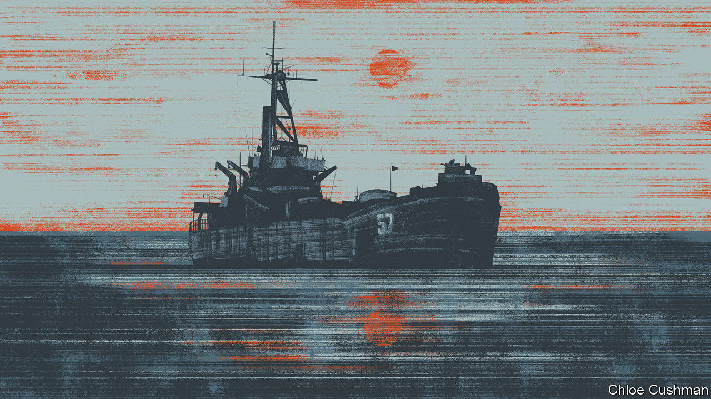

###### Chaguan

# A Chinese dispute with the Philippines is a test of America 

##### China yearns to expose its rival as an unreliable ally 

 

> Nov 9th 2023 

To grasp China’s approach to the international rule of law, look at the South China Sea. In recent weeks and months, large white-hulled ships belonging to China’s coastguard have been bullying small boats sent to resupply a rusting ship-cum-garrison purposely grounded by the Philippines—an American treaty ally—on a disputed coral atoll two decades ago. China claims that atoll, the Second Thomas Shoal, as its own. At the same time, fighter jets from the People’s Liberation Army (PLA) have repeatedly staged dangerously close intercepts of American reconnaissance flights in international skies close to China’s coasts.

To justify such assertiveness, China offers convoluted claims about the history of the  and about international law that are rejected by almost all its maritime neighbours. To understand this apparently self-defeating strategy, the Broadway musical “Guys and Dolls” is an oddly helpful guide. Specifically, China’s approach to geopolitics brings to mind Big Jule, a character in that peerless drama, first performed in 1950. A visitor from Chicago, Big Jule intimidates a cast of small-time New York gamblers with hints of ties to mobsters and glimpses of a gun under his coat. After losing a fortune on a dice game, Big Jule proposes a few more rounds, this time using his own custom dice, which are blank. “I had the spots taken off for luck. But I remember where the spots formerly were,” he explains, after patting his revolver meaningfully. Playing this version of the game, his outraged but fearful hosts proceed to lose large sums to Big Jule.

The link with Chinese statecraft involves Big Jule’s use of spurious rules to get his way, rather than simply admitting to robbing fellow gamblers at gunpoint. There are no “Guys and Dolls” references in “China’s Law of the Sea, The New Rules of Maritime Order”, a recent book by Isaac Kardon of the Carnegie Endowment for International Peace. Leaving that flaw aside, the book is a fine, deeply researched guide to China’s efforts to subvert or reinterpret any principles that complicate its claims to more than four-fifths of the South China Sea. Citing Chinese official texts, Mr Kardon shows how the Communist Party sees international law as a “weapon”: a way to codify power relations between larger and smaller states, rather than a source of binding, universal norms.

In painstaking detail, the book records how soon after China signed the UN Convention on the Law of the Sea (UNCLOS) in 1982, officials in Beijing began passing laws that challenged the treaty. China applies rules for drawing maritime boundaries around rocks, reefs and far-flung islands in different ways, depending on whether features are Chinese-controlled or occupied by the troops or fishing fleets of its rivals. Chinese authorities forcefully defend exclusive fishing, mineral and navigation rights within 200 nautical miles of their territory, citing UNCLOS. At the same time, China routinely sends naval ships, fishing fleets and oil- and gas-survey vessels into waters that are just as close to other countries. (America upholds UNCLOS rules but is not a party to the convention.)

In 2016 the Permanent Court of Arbitration in The Hague largely upheld a claim by the Philippines government that China’s assertion of “historic rights” over swathes of the South China Sea is without legal basis. China calls that arbitral ruling a scrap of waste paper and continues to maintain and expand military bases on disputed reefs and artificial islands.

In its confrontation with the Philippines over the Second Thomas Shoal, China has given public warning that it will not allow boats to deliver building materials to shore up the crumbling hulk of the , the beached ship used as a garrison by Filipino marines since 1999. Chinese coastguard cutters have used lasers and water cannon against supply boats, and collided with a Filipino vessel in October. The Philippines government released videos of these clashes. With American credibility as a treaty ally at stake, President Joe Biden said last month that any attack on Filipino aircraft, vessels or armed forces would trigger the two countries’ “ironclad” mutual-defence commitments.

Sit down, you’re rockin’ the boat

To Chinese experts, it is self-evident that politics will decide these questions of international law. Zhou Bo, a retired PLA senior colonel now at Tsinghua University’s Centre for International Security and Strategy, argues that China has been “restrained” at the Second Thomas Shoal and that the use of water cannon does not count as force. As a result he is sceptical of suggestions that America might escort Filipino convoys to the , especially with conflicts raging in Ukraine and the Middle East. “Without the use of force, I think it would be difficult for the US to be provocative, especially with two wars going on in the world,” he says. 

Against that, Hu Bo, a naval expert at Peking University, concedes that China faces a diplomatic dilemma at the Second Thomas Shoal, where neighbouring Asian countries may sympathise with the Philippines as the weaker party. “Right now, nobody cares about the truth and facts. Right now, people just say China has big ships and the Philippines has small ships,” he says.

As for mid-air intercepts, American arguments about its legal rights to fly and sail through international airspace and waters, and its calls for more “professionalism” from Chinese pilots, fall flat. “I consider a collision almost inevitable, given the high frequency of encounters,” says Mr Zhou. But if Chinese pilots stayed farther away, that would amount to “escorting America as it harms China’s interests,” he insists.

The South China Sea is a dangerous and revealing place just now. Both China and America have every reason to avoid conflict there. But China yearns to expose America as an unreliable ally, and to make the Philippines obey Chinese-drawn red lines, or pay a visible price. To keep the peace, rules will be of less help than calculations of relative power and national interests. In this bleak world, Big Jule would be right at home. ■


