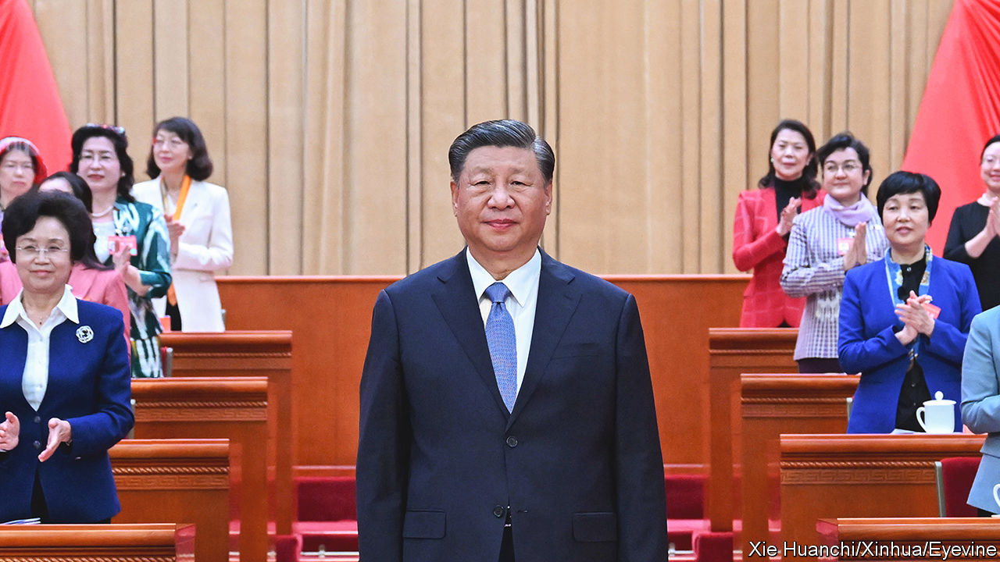
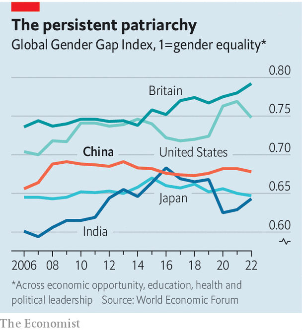

###### Xi, her, hers

# China wants women to stay home and bear children 

##### Xi Jinping shares his vision for a patriarchal society 

 

> Nov 9th 2023 

Every five years China holds a national women’s congress. Like the country’s annual plenary session of parliament or the Communist Party’s own five-yearly congress, the gathering of women is a pomp-filled affair, taking place on the red carpets and under the gaudy chandeliers of the Great Hall of the People in Beijing. Few people pay much attention to it. But at this year’s event, held in late October, subtle changes in rhetoric from top officials raised some eyebrows. They seemed to confirm a shift in the government’s thinking about the role of women in society.

For decades officials have reiterated the government’s commitment to equality of the sexes at each meeting of the congress, often using boilerplate language introduced by Jiang Zemin, then China’s leader, in 1995. But in the opening address at this year’s gathering, Ding Xuexiang omitted the standard phrasing—or any version of it. Mr Ding, a member of the Politburo Standing Committee, the party’s apex decision-making body, did have some advice for women. They should study the philosophy of Xi Jinping, China’s leader, and “establish a correct outlook on marriage and love, childbirth and family”. 

Mr Xi (pictured) did mention “the basic national policy of gender equality” when he addressed leaders of the All-China Women’s Federation, a party-led body, at another event on October 30th. But he did not mention women at work or in government, perhaps because there are no women in the 24-member Politburo. Mr Xi used most of his speech to talk about fertility and family. “We should actively foster a new type of marriage and childbearing culture,” he said, encouraging delegates to “tell good stories about family traditions”. That is in keeping with his conservative view of society. In the past Mr Xi has spoken about the importance of “good wives and mothers” and promoted patriarchal social norms.

Recently, though, Mr Xi and his all-male coterie have started to sound a bit desperate. China needs women to have more babies in order to reverse a demographic decline that is likely to act as a drag on economic growth. For the first time since the 1960s, the country’s population began shrinking last year. (Its working-age population started to decline in 2012.) The government is trying hard to reverse this trend. In 2016 it ditched its decades-old policy of limiting most couples to one child. In 2021 it adopted a three-children-per-couple policy. 

 


But young people are still reluctant to marry and reproduce. A growing number of women are defying gender norms and choosing independent lifestyles. Many other youngsters, both men and women, are struggling to find jobs, let alone buy a house and start a family. Incentives to have children, such as cash handouts and tax breaks, have failed to convince couples that more kids are worth the cost. The average number of births per woman is well below that needed to maintain the population. Meanwhile, China is ageing rapidly, creating a huge burden of care.

Chinese women do not need to parse the rhetoric of officials to know that gender equality is no longer a priority for the party. Since Mr Xi assumed power in 2012, the situation has got progressively worse. The latest Global Gender Gap Index from the World Economic Forum, which measures progress towards parity between men and women, ranks China 107th out of 146 countries. In 2012 it ranked 69th out of 135. China’s score has declined in several areas, such as educational attainment, political empowerment and health. 

Xi, her, hers

Other big countries score worse (see chart), but China’s fall in the ranking seems almost intentional, the result of an effort to push women back into traditional roles. There is something quite cynical about Mr Xi’s vision, says Olivia Cheung of the School of Oriental and African Studies at the University of London. “Fundamentally, Xi Jinping sees women like everyone else in China,” she says: “mainly as risks to be controlled and resources to be harnessed for achieving the China dream.” ■


