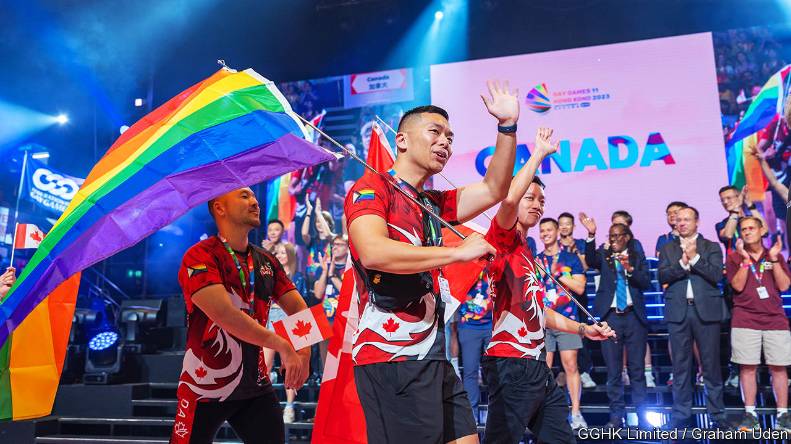

###### Not all fun and games

# The people of Hong Kong are growing more tolerant 

##### Their government is not 

 

> Nov 9th 2023 

The Queen Elizabeth Stadium in Hong Kong typically hosts rather humdrum events, such as debating competitions. But on November 4th the arena shimmered with glow sticks, as some 1,500 spectators waved rainbow flags. In some ways the opening ceremony of the Gay Games was similar to that of the Olympics, with LGBT+ athletes marching alongside their countrymen (see picture). The Gay Games, though, have a more carnivalesque atmosphere.

The weeklong event, delayed a year because of the pandemic, has come to Hong Kong as the city reconsiders the rights of sexual minorities. In September its top court ruled that the local government must rectify its failure to provide an “alternative framework for legal recognition of same-sex partnerships”, though it did not call for full marriage equality. In October a different court ruled in favour of equal inheritance rights for same-sex couples. 

The public would like the city to go further. Earlier this year a survey found that 60% of Hong Kongers support gay marriage, up from 38% a decade ago. In general, there is a growing sense of acceptance, say observers. “I can see more and more people holding hands on the street,” notes Shaun So, a participant in the games. 

But not everyone has rolled out a rainbow carpet for the games. Conservative lawmakers and anti-LGBT+ activists argue that they subvert traditional Chinese values and are funded by foreigners, violating the city’s national-security law. (An international non-profit organisation runs the games.) Some pro-democracy activists opposed the event, too. Holding it in the city, they claim, represents an open embrace of “the illegitimate regime tasked with crushing Hong Kong”. (Guadalajara, Mexico, is co-hosting the games.)

Since Hong Kong was rocked by pro-democracy protests in 2019, China has tightened its grip on the city, restricting civil society and purging the local government of liberal types. No public funds have gone towards staging the games, a turnaround from 2017, when local officials supported the bid to host the event. Now such officials are making decisions “based on their guess of what Beijing wants”, says an activist. In recent years, the mainland government has made life harder for sexual minorities, such as by stifling LGBT+ groups. 

Hong Kong has long prided itself on being more open and inclusive than the mainland. The local government isn’t helping. But in terms of LGBT+ rights, the city still does better than most countries in Asia. And the public, at least, is pushing for more progress. “We need to be patient,” says Mr So. “And, just like a marathon, we must keep going and never give up.” ■


