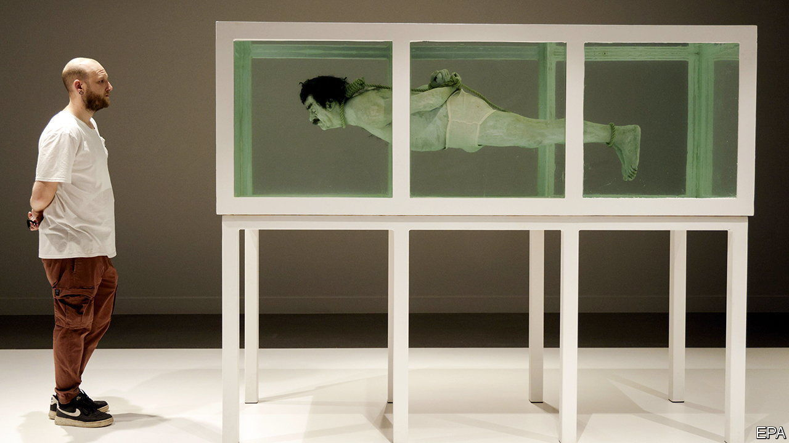

###### Risky business

# A new Museum of Prohibited Art shows how censorship evolved 

##### When one person’s art is another person’s insult 

 

> Nov 3rd 2023 

CHRIST CRUCIFIED on a fighter jet. Ronald McDonald on the cross. The  in traditional guise, reaching under her robe between her legs. At the new Museum of Prohibited Art in Barcelona, it is not hard to detect a common theme. 

Many objects in the museum focus on religion, but not all. Mockery of macho politicians has a way of bringing out the censors, too. Here is ’s Mao Zedong, there a painting of Emiliano Zapata naked on horseback, wearing a pink sombrero and high heels. (The revolutionary Mexican leader’s descendants threatened, preposterously, to sue the artist, Fabián Cháirez, for defamation.) Visitors pose for selfies next to “Always Franco” by Eugenio Merino, in which Spain’s longtime dictator stands in a Coca-Cola-branded refrigerator. The museum’s main criterion is that works were banned or censored in some way. Tatxo Benet, a journalist-turned-businessman, founded the museum and collected the art.

Artworks taking on Islam tend to be more restrained than those targeting Christianity. There is a roomful of prayer mats with holes cut in them, where a pair of stiletto heels fits, by Zoulikha Bouabdellah, an artist of Algerian descent. In “Piège à loup” by Amina Benbouchta, a Moroccan artist, a wolf-trap lies on top of an embroidered pillow. Both are elegant commentaries on the status of women in Islamic societies—but in shock value hardly compare with the Virgin Mary pleasuring herself.

That is because the risk of art always depends on context. “Shark” features a sculpture of a nearly naked, trussed , arranged in formaldehyde, like the real shark in a similar work by Damien Hirst, a British artist. In 2006 officials in several European countries declined to show “Shark”  because of the violence triggered by cartoons of the Prophet Muhammad in Danish newspapers. No work depicting the prophet appears in the museum, perhaps for that reason, though it may show one in the future.

Indeed, one of the museum’s strongest points is highlighting the nature of censorship itself. The crudest version of it is a straightforward state ban: policemen rip artwork off walls and lock it away. But some works are attacked by individuals. The painting of the masturbating Madonna, for example, was vandalised at an exhibition in 2019 and still bears the slash of a knife. And many works in the museum were censored by the artists themselves. For example, withdrew his “Caprichos”, viciously satirical etchings, from sale, fearing the unwelcome attention of the Spanish Inquisition.

Sometimes companies and institutions squash free expression. Lego “declined” to send a bulk order of bricks to , a Chinese dissident artist, saying it avoided endorsing projects with a political agenda. Instead Mr Ai sourced bricks from supporters, in a triumph over corporate caution. A self-portrait by Chuck Close is the only example of modern cancel culture on display—several women accused him of sexual harassment in 2017, and the National Gallery of Art in Washington subsequently nixed a retrospective of his work. 

A sculpture of a Francoist secret policeman sits in the museum’s lobby. But visitors will walk away remarking on how censorship is often subtler nowadays. ■


