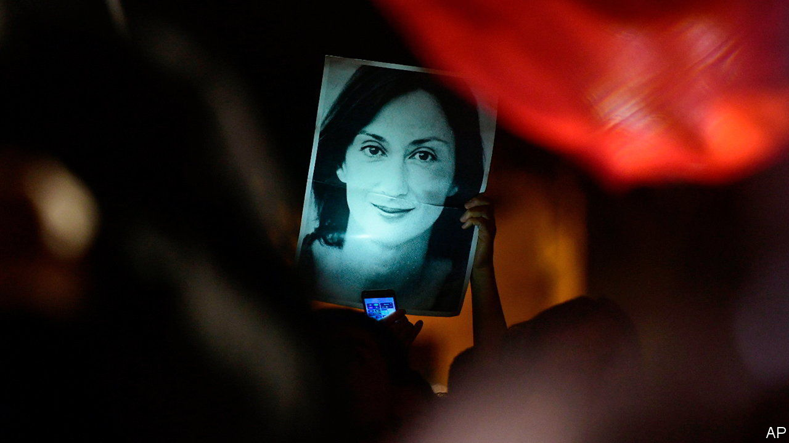

###### Murder, she wrote

# Daphne Caruana Galizia’s son tries to make sense of her murder 

##### Malta’s courageous journalist, assassinated in 2017, has spotlighted the country’s corruption 

 

> Nov 9th 2023 

By Paul Caruana Galizia. 

When Daphne Caruana Galizia, a Maltese journalist, was  in 2017, the 53-year-old had been close to uncovering a huge government scandal (subsequently exposed by a journalist collective named in her memory). It involved ministers, a power-station contract and an alleged system of kickbacks, which was said to have cost Maltese taxpayers millions. 

In “A Death in Malta”, Paul, the youngest of her three sons and a journalist himself, writes movingly about his mother and her work, as well as his family’s ongoing pursuit of justice. Caruana Galizia was a towering and unusual figure in Malta; her death . 

Bored by domestic life, Caruana Galizia started in journalism as a young mother in the 1980s, soon becoming both the island’s first female columnist and the first reporter to write under her own name. (Maltese papers then eschewed bylines, so great was the fear of repercussion.) She first wrote about low-level criminality, before investigating . Her renown grew quickly, and her blog sometimes attracted a larger audience than the combined circulation of the national daily newspapers. 

But her high profile also provoked larger torrents of hate. Libel lawsuits, easy to file in Malta, piled up; at the time of her death, she faced 42 civil and five criminal cases. She suffered “churning nerves” in the face of so much hostility and was reserved and softly spoken, which was at odds with the “bravura of her writing”. For years, the family had lived with threats. The author recalls how his mother would check their car for bombs, before taking him and his brothers to school. Their dog had its throat slit, and their house was almost burned down twice in arson attacks. 

For years the European Union did not pay much heed to its smallest member state, despite the collapse of Malta’s rule of law. But Caruana Galizia’s death prompted scrutiny of the Mediterranean island. “A Death in Malta” expertly lays bare the island’s webs of corruption and hate, explaining how Caruana Galizia came to be killed and how the state tried to shield those behind her death. 

Six years after she was blown up, too little has been done to hold those responsible to account. Two hitmen were given 40-year prison sentences for her murder in 2022, but no one has been condemned as the mastermind. Yorgen Fenech, a former director of Electrogas, a utility company, was arrested in 2019 and in her assassination. He maintains his innocence and has yet to stand trial. This is a story of journalistic impact but elusive justice. ■


