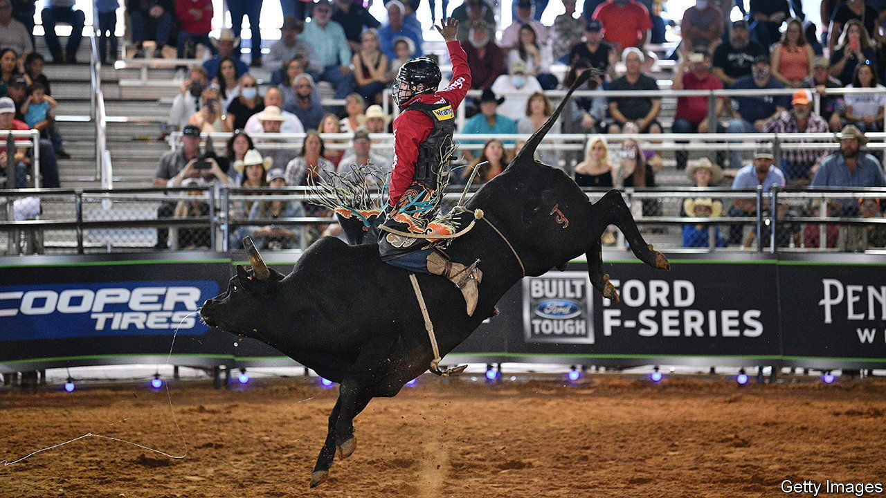

###### Cowboys and Indians

# Rodeo plays a central role in Native American culture 

##### Bull-riding and roping offer passports for travel and scholarships 

 

> Nov 8th 2023 

Freshly washed Wrangler  and shiny silver belt buckles. Coors Light and Michelob Ultra for sale at the concession stands. It could have been any of the 650 professional rodeos sanctioned by the Professional Rodeo Cowboys Association (PRCA), the oldest and largest rodeo group, which 6m Americans attend each year. But instead, this was the Indian National Finals Rodeo (INFR), which recently took place in Las Vegas. Contestants were members of the 574 Native American tribes, and most of the 20,000 attendees were Native American, too. At one afternoon show, the national anthem was sung in Apache. “Where’s the Navajos at?” the announcer boomed, as he warmed up the crowd. 

Though historically sidelined, Indian rodeo is thriving, with more than 100 separate events across the country. The sport is remarkably popular among tribal members: though Native Americans account for only 3% of America’s population, the INFR claims 3,500 cowboys and cowgirls, around half the members the PRCA has. Native competitors are becoming increasingly prominent in mainstream rodeo, too. Among the biggest stars are Dakota Louis, a bull-rider (pictured), and Derrick Begay, a roper, who will compete in the PRCA’s National Finals Rodeo, held in December (also in Las Vegas). 

For many on rural tribal lands, rodeo is not just a sport. It is “one of the few opportunities in Indian country to get out, to make a living, to get an education”, says Bo Vocu, a retired bull-rider and president of the INFR. Unemployment among Native Americans is more than double the national average and hovers around 50% on some reservations. With jobs scarce, bull-riding and roping can offer income and even bring college scholarships. 

But rodeo is not just a proverbial “ticket off the rez”, though its material rewards are real and attractive. (The INFR paid out more than $1m this year.) It is also a celebration of the fact that many Indians have long been cowboys and “rodeoed”. 

The sport is often associated with white cowboys. But modern rodeo, which began in the 1880s and 1890s, was originally a “very multicultural, multilingual space”, says Rebecca Scofield, an associate professor of history at the University of Idaho. Rodeos brought together European immigrants, Mexican  freed blacks and Native Americans. 

Rodeo’s name comes from the Spanish “to round up”. Regular round-ups to sort and brand cattle led to competitions to see who could rope and ride with the greatest skill. In 1888 a rodeo in Prescott, Arizona, was the first to charge admission and among the first to award prizes. By 1922, rodeo had even reached Madison Square Garden. As rodeo cowboys unionised in the first decades of the 20th century, some organisations explicitly excluded blacks and Native Americans, who were often relegated to . By the late 1940s, the stereotypical rodeo cowboy had become “white, straight and hyper-masculine”, according to Ms Scofield. 

The INFR provides a forum for Native Americans to connect and to be in a rare rodeo majority. “It definitely is a gathering of the nations for Indian cowboys,” says Megan Lunak, a roper from the Blackfeet tribe. With poverty and mental illness high on reservations, rodeo is a celebration of “resilience”. It is also a “a way to feel free,” since it facilitates travel, says Delphine Red Shirt, a lecturer in Native American Studies at Stanford. 

Indian rodeos offer practice for competitors to be bucked off and beaten up as they develop the skills required to succeed on the higher-paying, mainstream rodeo circuit. The INFR is “pushing more Indian cowboys to get out there” rather than “just chase their local rodeos”, according to Bo Tyler Vocu, Mr Vocu’s son, a talented bronc- and bull-rider.

Pro rodeo has begun to embrace Native American participants, in no small part because tribal riders come with a devoted following. Many Native Americans know someone who rodeos or have rodeoed themselves. As the sport seeks to shore up its audience (as white rural  shrink), rodeo will only continue to get more diverse. The rodeo of the future may well look more like the rodeo of the past. ■


