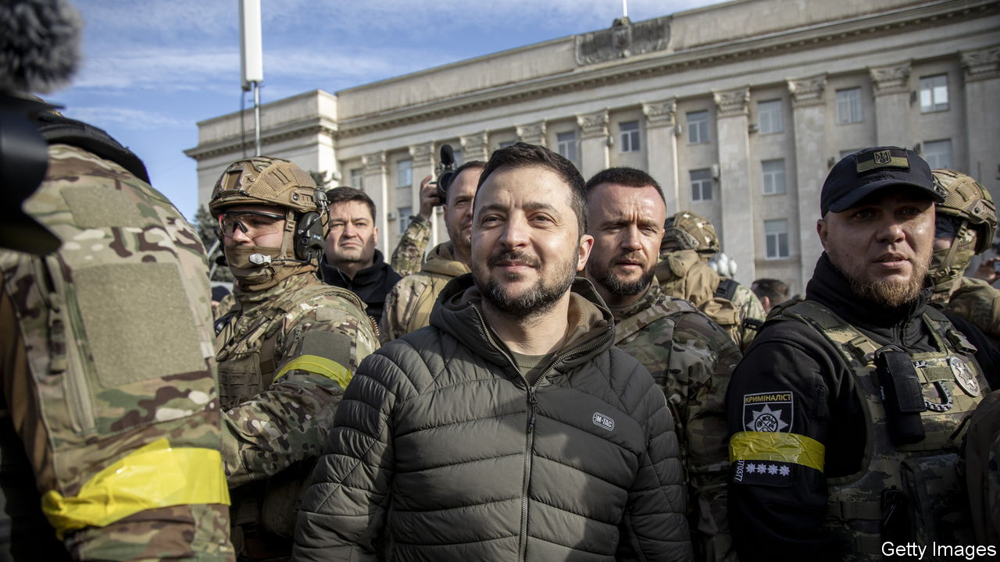
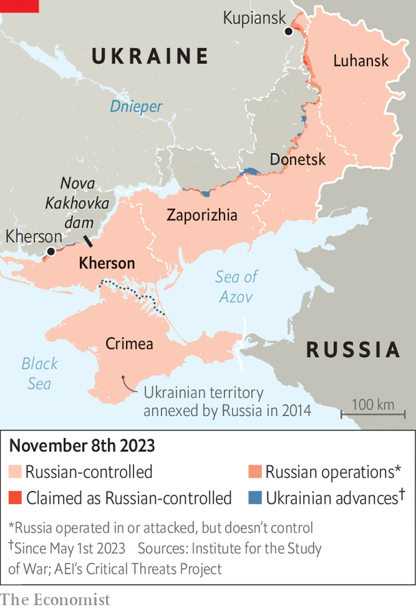

###### Free under fire

# A year after its liberation, Kherson still knows fear—and defiance 

##### Russia continually lobs shells at the Ukrainian city 

 

> Nov 9th 2023 

THE RUSSIANS are gone, with their billboards, their roubles and their savagery. So are the flood waters, which submerged parts of Kherson after the collapse of the Nova Kakhovka dam in June, probably thanks to Russian sabotage, upstream on the Dnieper river. Supermarkets are fully stocked once again. Canned food from Crimea and baby formula that reeked of plastic are gone from the shelves, and prices have returned to normal. 


But the scars of the occupation are fresh. Between tricks on his scooter, Sasha, a boy of 12, describes how the Russians tortured his father in a basement. His friend ducks when a nearby motorbike backfires. Fighting back tears, a woman says that her brother remains in Russian captivity. 

On November 11th Kherson’s residents will mark the first anniversary of their city’s liberation from Russian forces. They will do so without fanfare. In other parts of Ukraine, away from the front lines, reminders of the war are rare, the odd siren excepted. Bars and restaurants in Kyiv are packed; evening traffic is as thick as before the invasion. Thanks to improving air defences and warm weather, the blackouts triggered by Russian missile attacks last year have not yet resumed on a mass scale. 

But in dozens of cities and towns along the length of the front—which snakes through Ukraine for nearly 1,000km, from Kupiansk in the north to Kherson in the south—the war is a constant. Every day the Russians lob hundreds of shells into Kherson from the Dnieper’s opposite bank. Explosions, and the clap of outgoing fire, shake the city and its suburbs every few minutes. At Kherson’s central market workers use plywood to replace windows shattered by a Russian missile that ripped through the area on October 27th. New windows would only get blown out again, says Iryna, a saleswoman. Russian shells killed at least five people in the city in the following week.

But amid the fear is defiance. An elderly, somewhat tipsy man interrupts your correspondent’s interview with a policeman to ask if he would be breaking any laws by dousing his old Soviet army uniform with petrol and burning it on the pavement. The policeman says it would be perfectly fine. “I believe in victory,” says Hanna, a seamstress and mother of two. “But I don’t think it will come tomorrow or the day after tomorrow, or even by the end of next year.” 

 


Some speculate that the intensifying Russian barrage may be the result of recent Ukrainian gains. In the second half of October Ukrainian troops appear to have established a small bridgehead on the other side of the Dnieper, north-east of Kherson. “They see that our forces are advancing so they’re hitting Kherson in retaliation,” says Oleksandr Prokudin, the local governor. “Maybe it will get even worse.” He says that mass evacuation may become necessary.

Many have already gone. Some 150,000 people were in Kherson when the Ukrainians retook it. Only 50,000-75,000 remain. Many left because they could not do so during the occupation. Others say the shelling has become unbearable. “When they liberated [Kherson] I watched with tears in my eyes and rejoiced,” says Angela, 61, preparing to board the night train to Kyiv. “And now to see everything being destroyed and people die, it’s a shock.”

Asked to gauge the mood among locals, Mr Prokudin searches for the right word. “Shitty,” he says finally. He still believes Ukraine’s troops will dislodge the Russians from the Dnieper’s far bank. That seems unlikely. To place Kherson out of the range of enemy Grad rockets, Ukrainian troops would have to push the Russians, shielded by one of Europe’s great rivers, back another 40km. The biggest advance Ukraine’s army has made over the course of its summer counter-offensive is 17km, along a different section of the front line. 

With the counteroffensive having run out of steam, the atmosphere has also soured in Kyiv. Ukraine’s president, Volodymyr Zelensky, has publicly contradicted Valery Zaluzhny, the country’s top military commander, who recently told  that the war had reached a “stalemate”. Speculation of a rift between the two men mounted when one of the president’s aides accused Mr Zaluzhny of playing into Russia’s hands by discussing the situation on the battlefield with the media. 

Many in Ukraine see Mr Zaluzhny as a potential rival to Mr Zelensky and the man best placed to challenge him for the presidency—although the general has made no indication of wanting to do so. In any case, presidential elections in Ukraine, originally scheduled for next spring, may not take place for some time. On November 6th, Mr Zelensky confirmed what many had already known, namely that a vote could not be held during wartime. A rare bit of good news for Ukraine came two days later, when the European Commission, the EU’s executive arm, recommended the opening of membership talks with Ukraine. 

Many of those who remain in Kherson are pensioners. Oleh Mazuriak, a 75-year-old cardiologist, says the bombs and stress have increased the local incidence of strokes, as well as hypertension. “Thank God, we have medication for them now,” he says, smoking one cigarette after another in his garden a few streets away from the river. (He resumed the habit during the war.) He barely flinches at the nearby blasts of artillery fire. The shelling is nothing compared with the horrors of occupation, he says. “We’re surviving, and we’re not giving up. Somehow it will work out.” ■


