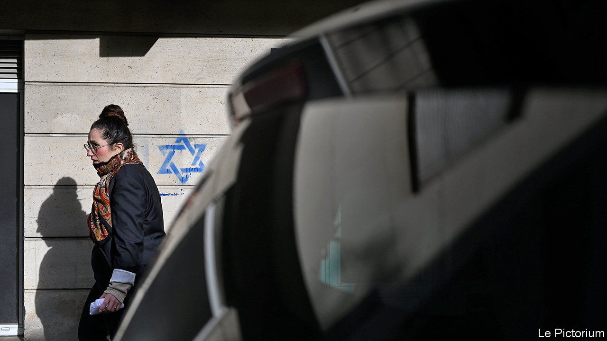

###### Jews in France

# Antisemitism surges in France after the Hamas attacks on Israel 

##### Dread and distress among French Jews 

 

> Nov 9th 2023 

A short walk from the halal butcher and Istanbul supermarket, amid the brutalist tower blocks of Sarcelles, lies what remains of “Little Jerusalem”. Tucked under a rain-streaked concrete block, across the road from the Grand Synagogue and a Hebrew bookshop, a kosher bakery is doing brisk business. Around the corner, diners at Chez Inoun tuck into grilled lamb over a glass of kosher merlot from Galilee. 

Sephardic Jews first arrived in Sarcelles from French north Africa in the 1950s and 1960s, when the place was considered a model of a modernist new town. At first glance, life goes on pretty much as normal. Yet, as antisemitism surges across France, this  (suburb) north of Paris is both a test of whether locally cordial intercommunal ties can last, and a hub of dread.

“We are very afraid,” says an elderly resident clutching a bag of pastries in the bakery. He wears a cloth cap over his kippah to disguise it, he says, and feels more anxious than at any other time during the 55 years he has lived in Sarcelles. Since October 7th the French interior ministry has recorded 1,159 antisemitic acts in France, three times as many in one month as during the whole of 2022. During two separate recent incidents, stars of David were stencilled overnight on to residential dwellings in and near Paris, recalling the darkest days in the capital under Nazi occupation; investigators are now looking into whether this was a Russian destabilisation operation. In Sarcelles, with its 12,000-strong Jewish population, the police and military presence has been reinforced. Albert, head waiter at Chez Inoun, says that his place is less busy than usual on a weekday lunchtime: “People are afraid of what might happen.”

France is home to both Europe’s biggest Jewish and its biggest Muslim populations. Each time conflict in the Middle East flares up, authorities worry that tensions there will be imported to France. In 2000, after the second Palestinian intifada (uprising) began, the number of recorded antisemitic incidents in France jumped nearly tenfold from the previous year, to 744. At that time, the nature of antisemitism shifted too. What was once primarily the sinister work of those linked to French neo-Nazism and the extreme right became more complex, mixing anti-Zionism, antisemitism and far-left politics. The share of racist acts attributed to the extreme right fell from 67% in 1992 to 9% in 2002, according to Nicolas Lebourg, a historian.

The “new antisemitism”, says Moïse Kahloun, president of the Grand Synagogue in Sarcelles, comes from the extreme left. After the recent murderous Hamas attacks on Israel, he says, the “negationist” discourse from the far left has fed an “atmospheric antisemitism” and spread the “hatred of Jews”. Jean-Luc Mélenchon, leader of the hard-left Unsubmissive France, stirred outcry even on the left after he failed to describe the Hamas attacks as acts of terrorism. One of his deputies, Danièle Obono, said that Hamas was merely a “resistance movement”. 

France’s struggle against antisemitism has become politically divisive. A cross-party march in Paris against antisemitism, organised by the heads of the two houses of parliament, is planned for November 12th. Marine Le Pen of the hard-right National Rally party, whose father once called the Holocaust a “detail” of history, promises to attend. To some surprise, she has come down firmly in defence of Israel. Friends of Mr Mélenchon are using her presence as a pretext for not turning out. 

For Jews in Sarcelles, there is some comfort to be drawn from the work the town has done to try to bring its myriad tongues and faiths together. Recent efforts are partly a response to an outbreak of antisemitic violence that shook the place in 2014. What began as a pro-Palestinian march at the time turned into a riot, including arson attacks in Little Jerusalem on a kosher delicatessen and a Jewish-owned pharmacy. A place that had taken pride in the coexistence of families descended from 90 different nationalities took a long hard look at itself. 

Today, says Patrick Haddad, who has been the town’s Socialist mayor since 2018, Sarcelles takes intercommunal relations seriously. Religious leaders, including those from the four local mosques, speak regularly to each other. The town hall runs campaigns against racism and antisemitism, and holds regular public debates. Out on the street near the town hall, two young men, each wearing a kippah, say that they do not feel unsafe locally. So far since October 7th, says Mr Haddad, Sarcelles has been spared significant acts of antisemitism. 

In some ways, due to its religious geography, Sarcelles is an exception in France. Yet it also captures many contemporary anxieties about the fate of French Jewry. During the exodus from French north Africa in the 1950s and 1960s, some of those who arrived in Sarcelles had family members who chose to go instead to Israel. Others have seen relatives leave more recently. Because of this, says Mr Haddad, the Hamas attacks were “almost physical” for them. Mr Kahloun, who has lived in Sarcelles since the 1970s, is among them: his daughter now lives in Israel.

Perhaps most painfully, the atrocities by Hamas have put an end to the “myth” of Israel as a refuge for French Jews, says Mr Haddad. “Each time there are antisemitic acts in France,” he says, “there are always Jews who say ‘I’m going to live in Israel and I will be safe there’.” This no longer feels true. “In the end,” adds the mayor, “there aren’t many places to go to.” ■

