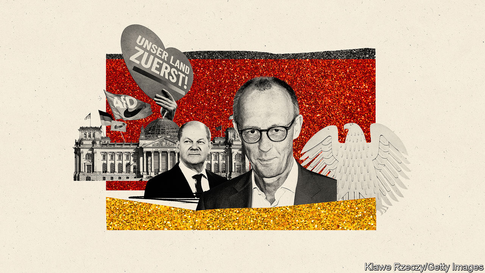
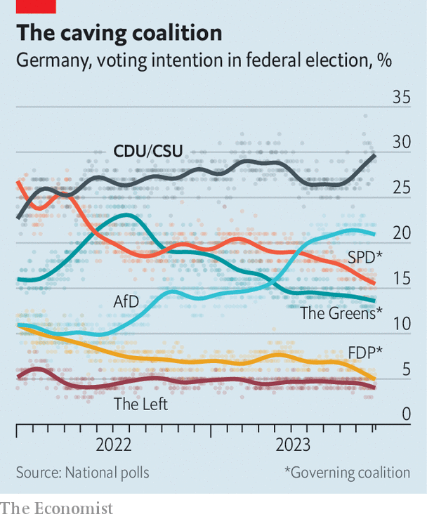

###### Cling to the centre

# Germany’s Christian Democrats are unsure whom to hug 

##### The centre-right is wary of teaming up with the far right 

 

> Nov 9th 2023 

This should be a happy time for German conservatives. True, the Christian Democratic Union (CDU), the venerable right-of-centre party, has been out of power since Angela Merkel ended her 16-year reign as chancellor in 2021. But in just two years the ruling coalition, led by the left-of-centre Social Democrats (SPD), has withered in opinion polls (see chart). The three parties in government can now jointly muster barely 35%. The CDU and its Bavarian sister party by themselves command around 30%, a respectable rise from the 24% that they actually scored in the 2021 vote. 

 


The party has been doing well in recent local elections, too. In early October the CDU romped to victory in the central state of Hesse, scoring an eight-point surge to grab 35%. In Bavaria the Christian Social Union (CSU) retained the hold it has clamped on Germany’s biggest state (by area) since 1957. “The majority of Germans now are voting for non-left parties,” says Jens Spahn, a CDU parliamentarian and former health minister.

Yet far from being smug, the mood among mainstream conservatives is uneasy. Multiple challenges weigh down the CDU. One is Mrs Merkel’s legacy. The length of her dominance means that the party’s successors as leaders inevitably look small by contrast; yet they remain damaged by some of her controversial policies, such as welcoming more than 1m refugees and phasing out nuclear power. A second challenge is that although the CDU is Germany’s strongest party it still needs coalition partners. Conservative voters know that the most likely ones are all to the left. “They say, if I vote for you we’ll just get a variant of the same old thing,” says Mr Spahn.

In part because of those two challenges the CDU now faces a third: a growing threat from the populist far right. Often dismissed as marginal since its founding ten years ago, the anti-immigrant, anti-elite, anti-Europe and pro-Russia Alternative for Germany (AfD) has profited more than the CDU from disappointment with the government. Polls now suggest it is Germany’s second-most-popular party, with nearly 22%. In three eastern states that will vote next year it is outpolling the CDU. A seemingly pragmatic option would be a conservative alliance between the two. But most Germans, particularly in the more liberal west, view the AfD with horror.

So, officially, does the CDU. Hendrik Wüst, a rising star in the party who was elected last year as minister-president of North Rhine-Westphalia, the most populous state, is categorical. The AfD is not a democratic but a fascistic party, as ruled by the courts: “They put into question the foundations of our democracy, our freedoms, our attachment to the West, to Europe,” he says. “They are our opponent, not a potential ally.” Mr Wüst, who runs his state in coalition with the Greens, thinks the CDU should stick to its own core values and centrist instincts.

Friedrich Merz, the party’s current national leader, also dismisses dealmaking with the AfD. But his more conservative faction of the CDU has at the same time tried to steal the populist right’s thunder by drumming on the same issues that appear to boost its support. The most obvious is immigration, a perpetual bugbear for the AfD. Given an influx last year of 1m Ukrainian refugees, a big jump in the number of asylum-seekers from elsewhere and obsessive popular-media coverage of crimes attributed to foreigners, public fears of immigration have risen markedly. 

Mr Merz, a bespectacled former corporate lawyer, has helped stoke such fears, describing Ukrainian refugees as “benefit tourists”, implying that a Berlin district with many immigrants is no longer part of Germany, and dismissing the idea of accepting refugees from Gaza because “we have too many antisemites already.” Mr Spahn has also taken up the cudgels, asserting that people from “Muslim-Arab cultures” will make Germany more violent, and also suggesting that German authorities should use force to stop irregular immigration. “We need a simple recognition of the fact that ,” he insists, pointedly contradicting the magnanimous declaration that “we can handle this” made by Mrs Merkel at the height of the Syrian refugee crisis of 2015.

Such rhetoric resonates with a souring public mood, underlined by recent surveys showing that immigration currently tops voter concerns. But the CDU’s adoption of hard-right talking points is risky, warns Julia Reuschenbach, a political scientist at the Free University of Berlin. In other European countries, centre-right parties that have similarly tried to outflank radical upstarts have in nearly every case ended up hurting themselves more. “Italy’s conservatives tried to appease the far right and the result is that they no longer exist,” says Mr Reuschenbach. “In their place there are three far-right parties.”

Tarik Abou-Chadi of Oxford University cites another strong example. In Bavaria’s election Markus Söder, the CSU’s popular and long-standing leader, ran a boisterous campaign attacking the ruling coalition in Berlin, and particularly the Greens, for their allegedly bossy ways and out-of-touch idealism. This did win new votes for conservatives; but they accrued not to the CSU but to the AfD and the Free Voters, a local populist party. Together they surged to 30%, while the CSU just held steady at 37%. “The focus on culture wars simply allows and encourages the dominance of these issues in public discourse,” says Mr Abou-Chadi. “This helps to normalise the AfD.”

Mr Reuschenbach notes that by contrast, the CDU has performed strongly in recent state elections where it has emphasised competence and moderate conservative values. Mr Wüst would agree; his state is a prime example. “We can change and adapt,” he says, but only so long as this is “on the basis of our Christian values and on the attitudes of the middle class.” 

Given the nature of German politics, where it is impossible for any party to get an outright majority, and given the nature of a public that generally prefers calm assurance to stirred-up anger, the CDU needs to take care not to alienate potential coalition partners with harsh rhetoric. Even if German opinion is shifting a bit to the right, the CDU’s only path to power is still through a deal with the left. By tilting right, Mr Merz only makes that harder. ■

