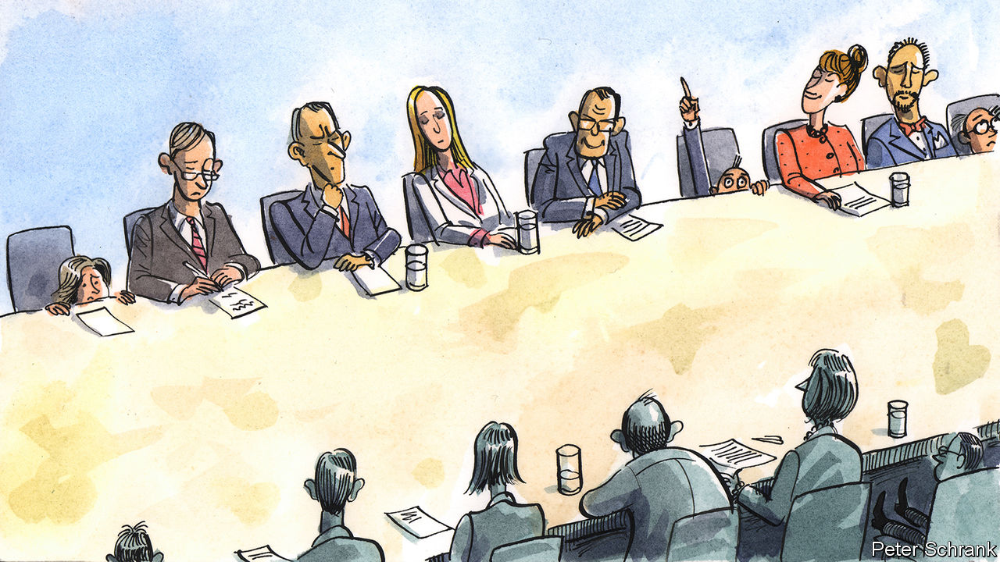

###### Charlemagne

# The outsize influence of small states is fading in the EU 

##### Tiddlers of Europe, unite! 

 

> Nov 9th 2023 

Have you ever sat at a table so large you needed opera glasses to see what was happening at the other end? Such is the fate of those involved in gatherings of the EU. In Brussels, meetings with more than two dozen attendees—one from each of 27 member states, plus various hangers-on—are the norm. The upshot of everyone having a seat at the table, both metaphorically and literally, is a rather odd distribution of power. For whereas a handful of participants represent countries with tens of millions of citizens each, the fellow from Malta is there by dint of a population the size of a couple of Parisian . The big beasts of the EU, notably France and Germany, hold plenty of sway. But a club which is happy to negotiate through the night to reach consensus is one that ends up giving a disproportionate amount of power to the likes of Ireland, Luxembourg or the Baltics. Alas for the tiddlers, the era of small-state privilege may be drawing to an end.

Three elements give Europe’s bantam states their unexpected heft. One is their sheer number: 15 countries in the EU have populations of under 10m, jointly making up just 14% of the bloc’s 448m. When the club’s leaders walk down the red carpet on their way to Brussels summits, Olaf Scholz representing 84m Germans has to jostle with three Baltic leaders whose combined population of 6m would not place them in the top five most populous . The second element is that, unlike America, the EU is more akin to an intergovernmental confederation than a fully formed union. Thus all countries appoint one member to the European Commission and one judge to the EU’s top court, for example. Many decisions have to be agreed to unanimously, notably on tax or foreign affairs: with those dossiers, all national governments enjoy a veto, greatly magnifying the power of the “smalls”. Finally, population-challenged states nab plenty of top jobs, often as compromise candidates: becoming the commission’s president is a habitual retirement gig for outgoing Luxembourgish prime ministers.

Small countries know their privilege is unearned. Occasionally they exploit it regardless. Nobody much likes the way Ireland and Luxembourg run their tax affairs, for example, essentially siphoning off money from others in the club by giving multinationals sweetheart deals. Tough luck, is the duo’s retort, hinting at the veto in their back pocket should anyone attempt to change the rules. Mostly the smalls try not to push their luck: vetoes from small countries are rare (with the exception of Hungary, whose cantankerous government uses them to shake down the rest of the bloc). When they have a point to make, they congeal into alliances to give themselves additional heft.

Many can also see the writing on the wall when it comes to the influence of the smalls. One reason is that those tables hosting EU meetings may soon have to be extended yet again. Another nine member states might now plausibly join in coming years. That includes Ukraine, which will probably start negotiations to become an EU member by the year’s end after a mostly positive assessment of its current reforms issued by the commission on November 8th; Georgia, Moldova and six western Balkan states are also making progress. The EU cannot plausibly be run with 36 capitals each wielding a veto or a right to appoint top officials. Yet every change would disrupt a system that has elevated the smalls beyond their natural station.

Nobody yet knows the rules that would govern an enlarged EU. France and Germany are keen to further restrict vetoes (though oddly will not allow themselves to be overruled when it comes to having the European Central Bank in Frankfurt or an unnecessary second chamber for the European Parliament in Strasbourg, say). Annalena Baerbock, the German foreign minister, said on November 2nd that her country would be “ready to do without our own commissioner” for a bit. What she really meant is that Finland and Bulgaria should be ready to make do without theirs for rather longer. Lest unnecessary tasks be invented to keep Eurocrats busy, the smalls might expect to lose their appointment privileges.

Already the system has started to skew away from the tiddlers. Before 2009 leaders from each EU country, no matter how small, would take turns representing the bloc on the world stage for six months. The president of America or China would thus be left bemused as to why he was standing next to the prime minister of Belgium at some global summit. (A permanent president, though scarcely more recognisable, now holds the job for a five-year stretch.) Brexit harmed the interest of the smalls: a more intergovernmental union of the sort favoured by Britain was precisely the sort that preserved their interests.

But perfectly formed

More recently a shift in economic policies has swung the pendulum in favour of the “bigs”. For decades the EU machine in Brussels was a champion of free trade, and enforced rules that forbade national governments from subsidising their favoured companies. This suited small countries well: their instincts are for open economies, given their firms have long had to venture beyond their tiny domestic markets to thrive. Big countries, by contrast, have large firms that can benefit from protection from Chinese or American rivals. Following the covid-19 pandemic and the war in Ukraine, the trend has been for state-aid rules to be relaxed, allowing billions to be spent in the name of “strategic autonomy”. Most of that has gone the way of companies in France and Germany, for example in their bids to attract costly microchip plants. Small countries (as well as big broke ones like Italy) are justly worried.

Wee member states still have a card to play before being consigned to euro-irrelevance: they will have a veto in approving the EU’s new arrangements, and thus a chance to make sure that any rule changes do not hit them too hard. At least they will still have a seat at the table at which the key decisions are made—even if they have to scream to be heard at the other end. ■


