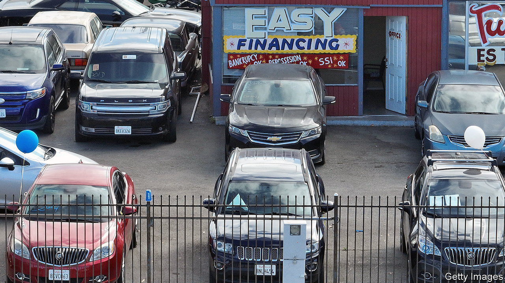
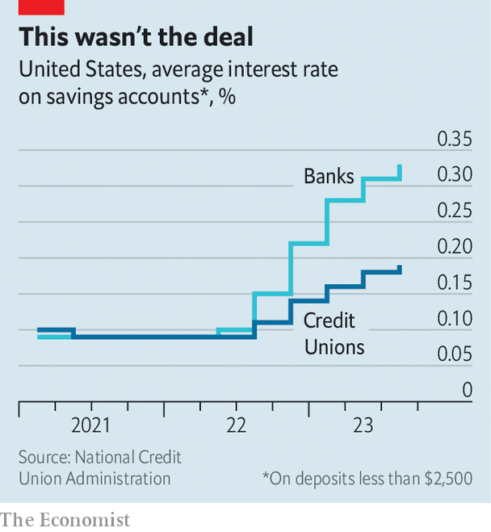

###### Death valley

# America’s bad auto loans could have nasty consequences 

##### The country’s credit unions are particularly exposed 

 

> Nov 9th 2023 

The Federal Reserve’s interest-rate rises are causing pain in the land of casinos: Nevadans are googling how to return their car more than folk in any other state. Yet while their pain is acute, it is not unique. Across America, the share of high-risk auto borrowers that are behind on payments by at least 60 days reached 6.1% in September, its highest in three decades (even if just a little higher than in 2019). 

This spells trouble for an unglamorous yet increasingly important institution: the credit union. After all, one in three Americans who borrowed to buy a car during the covid-19 pandemic did so from such an organisation. The sector is now looking at a liquidity crunch of its own, as investments struggle and regulators demand bigger buffers. America’s 4,700-odd credit unions provide members with generous deposit rates and lending terms, and are run on a not-for-profit basis—an approach that won over savers during the low-rate era. All told, they now hold deposits worth more than 10% of those in traditional banks.

 


In response to current difficulties, credit unions have been forced to break with their business model, and have raised deposit rates more slowly than banks (see chart). Although they usually benefit from the fact that members, who tend to be associated with an institution such as a government bureaucracy or university, are patient types, that patience is now being tested. Average deposits in credit unions fell by 3.5% in the year to July, an unwelcome trend in a sector that has enjoyed near-continuous growth since the 1970s. 

Despite raising deposit rates slowly, credit unions are showing less restraint elsewhere. Outstanding loans grew by 12% in the year to July, and growth is not slowing. A fifth of union savings are in outfits where loans exceed deposits, up from an 80th at the start of 2021—meaning they need greater liquidity to ensure safety.

Indeed, regulators are monitoring the sector’s liquidity. Just four unions went under in the first half of the year—consistent with recent trends—and in aggregate balance-sheets look healthy. There are some worrying shifts, however. Cash and cash equivalents have fallen by half as a share of assets from a high reached during the pandemic, as unions have sought to meet loan demand. Although they also face higher interest rates, co-operatives are nevertheless taking on debt: their borrowing is now equivalent to 6% of assets, up from an average of 3.5% over the past decade.

This has led credit unions to seek other sources of funding, including by selling loans. Normally they trade among themselves, notes Steve Rick of TruStage, a mutual-insurance company. But such is the state of the sector that few co-operatives have the cash to buy others’ loans. Some have thus turned to the asset-backed securities market, in which they can exchange their car loans for cash upfront at the same time as offloading credit risks from their balance-sheets. Unfortunately, they can do so only on particularly bad terms. 

Since 2017 credit unions have raised $2.8bn in such markets, some $1.6bn of which has come in the past six months. This represents a large increase in costs, and as a consequence signals that there is little chance of better rates on deposits for members in the months to come. Like Nevada’s car-owners, many may end up simply walking away. ■


