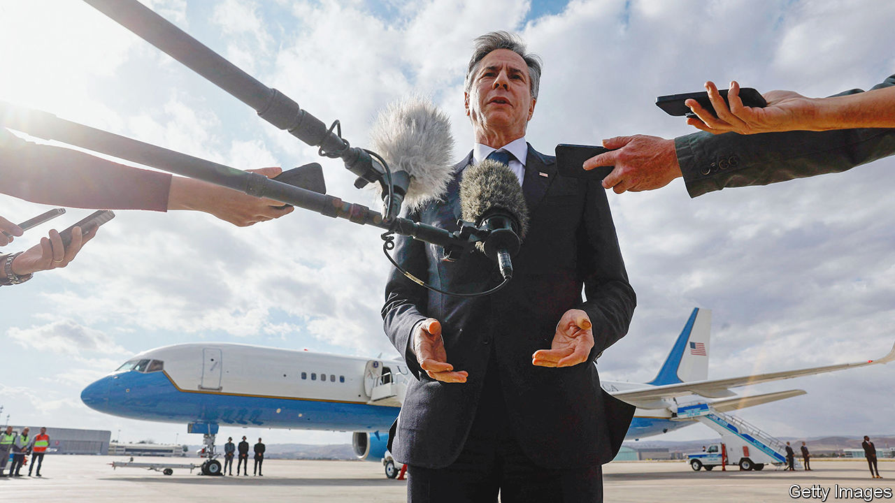

###### Little Satan

# America’s economic might gives it little sway in the Middle East 

##### How its influence has declined over the past three decades 

 

> Nov 9th 2023 

For the past month, American diplomats have been trying to stop the Middle East from falling apart. Ever since Hamas attacked Israel and Israel retaliated, they have lobbied Jerusalem to allow aid into Gaza, shuttled between Gulf capitals to meet Arab leaders and stopped off in Amman and Cairo to ask Israel’s neighbours to help with refugees and the injured. Antony Blinken, America’s secretary of state, is looking a little tired. 

A regional war has so far been avoided. But otherwise American policymakers have frustratingly little to show for their many flights. Few people have made it out of Gaza, insufficient supplies of food and medicine have made it in and countries in the region remain reluctant to discuss how the war might come to end, especially what could come after Hamas. Following his second tour of the region, which finished on November 5th, Mr Blinken stressed that “all of this is a work in progress”.

America’s economic might has been a cornerstone of its diplomacy for decades. At the start of the war, the hope was that financial rewards might persuade Egypt to accommodate Gazan refugees and squeeze more co-operation from Jordan and Lebanon. All three countries are teetering on the edge of financial ruin—they need help. The problem is that Washington no longer has the tools required to compensate governments; certainly not for things that risk upsetting their own people, such as being seen to abandon the Palestinians’ cause by softening to Israel or taking refugees.

Over recent decades, American diplomacy in the Middle East has changed. The superpower used to be accused of being too hard-nosed and seeking to control other governments via imf programmes. Since then, imf bail-outs have become more common, and they arrive with fewer strings attached. American loans have turned into aid worth billions of dollars. In 1991 America and its allies held half of Egypt’s external debt; today Washington holds none. Before the war, the country’s officials preferred to talk about poverty reduction rather than geopolitical favours.

Behind America’s shift was the hope that prosperity would stabilise allies, such as Jordan’s monarchy and Egypt’s dictatorships, and improve its own reputation, which had been battered by wars in Afghanistan and Iraq. Yet little economic growth has materialised. The Middle East is home to some of the world’s most troubled economies. Lebanon has fallen over the edge: the government defaulted on its debts in 2020, and lacks the political stability required to negotiate with creditors. Inflation is now raging at more than 100%.

Others are doing little better. Unemployment in Jordan is higher than at any point in the past 25 years, except for during the covid-19 pandemic, and the state relies on support from America and the imf to escape default. Similarly, Egypt has been flirting with default since a foreign-currency crunch last year. Three separate imf bail-outs in the past decade have stalled owing to the country’s refusal to dismantle loss-making firms run by the armed forces. 

Marching orders

This bleak picture is a problem for America, and not only because it represents a failure of its aid policies. The country would once have been able to forgive debts in return for favours, as it did in 1991 in thanks for Egypt’s involvement in the Gulf war. In 1994, when Jordan was negotiating a peace treaty with Israel, King Hussein’s first ask of President Bill Clinton was to forgive debts. Now there is no lending for America to forgive. Moreover, the few American investors and firms left in Egypt and Lebanon packed up at the onset of financial turmoil. Thus there is little that officials can do by influencing business, too. 

Another option would be for America to offer a truly enormous amount of aid as its side of a grand bargain. Inevitably, however, such a package would face fearsome political opposition in Washington. Meanwhile, any attempt to induce co-operation by threatening to pull the plug on aid to Egypt and Jordan would not be credible. In Egypt, most of America’s money goes to the army, making it too important to play games with given the security situation. In Jordan, more cash goes directly into the government’s budget, but this is widely seen as compensation for the hundreds of thousands of Palestinian and Syrian refugees that the country shelters. Policymakers in both places believe they are entitled to their grants as fair payment for keeping the peace with Israel and a grip on their populations. “We take the grants because they keep things balanced,” says one. “[Americans] I speak to know this.” 

What Lebanon gets from America is now mostly humanitarian aid, which came to $92m in the year to June. Such funds bypass government coffers and go straight to the population, meaning that they offer little financial leverage—and the country’s government is so fragile it is not in a position to bargain. Hizbullah, a militia-cum-social-movement, controls swathes of the country, has its own bank and has amassed tens of thousands of troops, which are firing rockets into Israel. Since America lists the group as a terrorist organisation, officials can hardly offer it economic goodies.

Without ways to entice allies into good behaviour, America’s financial diplomats must occupy themselves with punishing bad behaviour. America now enforces ten times as many sanctions globally it did two decades ago. Since October 7th its Treasury department has slapped on two rounds of restrictions covering everything from the Iranian state to Turkish construction companies. Unfortunately, Gaza’s most pressing problems, such as the provision of humanitarian aid and safety for refugees, cannot be solved by sanctions, and Hamas’s finances are sufficiently opaque as to be resistant to American measures. Many of the organisation’s financiers find a haven in Turkey—a country whose president, Recep Tayyip Erdogan, is reported to have refused Mr Blinken’s request for a meeting during his recent travels. ■


