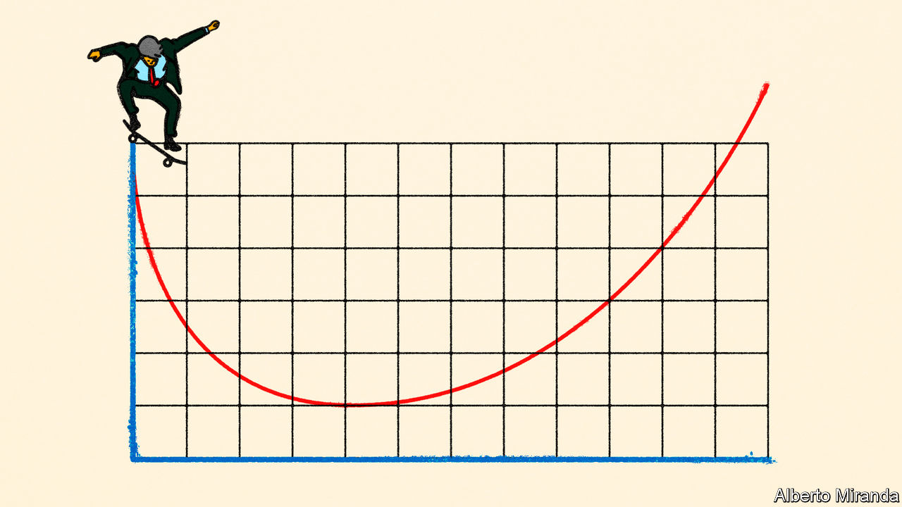
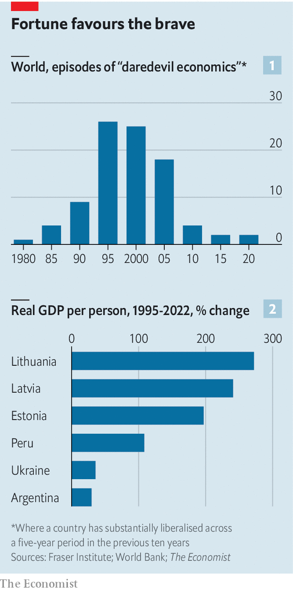

###### Take the plunge

# Are politicians brave enough for daredevil economics? 

##### New research shows rapid liberalisation offers growth, along with initial pain 

 

> Nov 8th 2023 

At first glance, Argentina faces a  in the second round of its presidential election on November 19th. Sergio Massa, the current finance minister whose government is presiding over inflation of 138% and a bizarre system of various official exchange rates, is facing . Mr Milei is a libertarian who says he wants to tear down the system, borrowing ideas from Friedrich Hayek, Milton Friedman and other free-market economists. 

Yet whoever wins, reformist Argentines doubt the country will truly change. In all likelihood, Mr Massa would double down on money-printing; he has little interest in dismantling the system of patronage that makes sustained growth impossible. Mr Milei, by contrast, would have little support in Congress. He has no experience of implementing policy. Many of the market-oriented economists sympathetic to Mr Milei, and even those who advise him, have surprisingly vague ideas about what Argentina needs to do to improve its economy. The country feels stuck.

 


Argentina is an extreme example of a wider trend. The world has forgotten how to reform. We analysed data from the Fraser Institute, a free-market think-tank, which measures “economic freedom” on a ten-point scale. We considered cases where a country improves by 1.5 points or more—a quarter of the gap between Switzerland and Venezuela—within a decade, indicating that bold, liberalising reforms have been undertaken. In the 1980s and 1990s such “daredevil economics” was common, as countries left the Soviet Union, and many deemed unreformable, such as Ghana and Peru, proved they were in fact reformable (see chart 1). Politicians changed foreign-trade rules, fortified central banks, cut budget deficits and sold state-owned firms.

In recent years just a handful of countries, including Greece and Ukraine, have implemented reforms. And in the decade to 2020 only two countries, Myanmar and Iraq, improved by more than 1.5 points. The same year a paper by economists at Georgetown and Harvard universities, as well as the imf, looked at structural reforms, and found similar results. In the 1980s and 1990s politicians across the world implemented lots of them. By the 2010s reforms had ground to a halt.

Daredevil economics has declined in popularity in part because there is less need for it. Although in recent years economies have become less liberal, the average one today is 30% freer than it was in 1980, according to our analysis of the Fraser Institute’s data. There are fewer state-run companies. Tariffs are lower. Even in Argentina, telecoms and consumer-facing industries are better than they once were. 

But the decline of daredevil economics also reflects a widely held belief that liberalisation failed. In the popular imagination, terms such as “structural-adjustment plan” or “shock therapy” conjure up images of impoverishment in Africa, the creation of mafia states in Russia and Ukraine, and human-rights abuses in Chile. Books such as Joseph Stiglitz’s “Globalisation and its Discontents”, published in 2002, and Naomi Klein’s “The Shock Doctrine”, in 2007, fomented opposition to the free-market “Washington consensus”. In Latin America “neoliberal” is now a term of abuse; elsewhere, it is rarely used as an endorsement. Many Argentines argue that the country’s attempts to liberalise its economy in the 1990s provoked an enormous financial crisis in 2001. 

Today, international organisations like the imf and the World Bank are rather less interested in daredevil economics than they once were. In an edition of its “World Economic Outlook” published in October 1993, the imf mentioned the word “reform” 139 times. In its latest edition, published exactly 30 years later, the word appears a mere 35 times. These days America has a new consensus, which takes a sceptical view of globalisation’s benefits, prioritises domestic interests over international ones and favours large-scale subsidies in order to speed up the green transition and bring home manufacturing. With less chivvying from the West, governments elsewhere feel less pressure to reform their own economies. Argentina’s free-marketeers in the 1990s drew on deep links with America. Fewer such connections exist today. 

In for a shock

Yet the view that daredevil economics failed does not stand up to scrutiny, even if projects often produced short-term pain. In the 1990s the three Baltic countries liberalised prices and labour markets. This allowed them to move from membership of the Soviet Union to membership of the euro within 25 years (see chart 2). In the 2010s Greece implemented many reforms demanded by the imf and European authorities. Inward foreign direct investment is now soaring, and this year Greece’s gdp is expected to grow by about 2.5%—one of the strongest rates in Europe. Not long ago many argued that China had rejected daredevil economics and succeeded. Recent economic weakness, including a troubled property market under President Xi Jinping, casts doubt on this notion. 

Indeed, a growing body of research suggests that daredevil economics has largely achieved its aims. A paper by Antoni Estevadeordal of the Georgetown Americas Institute and Alan Taylor of the University of California, Davis studies the effect of liberalising tariffs on imported capital and intermediate goods from the 1970s to the 2000s, finding that the policy raises gdp growth by about one percentage point. Ten years after the beginning of a “reform wave”, gdp per person is roughly six percentage points higher than could have reasonably been expected otherwise, according to a paper published in 2017 by economists at the European Central Bank, which analysed 22 countries of different income levels from 1961 to 2000. 

Meanwhile, a paper published in 2021 by Anusha Chari of the University of North Carolina, Chapel Hill and Peter Blair Henry and Hector Reyes of Stanford University finds positive impacts from a wide variety of reforms in emerging markets, from stabilising high inflation to opening capital markets. For instance, trade liberalisation tends to raise the average growth rate of gdp over a decade by more than 2.5 percentage points a year. In another paper, focusing on Latin America, Ilan Goldfajn, president of the Inter-American Development Bank, and colleagues acknowledge that growth has been disappointing, but contend that “without some subset of the Washington consensus policies, it would have been difficult, if not impossible, to achieve macroeconomic stability and to recover access to foreign financing in the late 1980s and early 1990s.” Other research has found faster growth in Africa since 2000 among reforming countries. 

In most places where reforms appear to fail, the problem is a lack of commitment. Take Ukraine, where even before covid-19 and Russia’s invasion gdp per person was lower than when the Soviet Union collapsed. By the early 1990s it was clear that the government was not taking daredevil economics seriously. A memo written for the World Bank in 1993 by Simon Johnson and Oleg Ustenko, two economists, noted that “only a tougher and more radical set of policies can avert hyperinflation, but no political leader seems willing to adopt these measures.” What brought down Argentina in 2001 was not daredevil economics, as is commonly assumed. It was persistently large budget deficits. 

Perhaps Mr Milei will prove his doubters wrong. Perhaps he will win the election and then implement sensible economic reforms. This would include liberalising trade and making it easier for Argentina’s bosses to hire and fire. Doing so would help the country enormously. It would also demonstrate to the rest of the world a path forward. Daredevil economics may be disruptive, but it pays off. ■


