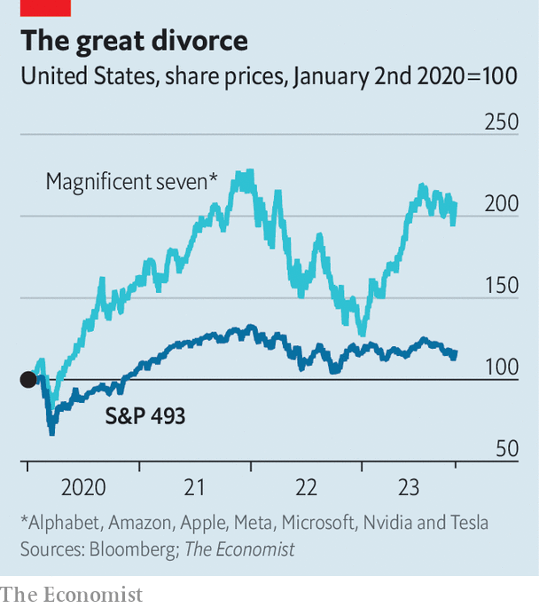

###### Buttonwood

# Forget the S&P 500. Pay attention to the S&P 493 

##### The alternative benchmark offers a better view of America’s stockmarket 

 

> Nov 8th 2023 

Think of America’s stockmarket. What is the first firm that springs to mind? Perhaps it is one that made you money, or maybe one whose shares you are considering buying. If not, chances are you are thinking of one of the big hitters—and they don’t come much bigger than the “magnificent seven”.

Alphabet, Amazon, Apple, Meta, Microsoft, Nvidia and Tesla are Wall Street’s superstars, and deservedly so. Each was established in the past 50 years, and five of them in the past 30. Each has seen its market value exceed $1trn (although those of Meta and Tesla have since fallen, to $800bn and $700bn respectively). Thanks to this dynamism, it is little wonder that America’s stockmarket has raced ahead of others. Those in Europe have never produced a $1trn company and—in the past three decades—have failed to spawn one worth even a tenth as much. Hardly surprising that the average annual return on America’s benchmark S&amp;P 500 index in the past decade has been one-and-a-half times that on Europe’s Stoxx 600.

 


There is just one problem with this story. It is the hand-waving with which your columnist cast the magnificent seven as being somehow emblematic of America’s entire stockmarket. This conflation is made easily and often. It is partly justified by the huge chunk of the S&amp;P 500 that the magnificent seven now comprise: measured by market value, they account for 29% of the index, and hence of its performance. Yet they are still just seven firms out of 500. And the remaining 98.6% of companies, it turns out, are not well characterised by seven tech prodigies that have moved fast, broken things and conquered the world in a matter of decades. Here, then, is your guide to the S&amp;P 493.

Most obviously, having discarded the tech behemoths, our new index now looks substantially older. Consider its biggest companies. At the top of the list is Berkshire Hathaway, an investment firm led by two nonagenarians, and Eli Lilly, a pharmaceuticals-maker established in the 19th century by a veteran of America’s civil war. Further down is JPMorgan Chase, a bank that made its name before the founding of the Federal Reserve. That is not to suggest that these firms do not innovate. All of them, by definition, have remained highly successful, even if none has crossed the $1trn threshold. Whippersnappers, though, they are not.

As a result of this maturity, the S&amp;P 493 is less susceptible to the market’s changing mood (see chart). This is a double-edged sword. On the plus side, it offered protection during the crash of 2022. The more established business models of S&amp;P 493 companies started the year with less hype than those of the magnificent seven, leaving them less vulnerable when the hype duly evaporated. Meanwhile, a smaller proportion of their value came from the promise of distant future earnings—the present value of which fell dramatically as interest-rate expectations soared. The net effect was that, while the magnificent seven together lost 41% of their value, the S&amp;P 493 lost just 12%.

This year, however, the tables have turned. On the face of it, the old-timers ought to have done well, since the American economy has remained remarkably buoyant. This, combined with enthusiasm concerning the potential of artificial intelligence to juice their profits, led to a stellar recovery for the magnificent seven. In the first ten months of the year their share prices rose by 52%, nearly erasing the losses of 2022. By contrast, the value of the S&amp;P 493 fell by 2%.

What to make of this bifurcation? One conclusion is that America’s tech giants have become overvalued and must eventually face a crash. Another is that, just as share prices have diverged, so too will the companies’ sales and profits, meaning that the magnificent seven really are about to leave the dinosaurs in the dust. Investors seem to choose between these hypotheses largely according to their own temperament, since traditional valuation measures such as the price-to-earnings ratio, which for the magnificent seven is roughly double that for the S&amp;P 493, lend support to both camps.

A third conclusion, now aired increasingly often, is that the S&amp;P 500’s domination by seven stocks which are so different from the rest means it is no longer a good benchmark. That is not quite right. Many people invest in funds tracking the index precisely so they can capture the gains of the winners without having to care about its composition. Still, if you want to know what America’s stockmarket really looks like, avoid the headline index. Look at the S&amp;P 493.■


