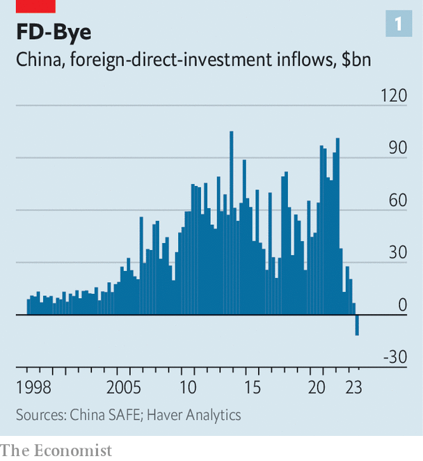

###### Soft-currency power

# The Chinese yuan is losing value, yet gaining ground 

##### Low interest rates have a paradoxical effect 

 

> Nov 9th 2023 

China owes a lot to foreign investment. Long before Foxconn started making iPhones for Apple, manufacturers from Hong Kong tiptoed across the border to Guangdong in search of cheap labour. In 1982 Jetta, a toymaker, opened a spray-painting plant among the nearby lychee orchards of Dongguan, according to “Toy Town”, a book by Sarah Monks. Water for a shower was boiled in a wok; the plant was in a tin shack. At another firm, Ms Monks reports, the workers decided that Mickey Mouse’s nose should be red, not black.

 


By the end of last year, the accumulated stock of direct investment in China amounted to almost $3.5trn. But in the third quarter of this year, something remarkable happened. The flow of fdi turned negative, for the first time since quarterly data began in 1998 (see chart 1). Foreign investors removed more money from the country than they put in, through a mixture of repatriated profits, repaid intra-firm loans and asset sales.

This reversal may reflect foreign disillusionment with China’s economic prospects and policymaking. Although the country will most probably meet its official growth target of 5% this year, it could shrink in dollar terms, according to the imf’s latest forecasts. China’s government has unnerved many investors with its overbearing reaction to the covid-19 pandemic, its regulatory crackdown on technology companies and its investigations of foreign due-diligence firms, including Bain, Capvision and Mintz.

Intensifying geopolitical rivalry has not helped either. It is becoming harder for foreign investors to find opportunities that are both commercially exciting and politically palatable in their home and host countries. In a survey of its members published in March, the American Chamber of Commerce in China found that 24% were considering relocating manufacturing out of China or had already begun to do so, up from only 14% the year before.

But the sharp reversal in the third quarter may also reflect a technical calculation. As interest rates remain high in America and fall in China, multinational companies have an incentive to spirit spare cash out of the country and unwind any loans to their subsidiaries that can be replaced with Chinese funding. “Many firms can now borrow more cheaply in China and nearly all can earn a higher return on their financial reserves by moving them offshore,” points out Julian Evans-Pritchard of Capital Economics, a research firm.

The combination of an interest-rate gap and a geopolitical gulf has, then, hurt one kind of globalisation. But it may be helping another kind: the embrace of China’s currency, the yuan (or “redback”, as it is sometimes called outside the country). 

In a report last month, China’s central bank pointed out that the cost of borrowing in yuan had fallen relative to other big economies. As a result, foreign firms had issued 106bn yuan ($15bn) worth of yuan-denominated “Panda bonds” in China during the first eight months of the year, an increase of 58% compared with the same period in 2022. Indeed, in September the yuan surpassed the euro to become the second-most-popular currency for trade financing, with 6% of lending, according to swift, a payments-messaging firm. 

 


A meticulous new report on China’s overseas lending by AidData at William and Mary, an American university, also shows how government-owned lenders have made a “strategic pivot” away from the dollar in their lending to low- and middle-income countries (see chart 2). The share of new commitments in yuan soared from 6% in 2013 to 50% in 2021.

Many of these loans were made by China’s central bank to countries that are in debt distress. The recipients were then able to use the yuan to repay Chinese creditors and the imf, preserving their scarce dollar reserves for other needs. The authors of the AidData report wonder if China’s rulers saw a chance to “kill several birds with one stone”—preventing defaults and encouraging the international use of the yuan at the same time. 

After all, countries that borrow in the yuan are more likely to use the currency for international payments, according to work by Saleem Bahaj of University College, London and Ricardo Reis of the London School of Economics. Forty economies have now signed a swap agreement with China’s central bank, which obliges it to temporarily exchange yuan for an equivalent amount of the other party’s currency. Signing such an agreement increases the yuan’s share in a country’s international payments by 1.3 percentage points, they find.

The sanctions imposed on Russia by America and Europe have also helped the yuan. Indeed, more than half of mainland China’s transactions with the rest of the world are now settled in its own currency, points out Mr Evans-Pritchard. In the pioneering province of Guangdong the share is even higher, at over 54% in the first three quarters of this year. Guangdong’s workers never got Mickey to embrace a red nose. But the province has at least persuaded some foreigners to embrace the redback. ■


