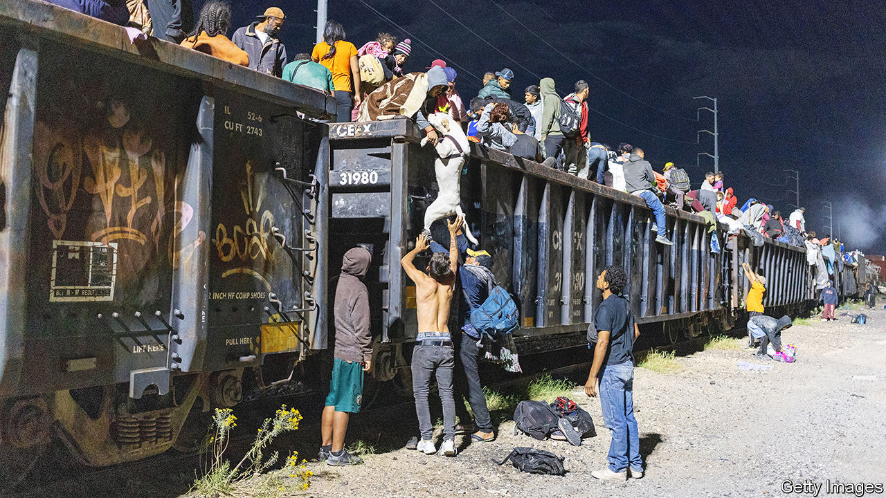
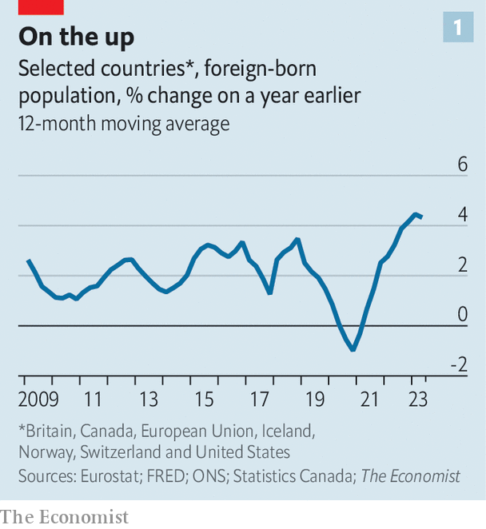
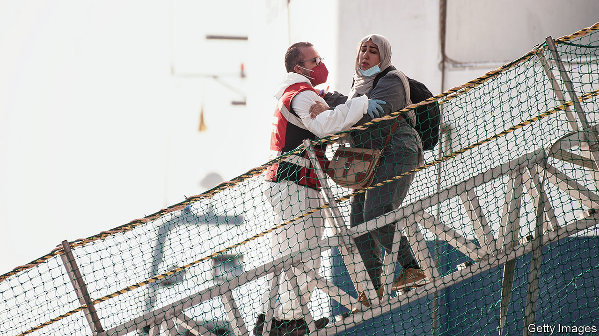

###### New arrivals, old problems

# Why migration is in such a mess once more 

##### Violence and poverty are pushing the desperate towards jobs and safety 

 

> Nov 9th 2023 

ILLEGAL IMMIGRATION is taxing governments on both sides of the Atlantic. The maritime migration route between west Africa and the Canary Islands, a passage so dangerous it was avoided for years, is back in use: some 30,000 people have attempted the crossing so far in 2023. Countries like Germany, once friendly to asylum-seekers, are slashing benefits and hastening deportations. This year half a million people may traverse the Darién Gap, part of the isthmus that links Colombia to Panama, to reach the United States. That is more than four times as many as attempted the crossing throughout the 2010s. 

 


This human drama exists alongside a quieter increase in authorised migration. A recent report from the OECD, a club mainly of rich countries, found that its 38 members accepted a record 6.1m immigrants permanently last year. ’s own calculations show immigration to rich countries increasing at its fastest pace in the 15-year period for which we have reliable data (see chart 1 ). Across the OECD, around 10% of people live in countries they were not born in.

The statistics derive from a range of factors pushing people to move, and to a host of enticements pulling them towards Western countries. When it comes to the pushes, conflict in parts of Europe, the Middle East and sub-Saharan Africa is driving millions elsewhere. (Some 4.7m Ukrainians have fled their country, at least temporarily, for Europe.) Grinding poverty also pushes people to move, as does crime and gang violence. 

 


Now for the pulls. Most migration, of any sort, takes place within regions, rather than from the poor to rich world. But the relative safety of Western countries is one factor drawing migrants with the means to get to them. Tight labour markets in rich countries are another big attraction. Over 70% of migrants across the OECD’s countries are in work, a number that continues to climb. Average wages in the EU are now over 12 times those in sub-Saharan Africa.

The numbers wishing to migrate will only grow in the coming years. Some worry that climate change could spark an exodus. A bigger concern, from the perspective of rich countries, concerns demography: as they grow older they will need more imported labour. For decades net migration in a cluster of rich countries has accounted for a greater share of the total population than do net births (see chart 2). Nearly 15m German residents, 18% of the population, are first-generation immigrants—a higher share than America at its peak in 1890. 

Diverging definitions

Officials overseeing borders are struggling to navigate the situation—let alone the migrants trying to cross them. Part of the problem is that the complexity of people’s migratory journeys is blurring a distinction that international law upholds rigidly. It is between refugees—those unable to return to their countries of origin owing to “a well-founded fear of being persecuted” who seek help through asylum systems—and other migrants. The numbers claiming asylum in OECD countries last year reached a record high of 2m people. Tension builds because anyone arriving in a signatory country to the UN Refugee Convention of 1951 may lodge an asylum claim. That thwarts governments’ efforts to keep newcomer numbers down. 

What happens if someone fleeing misery also wants a job? Organised labour-migration schemes are far too small to manage either the supply of migrant labour or the demand for it. That can leave asylum systems as one of the only channels through which migrants may enter countries without risk of immediate deportation. Underfunded and overwhelmed, many are buckling. Rich countries find themselves caught: how to balance the needs of economies beset by demography and tight labour markets with the delicate politics of immigration and asylum? 

Of church and state

All these difficulties are on display in America. A record 2.4m migrants were apprehended at its southern border in the year to September. The country’s asylum system is creaking. It sits on a backlog of 2m cases and takes an average of four years to process each one. “We haven’t put money into immigration judges, asylum officers, the people who decide whether or not the people you catch can stay,” says Theresa Brown, who served in the Department for Homeland Security in the Bush and Obama administrations. 

Understanding how the composition of those arriving has changed illuminates the hardships pushing migrants towards the country. Nowadays families who immediately surrender to border officials make up a far higher share of arrivals than in the past. Last month, for the first time, Venezuelans overtook Mexicans as the most-represented nationality among migrants arrested at the border. They are exiles from the autocratic regime of Nicolás Maduro.

One such is José Castillo, who is staying at a church shelter in San Diego. When he and other migrants leave each day to search for work, they pile their belongings in rubbish bags beneath a tent in the garden. A statue of the Virgin Mary stands watch. Mr Castillo left his wife and two young daughters in Falcón state and then waited for months in Monterrey, in north Mexico, to make an asylum appointment with America’s Customs and Border Protection via the CBP One phone app. 

The app tries to channel migrants into legal pathways, and reduce the numbers of would-be migrants crowding at America’s southern border. But numbers are gumming up its administration. Another scheme launched last year, which offered a two-year stay to certain nationalities from Latin America and the Caribbean who had a private sponsor, initially cut border arrivals from those countries. But it, too, has proved inadequate to meet demand.

America’s tight labour market—there are 9.6m job vacancies—is an obvious pull for migrants. Mr Castillo, a mechanic, explains that he can earn more in one day in California than he could make in months at home. Wayne Cornelius, a professor emeritus of the University of California at San Diego, reckons there has never been a better time for migrants to seek work in America. In September the Biden administration granted temporary permission to nearly half a million Venezuelan immigrants to stay and work legally.

That was done in part to ease the burden on beleaguered city governments like New York’s, which wanted to grant asylum-seekers the right to work so that they could afford housing. But Republicans and Democrats alike have also spotted a chance to plug labour gaps. America’s formal employment-migration schemes are not remotely adequate to manage companies’ need for workers, highly skilled or otherwise. The US Chamber of Commerce reckons that in 2024 just one person will receive an H-1B skilled work visa for every ten applicants. “The policy debate is being conducted almost entirely without regard to these labour-market realities,” reckons Professor Cornelius. 

Still, if you think America looks bad, try Europe. Politicians are once again at each other’s throats over illegal immigration. Border checks have been reimposed throughout the supposedly passport-free Schengen area. Governments are reviving questionable ideas like offshore processing: this week Italy’s right-wing government hailed a deal that would see Albania take in some of its asylum-seekers. 

Europe’s difficulties run deeper than America’s because it is not a unitary authority. However reasonable it might seem to distribute asylum-seekers around member states, one or other government will always refuse. The EU’s common asylum system does set common standards, but governments jealously guard their right to make asylum adjudications. Even the much-maligned “Dublin” system, under which asylum-seekers are supposed to be returned to the EU country in which they first registered, is honoured largely in the breach. Last year Germany was able to return to other EU countries only 6% of the asylum-seekers it considered eligible under the Dublin rules.

The difficulty is that Europe, too, is crying out for workers. Varun Kumar Jain’s story is revealing. In 2017 he left his native Bihar, a state in eastern India, for Warsaw. Tired of Bihar’s heat, he was also drawn by the Polish capital’s dearth of competitors in his field: Indian cooking. He was quickly able to parlay his tourist visa into a work permit. After four years simmering and chopping in an Indian restaurant he has just opened his own spot. His children attend a Polish school and he attends the country’s only Sikh temple. Despite strident anti-migrant rhetoric, Poland’s labour-hungry government has presided over a huge growth in such immigration. 

Back in the old continent

Ageing Europe will need ever more foreign workers for its growing labour-market needs owing to its demography. At 44 its median age is notably higher than America’s, at 39. By one estimate the EU would need to import 50m people over the next 25 years just to keep its population stable. As their labour shortages sharpen, rich countries will intensify their competition for immigrants, and not only the highly skilled sort—Europe has huge demand for carers, lorry-drivers and carpenters. 

 


Although immigration cannot solve a country’s demographic difficulties (because immigrants get old too), it can control the pace of change in the dependency ratio—the multiple of the economically dependent to working-age adults. That is critical for Europe (see chart 3). “If managed well, the people on the move that are being scapegoated today will be eagerly sought after tomorrow,” says Amy Pope, director-general of the International Organisation for Migration, the UN’s migration arm. 

Europe abuts a place where economic and political realities push people to leave. The median age in Africa is 19. Across the continent, only 3m formal jobs are made available for the 10m-12m Africans who enter the workforce each year. Most African emigrants move within the continent, as the parades of jobseekers lining the roads of South Africa testify. A second cohort, especially in east Africa, earns decent incomes in the petrostates of the Gulf, albeit at the cost of many of their civil rights. But a growing number make their way to Europe—and as Africa gets richer, more will acquire the means to do so.

The journey ahead

Failing to adjudicate properly between claimants undermines public support for all forms of migration, especially when labour migration is channelled through asylum systems. A more rational way forward is possible to imagine. Well-resourced asylum systems are needed alongside tailored labour-migration schemes which allow newcomers quick entry into labour markets. These should be encompassing enough to change the incentives of people otherwise planning to make unauthorised journeys. But it is hard to conceive that such schemes could ever be big enough to take on everyone who might want to emigrate. “I’ve become sceptical about the big promise that you can reduce irregular migration by increasing legal migration, because we create small legal trickles rather than large legal pathways,” says Victoria Rietig, a migration expert at the German Council on Foreign Relations, a research body in Berlin.

Canada and Australia offer interesting examples. Both these rich countries have maintained public support for extraordinarily high immigration rates (albeit not without trouble). Last year Canada welcomed 1m newcomers, boosting its population by close to 3%. It accounted for fully 42% of global refugee resettlement (which directly transfers vulnerable refugees to rich countries). Australia took a further 15%. But it is difficult to extrapolate from their experience. It is their geography that helps them keep control, which in turn reduces incentives for others to come.

In reality the sheer difficulty of managing migration is leading to official contortions. On one hand, policymakers jumpy about asylum numbers are happy to support potentially illegal policies like pushbacks at sea. On the other, governments are increasingly open to ushering asylum-seekers into the labour market once they arrive. This can take an explicit form: citing the “ever-increasing labour shortage”, some German states have sought to grant asylum-seekers the right to begin work immediately, rather than spend months in language and integration courses. 

More often, though, governments offer labour-market integration through neglect. Unable to cope, overwhelmed asylum systems channel their applicants into legal limbo. From there, many will find off-books work and hope for their status to be regularised; few asylum-seekers in America wait the 180 days or more the law may require before they can legally find work, for example. Eventually they will be able to obtain social-security numbers and work permits, formalising their entry into the labour market even before their immigration status is finalised. 

Frustration is leading other governments down tough paths. Confronted with unmanageable numbers of so-called spontaneous arrivals, some are increasingly reluctant to accept refugees via formal, often UN-organised resettlement. In 1980 America accepted over 200,000 resettled refugees; last year it took in just 25,000. 

 


Some on the political right have suggested rewriting or even tearing up the UN’s Refugee Convention. Progressives, meanwhile, worry that the convention’s provisions, not seriously revised for over 50 years, are too narrow to encompass those fleeing violent crime and extreme poverty—in parts of Central America or the Caribbean, for example. Yet it is by no means certain that a better agreement would emerge from the ashes of the old one, notes Elizabeth Collett, a global fellow based in Australia working for the Migration Policy Institute, an American think-tank. Merely to open the discussion could in fact lead to the removal of what protections there are for refugees. 

Muddling through with a smarter set of tools is the most practical bet. Governments’ main hope of restoring public faith in asylum systems, and of deterring future arrivals, is to show that they are able to deport people with no right to remain in the country. Mr Biden has recently (and not without controversy) resumed deporting Venezuelans. Facing a resurgent far right, Olaf Scholz, Germany’s chancellor, has been touring African countries seeking return agreements to fulfil his promise to “deport people more often, and faster”. A new EU proposal would see some asylum cases fully adjudicated within 12 weeks, with claimants held near borders. Last year slightly fewer than half of all asylum decisions across the EU were positive (although some appeals are successful). That leaves hundreds of thousands of claimants notionally eligible for deportation. 

Securing return deals requires a deft deployment of diplomatic carrots (development aid, formal migration partnerships) and sticks (withdrawals of visa or trade privileges), notes Ms Rietig. In the past readmission agreements on paper rarely translated into movements of people. Big countries with which Europe needs to maintain strategic relationships can be difficult to impress with sweeteners or credibly threaten with sanctions. In 2017 Nigeria rejected EU inducements to take back its people on the grounds that Turkey struck a better deal a year earlier. And agreements with bullying Europeans can prove extremely unpopular. 

Unless governments can improve their asylum systems, they will feel obliged to keep striking dodgy deals with neighbouring autocrats that leave them exposed to political racketeering. The EU’s €6bn ($6.4bn) migration agreement with Turkey in 2016 was a desperate, and largely successful, attempt to block a repeat of the 2015 migration crisis, which scarred Europe. Despite supposedly falling through, a recent €1bn deal with Tunisia, a popular departure point for Europe, does seem to have reduced migrant numbers.

In the absence of fully open borders, there will always be inducements for migrants to attempt unauthorised journeys. No policy alone can expect to reduce numbers dramatically. But the right combination might draw the political sting from migration and so create the space for more generous labour-migration and refugee policies alike. “Here’s the thing no one wants to hear,” says Ms Rietig. “Migration is not a problem to be solved, but a reality we can only hope to manage.” ■

