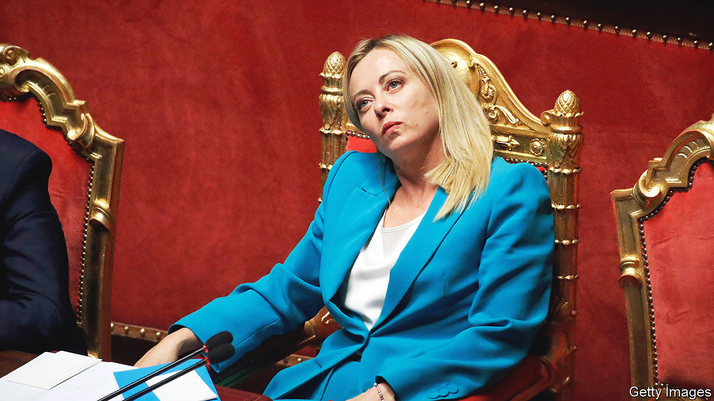

###### Constitutional chicanery

# Giorgia Meloni’s “mother of all reforms” is a power grab 

##### Italians should reject their prime minister’s demagogic proposal 

 

> Nov 9th 2023 

ITALIAN POLITICIANS cannot resist changing the rules. Nearly every government in the past 20 years has tried to introduce a new electoral law, a constitutional reform or a change in the relationship between the centre and the regions. These projects gobble up parliamentary time and, in the case of constitutional reforms, rarely succeed. Any change to Italy’s post-Mussolini constitution of 1948 requires a two-thirds parliamentary majority, something no modern government has enjoyed. In the absence of that, the reform can be put to a referendum. If approved by voters, it can still be thrown out by the constitutional court.

Undaunted, Giorgia Meloni’s  wants to do all three things. A bill to give Italy’s regional governments greater powers is already creeping through parliament. And on November 3rd the prime minister announced “the mother of all reforms”: a bill that would both alter the constitution and require a new electoral law. Her cabinet had just approved her plan, though the details are sure to be amended when it is sent to parliament.

Some of Ms Meloni’s aims sound reasonable. She says she wants to give Italy the political stability it so obviously lacks. (It is on its 70th government since the second world war; a laboratory mouse lasts longer than a typical Italian administration.) She also argues that her proposed arrangements would be more democratic. But their genesis could scarcely have been less so. Ms Meloni has not consulted the opposition, let alone the public, in drawing up the plan. And the nub of her proposal is the direct election of the prime minister, even though her coalition won power last year on a manifesto that promised voters the chance to vote for their (currently indirectly elected) president instead. 

The direct election of prime ministers is a bad idea with a poor record. Israel tried it in 1992. Less than ten years later, it ditched the experiment after it failed to bring the stability that was promised. No other country has followed Israel’s lead, which ought to tell you something. 

The proposed directly elected prime minister (who sounds more like a president, except that Italy already has one of those) would anyway need a majority, or gridlock would ensue, just as it does in countries with an executive president who does not control the legislature. Ms Meloni, therefore, aims to guarantee stable parliamentary majorities by allocating 55% of seats to whichever alliance gets the most votes at a general election. How the extra seats would be shared out remains unclear.

The prime minister would supposedly be from that alliance, though nothing would prevent a voter from choosing a prime minister from one party or alliance but plumping for an MP from another. A further big defect is that the plan does not require the winner to secure a minimum share of the vote to get the boost. An alliance with perhaps not much more than 25% of the vote could easily end up being rewarded with an unshakable parliamentary majority. Clearly, today’s prime minister hopes the beneficiary of this anti-democratic manoeuvre will be one G. Meloni.

The opposition’s rejection of her scheme means it will almost certainly be put to a referendum, assuming that Ms Meloni persists as she promises. She apparently does not want it to become a vote of confidence in her government. Good luck with that. The irony of her project, supposedly intended to guarantee that governments last their full term, is that it could imperil her own—the first in more than 20 years to have been elected with a strong parliamentary majority. One predecessor, Matteo Renzi, tried a similar trick a decade ago. His referendum on a package of constitutional reforms, less radical than Ms Meloni’s but also including a smaller top-up of seats for election winners, was voted down in a referendum in 2016. He resigned the next day. Ms Meloni should ditch her reform and instead turn her mind to inflation, a stagnant economy and the eternal problem of Italy’s high debt. ■

