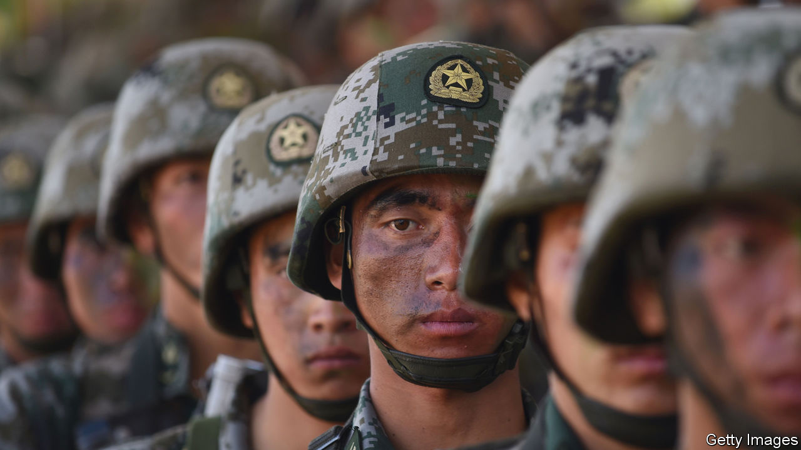

###### Superpower politics

# How scary is China? 

##### America must understand China’s weaknesses as well as its strengths 

 

> Nov 9th 2023 

When Joe Biden meets Xi Jinping in San Francisco next week, the stakes will be high. Fighting in the Middle East threatens to become another theatre for great-power rivalry, with America backing Israel, and China (along with Russia) deepening links to Iran. In the , China is harassing Philippine ships and flying its planes dangerously close to American ones. Next year will test Sino-American relations even more. In January a candidate despised by Beijing may win Taiwan’s presidential election. For most of the year, the race for the White House will be a cacophony of China-bashing.

America’s anti-China fervour is partly an overcorrection for its previous complacency about the economic, military and ideological threat the autocratic giant poses. The danger from China is real, and there are many areas where Mr Biden’s administration should stand up to its Communist rulers. But there is also a risk that America’s view of Chinese power slides into caricature, triggering confrontations and, at worst, an avoidable conflict. Even without war, that rush would incur huge economic costs, split America from its allies and undermine the values that make it strong. Instead, America needs a sober assessment not just of China’s strengths, but also of its weaknesses.

What are those weaknesses? Among the least understood are its military shortcomings, which we describe in a special report on the . After decades of modernisation, it is formidable—terrifying, even. With 2m personnel and an annual budget of $225bn, it has the world’s biggest army and navy and a vast missile force. By 2030 it could have 1,000 nuclear warheads. Mr Xi has ordered it to be capable of invading Taiwan by 2027, say America’s spies. And the pla projects force more widely, too. It intimidates China’s neighbours in the South China Sea and skirmishes with India. It has a base in Africa and is seeking one in the Middle East.

Yet look more closely and the problems leap out. Drilled for decades on Soviet and then Russian military dogma, the PLA is trying to absorb the lessons from Ukraine and to co-ordinate “joint” operations between services, which would be key to any successful invasion of Taiwan. Recruitment is hard. Despite the efforts of films such as “Wolf Warrior” to glamorise dreary military careers with mediocre pay, the pla struggles to hire skilled people, from fighter pilots to engineers. It has almost no experience of combat—Mr Xi calls this “the peace disease”. Its most deadly engagement in the past four decades or so was massacring its own citizens around Tiananmen Square in 1989.

Although China has made technological leaps, from hypersonic missiles to stealth fighters, its military-industrial complex trails behind in areas such as engines for aircraft and ships, and still relies on some foreign parts. American embargoes on semiconductors and components could make it harder to catch up with the global technological frontier. Despite Mr Xi’s endless purges, corruption appears to be pervasive. It may explain why General Li Shangfu was sacked as China’s defence minister this year after only a few months in the job.

China’s military frailties exist alongside its better-known economic ones. A property crunch and the Communist Party’s growing hostility towards the private sector and foreign capital are impeding growth. China’s gdp will increase by 5.4% this year and by only 3.5% in 2028, says the imf. Investment by multinational firms into China turned negative in the third quarter, for the first time since records began in 1998. China’s $18trn economy is big. But despite its much larger population, its gdp is unlikely to exceed America’s by much or at all by mid-century.

Behind China’s military and economic weaknesses lies a third, and deeper problem: Mr Xi’s dominance of an authoritarian system that no longer allows serious internal policy debate. Decision-making is deteriorating as a result. Economic technocrats have been sidelined by loyalists. By one estimate, pla troops spend a quarter of their time on political education, poring over such inspiring works as “Xi Jinping Thought on Strengthening the Military”. Mr Xi’s ideology is that the party, led by him, should command all things, always.

Personalised rule is bad for China—and perilous for the world. Lacking sound advice, Mr Xi might miscalculate, as Vladimir Putin did on Ukraine. However, he may be deterred by the knowledge that if he invades Taiwan but fails to conquer it, he could lose power. One thing is clear: despite periodic and welcome bouts of constructive diplomacy, such as recently resumed ministerial contacts with America, Mr Xi’s commitment to undermining liberal values globally will not diminish.

How should America respond? Judiciously. Trying to cripple China’s economy by isolating it could cut global gdp by 7%, reckons the imf. Closing America’s borders to Chinese talent would count as self-sabotage. Any excessively hawkish policy risks dividing America’s network of alliances. Worst of all, too rapid an American military escalation could provoke a disastrous war if Mr Xi mistakes it for the prelude to American aggression, or worries that unifying Taiwan with the mainland—peacefully or by force—will only grow harder should he continue to bide his time.

From complacency to confrontation to calibration

Instead, America needs to calibrate its China policy for the long run. Regarding the economy, that means openness, not isolation. supports limited controls on exports of technology with possible military applications, but not the broad embrace of tariffs and industrial policy that began under President Donald Trump and has continued under Mr Biden. To maintain its economic and technological edge, America should stay open for business—unlike China.

Militarily, America should seek deterrence but not domination. The Biden administration has rightly sold more arms to Taiwan, built up forces in Asia and renewed defence alliances there. But America should avoid a nuclear arms race or being seen to support formal independence for Taiwan. Dealing with China requires a realistic view of its capabilities. The good news is that its weaknesses and Mr Xi’s mistakes give the West time to counter the threat it poses.■


