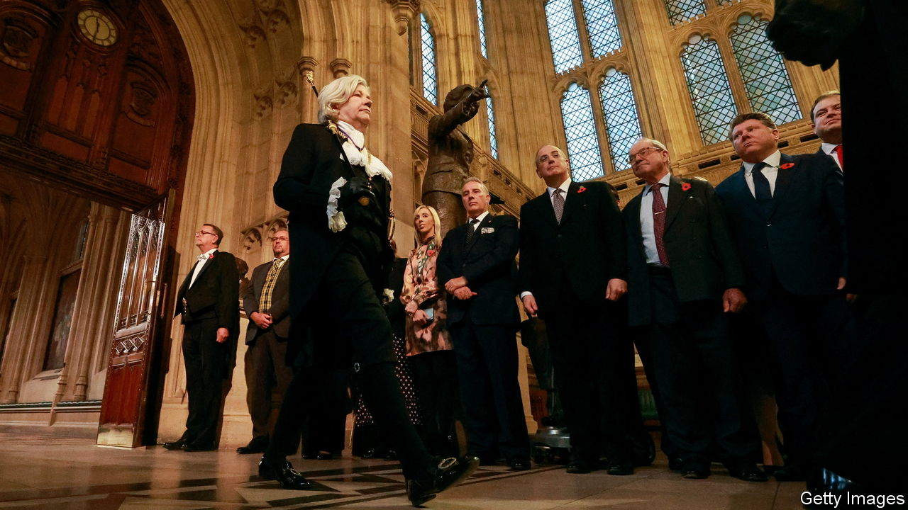

###### Flawmakers

# How to fix Britain’s legislative problems 

##### Parliament is failing at its most basic function—scrutinising laws 

 

> Nov 9th 2023 

THE STATE Opening of Britain’s Parliament, which took place on November 7th, is stuffed with pageantry. The most important is a nod to the English civil war. Black Rod, a stockinged flunkey, is dispatched to summon MPs to listen to the king, only for the doors of the Commons to be slammed in her face. The message: His Majesty can wait. Parliamentarians run the show. 

But how well are they doing? Parliament’s basic job is to , and MPs are botching it. The trend in recent decades is for Parliament to sit for fewer and shorter days, and to spend less time poring over laws. Take the number of urgent questions, a showy procedure whereby a minister is summoned to the chamber to comment on the story . These have exploded, from four in 2007-08 to 104 in 2021-22. The time left over for scrutiny is squeezed. 

Brexit and covid-19 set precedents for  and handing wide powers to ministers, habits that governments find as addictive as monarchs once did. Vague “skeleton” bills let ministers fill in the gaps in laws later. Henry VIII clauses, which allow ministers to alter primary legislation by issuing regulations known as statutory instruments, crop up in the most mundane bills. Even the most consequential decisions can get cursory scrutiny. The obligation for net-zero carbon-dioxide emissions by 2050 became law in 2019 after only 90 minutes’ debate in the Commons and without a vote among MPs. 

This is objectionable in principle. Scholars have long argued that Britain’s parliamentary system leaves the legislature at risk of being ridden over roughshod by the executive. And it is bad in practice, too. Drafting errors are on the rise; impact assessments of laws’ expected costs and benefits are frequently cosmetic or missing altogether. Rushed legislation is invariably bad legislation. Take Boris Johnson’s windfall tax on the oil-and-gas industry, which was driven through the Commons in a day and contained several big design flaws. Or Liz Truss’s law to cap energy prices—similarly hasty and similarly sloppy. Giving ministers so much latitude to make amendments fuels uncertainty.

This malaise strengthens the case for constitutional reform. Proportional representation would end one-party dominance of the Commons; an elected House of Lords would have a powerful mandate to halt badly drafted bills. But neither looks likely and both would entail profound changes in a country heartily sick of upheaval. Moreover, since the Lords is one of the few bits of Parliament still trying to do its job of fine-grained scrutiny, emptying the place risks being counterproductive. 

So simpler and quicker reforms should come first. Some are changes to process. Bill committees are meant to undertake line-by-line scrutiny of laws, but they are ad hoc and controlled by party whips. Putting them on a standing status, and picking their members by a secret ballot of MPs, would give them clout and independence. The Commons should require all non-urgent bills to be published in draft form to iron out glitches and help ensure that policy ideas are fully developed. A Statutory Instruments Act should lay out principles for the use of primary and secondary legislation, and impose tighter scrutiny on regulations made under Henry VIII clauses.

Other reforms should take aim at the people who make laws. Although it is a virtue of democracy that MPs are generalists, amateurism goes too far. MPs should be employing or commissioning experts in policy but their feeble budgets support only four full-time assistants; a representative to Congress in America can employ up to 18 full-time staff. The House of Lords would have greater clout if membership were no longer a bauble for party cronies; a strengthened appointments process could require nominees to meet a test of “conspicuous merit”. 

Fêtes accomplies

But these changes can do only so much. The decline of parliamentary scrutiny reflects a malaise in British political culture. The cabinet should recognise that properly scrutinised legislation serves the country’s needs better than showy, rushed lawmaking. Above all, MPs must remember that their primary constitutional function is not to attend village fêtes and glad-hand constituents, but to be national legislators. This week’s rituals were designed to signify that Parliament is sovereign. It should use that power to fix itself. ■

