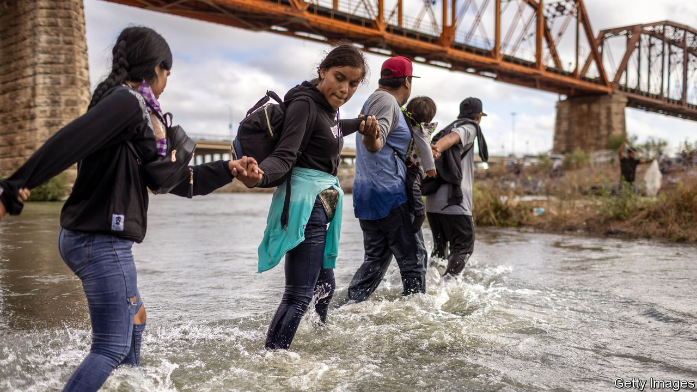
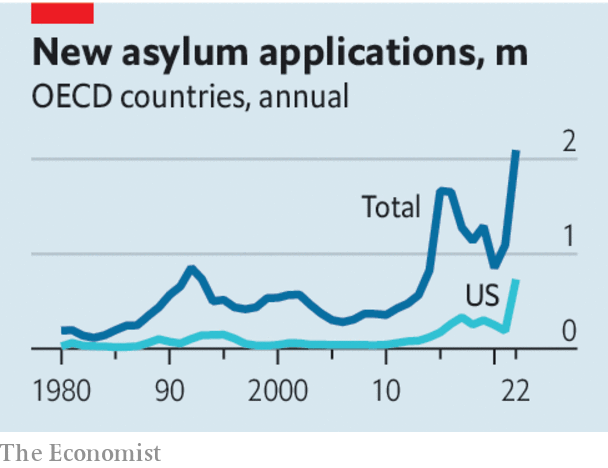

###### Open, but orderly

# More welcoming migration policies require borders that are secure 

##### Let more people in legally, swiftly exclude those who come illegally 

 

> Nov 9th 2023 

LAST YEAR rich countries accepted over 6m permanent immigrants, the highest figure on record. They also registered over 2m applications for asylum. Such numbers are neither unmanageable nor unreasonable, adding up to 0.6% of the receiving countries’ population. The rich world needs immigrants to fill gaps in its ageing labour markets: nearly three-quarters of permanent migrants work. And migrants benefit hugely from moving—otherwise they would not leave. But there is a whiff of panic on both sides of the Atlantic, as voters fret about the  crossing their borders without permission, and politicians vow to get tough. 

In the United States President Joe Biden is adding to Donald Trump’s , and governors are vying to bus irregular migrants to other states. In Europe asylum-seeker numbers are the highest they have been since the crisis of 2015-16, and Italy has just announced a deal with Albania to process asylum claims offshore in a vague arrangement that Albania’s prime minister himself said would not work. Under pressure from a resurgent far right, the German government has said it plans to explore something similar, and pledged to slash benefits for asylum-seekers. 

 


Rich countries are attractive places: peaceful, orderly and, obviously, rich. Incomes in the European Union are 12 times higher than in sub-Saharan Africa. Small wonder so many people want to move from poor countries to rich ones. In a world of free movement, millions more would arrive than rich-country voters are willing to accept. In the real world, the chance of getting a visa is so remote that many claim asylum instead. 

This is not what the asylum system was designed for. Governments in the rich world have struggled to process floods of asylum claims speedily or fairly, and the issue has become politically toxic. Voters detest the notion of disorder on their borders; they want their governments to be in control of who arrives. When they think the borders are secure, however, voters are often more welcoming. In Australia, an island with a fierce deportation policy for people arriving without permission, 29% of the population are foreign-born, compared with 14% in the United States. In Canada (which shares no border with a poor country) the foreign-born share is 23% and, despite a , voters are largely pro-immigration. 

As Canada and Australia have grown, the EU’s working-age population fell by 5m in the decade to 2021. The demographic crunch is less severe in America, but more so in Japan and South Korea. An obvious way to tackle looming shortages of young workers in rich countries would be to let in more immigrants. But for this to be politically feasible, they would need to be admitted through regular, visible channels. That means, for a start, imposing some discipline on the asylum system. Not, as some on the right suggest, by scrapping the Refugee Convention, the international agreement that binds signatories to provide refuge to those fleeing from a credible risk of persecution. Nothing better would replace it. But it is reasonable for governments to discourage abuses of the system. 

So they should process claims quickly, and accelerate the removal of those whose applications fail. There is no fundamental reason why claims should not be heard offshore, before the would-be asylum-seeker sets foot in the destination country. Canada takes large numbers of refugees directly from camps in Africa, for example. However, deals like the one Italy is pursuing with Albania, and Britain has attempted with Rwanda, are often badly administered and subject to legal challenge. So rich countries will still have to beef up their domestic asylum systems. They should increase their support for countries that host large numbers of refugees, such as Colombia, Pakistan and Turkey. Countries from which a lot of asylum-seekers come will also need incentives to take them back. All this will require patience and diplomatic agility, which today are often lacking. 

As they crack down on those who migrate without permission, governments should widen opportunities for people to move legally. They could expand legal pathways for countries that take back failed asylum-seekers, or use a points system to help with selection. They could focus on specific sectors, such as construction or tech, offer more visas to seasonal workers on farms or in hotels, and attract more students. Scholars disagree as to how much expanding legal migration cuts the illegal sort, but it brings huge benefits for the migrants and big ones for the host country, especially if policies encourage migrants to work. 

Migration cannot be managed perfectly, but it can be managed better. By demonstrating that they control their borders, governments may earn themselves political space to open the gates a little wider, without losing elections to those who would slam them tightly shut. ■

