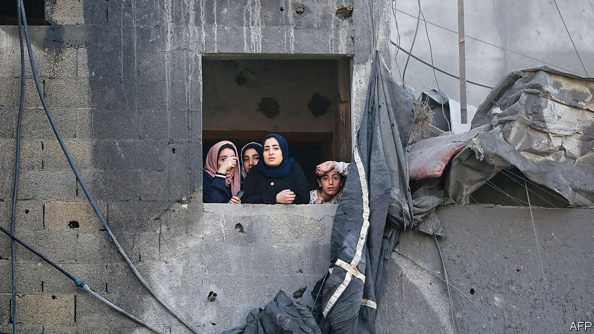

###### Gaza’s civilians

# All parties are blaming each other for the dire situation in Gaza 

##### Aid deliveries work out at 29ml of water per person a day 

 

> Nov 8th 2023 

LIFE in gaza, for many, is now all about walking and waiting. People walk to water trucks and wells, to bakeries, to wherever someone has some food to distribute. Then they wait, often for hours; sometimes they go home empty-handed. At night they wait for dawn, which usually brings a lull in Israel’s bombardment, and a chance to catch a few hours of sleep.


The 2.2m people in  have now endured more than a month of war and near-total siege. Some are also nearing a month of displacement. Since October 13th Israel has repeatedly told the 1.1m inhabitants of northern Gaza to flee south. About three-quarters are thought to have heeded the warning. There are fewer  strikes in the south, but it is hardly safe: on November 7th, for example, one Palestinian was killed and nine others injured in a strike on a school in Khan Younis, the first city south of the evacuation line.

Most of those displaced are sheltering in UN facilities, hospitals and other public buildings—all of them bursting at the seams. At a vocational-training centre in Khan Younis, the most crowded UN shelter, each resident has less than two square metres of personal space and each toilet is shared by at least 600 people.

Before the war the average person in Gaza received 80 litres of water a day. In emergencies, the UN says a minimum of 15 litres is needed for drinking, cooking and hygiene. The typical daily allotment now is just three litres, much of it dirty stuff that comes from agricultural wells. Bathing has become an unimaginable luxury for many Gazans, and dehydration is a common complaint. Health workers say there have been thousands of cases of diarrhoea caused by poor sanitation.

Food is scarce too. Shoppers struggle to find basics like eggs, rice and cooking oil. They queue overnight at the handful of bakeries still operating to secure a few loaves of flatbread. A typical meal is ready-to-eat staples and a few vegetables: canned tuna and raw onions, perhaps with a bit of bread. Some mothers are using contaminated water to prepare baby formula.

On November 7th the Israeli army denied that there was a shortage of food, water and other basic supplies in Gaza. It said that 665 lorries carrying 3,000 tonnes of food and 1.15m litres of water had entered the enclave since October 21st, when Israel lifted its veto on aid deliveries. The numbers sound impressive—until you divide them among 2.2m people over 18 days. The shipments work out to just 76 grams of food and 29ml of water per person a day.

The situation is worse in northern Gaza, where an estimated 300,000 people either could not or did not heed Israel’s evacuation order. Aid agencies have struggled to deliver supplies to the area, which is now cut off from the south by Israeli troops. The un says there are no bakeries still operating in the north. Some Palestinians who have tried belatedly to flee from the area have found the journey perilous: there have been numerous reports of civilians being shelled or bombed while making the walk.

At a press conference on November 8th, Hamas officials blamed the un for failing to provide enough aid to Gaza. They made no mention of their own role in starting the war, nor their responsibility for governing the enclave. Their indifference to the misery in Gaza has sparked a few displays of defiance. When Iyad al-Buzm, a spokesman for the interior ministry, held a press conference outside al-Shifa hospital earlier this month, a man walked in front of the cameras and shouted criticism of Hamas. Such displays are rare: critics have been tortured and killed before.

At least 34 Palestinian media workers have been killed by Israeli strikes since the war began, according to the Committee to Protect Journalists, a non-profit organisation in New York. Journalists in Gaza also say they have received threats from Hamas not to report anything that might be unflattering to the group. If Israel does not kill them, some grumble, Hamas will.

Most people, though, have no time for politics. They are simply trying to survive—and waiting for a ceasefire that seems a long way away. ■


