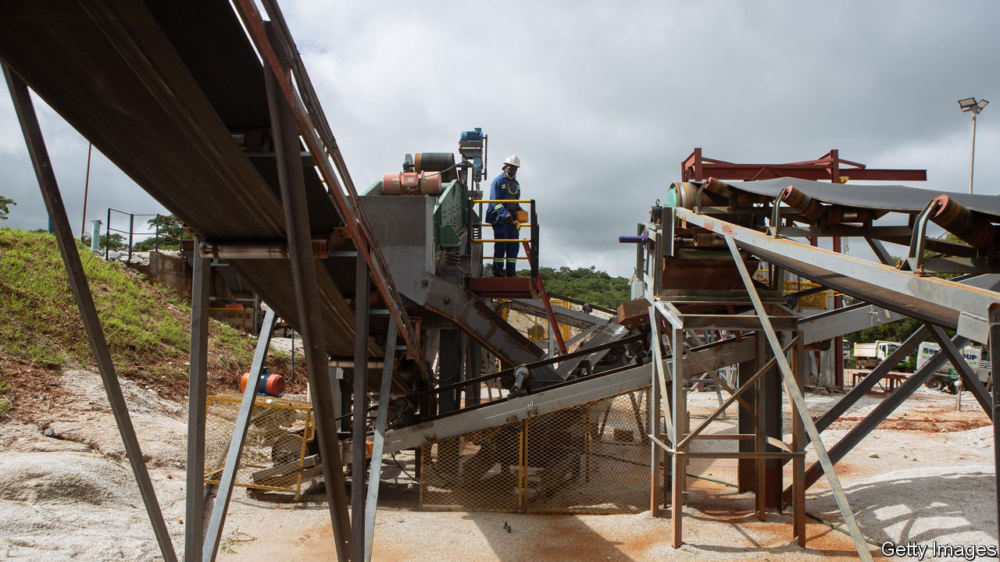
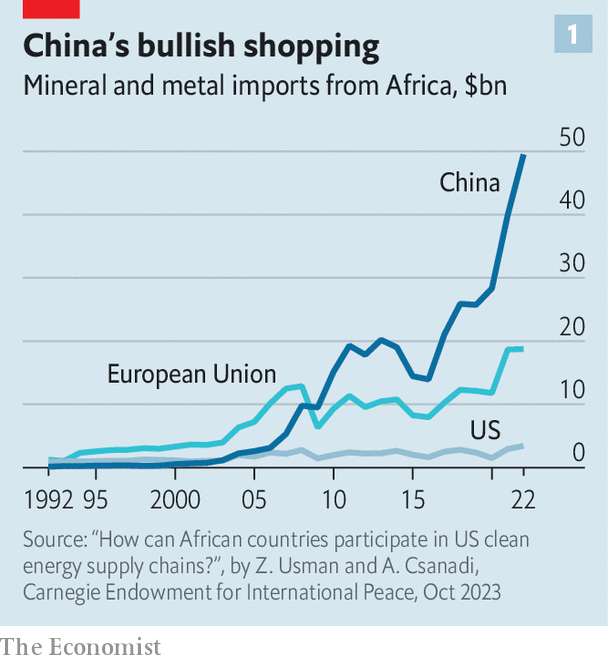
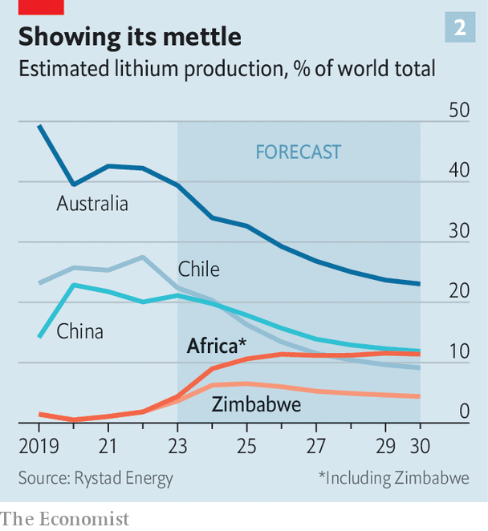

###### Critical minerals

# China is winning Africa’s “white-gold” rush for lithium 

##### Its grip on clean-energy minerals is a challenge for the West 

 

> Nov 9th 2023 

A visit to the district of Goromonzi, in north-east Zimbabwe, is a lesson in economic history. Its fallow fields hint at the decay that followed the government’s seizure of white-owned farms more than two decades ago. In the surrounding hills ad hoc campsites reveal the sites of artisanal gold-miners, digging for the same yellow metal that led British colonists to cross the Limpopo river in the 19th century. 

Today the rush is on for “white gold”. Every day scores of lorries rumble through Goromonzi, carrying lithium bound for China, where most of the metal is refined for use in batteries for electric vehicles and electronics. They carry loads from Arcadia, Africa’s biggest lithium mine, opened this year by Zhejiang Huayou Cobalt, a Chinese firm. “China is buying any lithium it can find,” says a local industry insider. “There’s an absolute feeding frenzy.”

 


China’s dash for lithium is part of a bigger challenge for the West. America and its allies want to weaken China’s grip on clean-energy supply chains. They see Africa, home to perhaps 30% of the world’s critical mineral reserves, as part of the solution, and argue that they can do more to help African countries add value to minerals before export. 

Yet China remains ahead. In 2022 the value of its imports of minerals and energy was double those of America and the EU combined (see chart 1), according to the Carnegie Endowment for International Peace, a think-tank in Washington. Its role in Africa’s lithium boom shows why. In 2025 Africa’s share of global lithium production will be 10.6%, reckons Rystad Energy, a Norwegian firm, up from just 0.1% in 2019 (see chart 2), with Zimbabwe accounting for most of the rise. Overall, more than 90% of Africa’s supply this decade will come from entities at least partly owned by Chinese firms, estimates Benchmark Mineral Intelligence, a consultancy. 

 


China’s urgency is spurred by its desire to maintain dominance of supply chains. China has 8% of global lithium reserves but refines 60-70% of the metal. The midstream firms that perform the chemical process, some of which are part of mining groups like Huayou, need to be fed. On average mining projects take 17 years from discovery to production, according to the Natural Resource Governance Institute, a think-tank in New York. But many Chinese firms are acquiring existing assets such as Arcadia. Huayou bought Arcadia from Prospect Resources, an Australian-listed firm, for $422m in 2022—and is developing it at breakneck speed. 

African countries are attractive, says Cameron Perks of Benchmark, because “there aren’t many places left to go for the Chinese”. Australia, an American ally, has this year blocked two Chinese investment proposals from firms involved in mining lithium and rare-earth minerals. Africa is “a virgin land for lithium minerals”, adds Susan Zou of Rystad, noting that Chinese miners have operated in African countries for many years. Though prices have swooned this year, they are still high enough for healthy margins.

Western firms are exploring for lithium in countries such as Ethiopia, Ghana, Namibia and Rwanda. Most projects are not yet producing ore. Some may still end up in the hands of Chinese firms. Before it decided to sell Arcadia, Prospect Resources had been talking to Western diplomats about getting financing from development agencies, but became frustrated at their slow pace. Huayou did the deal in months. 

There are reasons for Western hesitation. Some refineries are being built outside China. But investors worry that new mines and processing plants could lead to oversupply and depress prices. They also fret about the political risks of African projects, especially in countries with histories of graft and human-rights abuses, like Zimbabwe and Congo. 

Moreover, America’s domestic policies are not encouraging investment in African mines. For example, some tax incentives in the Inflation Reduction Act (IRA), Joe Biden’s bumper package of clean-energy subsidies, are applicable only if a rising proportion of the underlying minerals comes from America or countries with which it has a free-trade agreement. Yet America does not have any such agreements with countries in sub-Saharan Africa. 

“If not rectified soon,” argue Witney Schneidman and Vera Songwe of the Brookings Institution, an American think-tank, “the IRA will have the unintended consequence of...ceding the African market in critical minerals to other nations—such as China.” 

Nor is China blind to Africa’s desire to add value. Huayou has a processing centre at Arcadia. More Chinese firms could process and refine metal in Africa over the next few years, notes Ms Zou. She points out that Chinese miners already do most of the first stage of cobalt-processing in Congo. Chinese battery firms are also building facilities in Morocco. 

Nevertheless, it is hard to see how Chinese dominance of critical-mineral mining is ideal for Africa. China’s immediate priority is getting as much raw material out of Africa as quickly as possible. The case of Zimbabwe and lithium is also a reminder that Chinese mining comes in various forms. In addition to formal miners, there are numerous middlemen who buy rocks from artisanal miners at knockdown prices. In a report published in March, the Zimbabwe Environment Law Association (ZELA), a local NGO, concluded that “the Chinese are heavily involved in the illicit trade of lithium.” It added: “Domination by one country may lead to undesirable results such as under-valuation of mineral resources, tax avoidance and human-rights abuses in the sector.” 

At Goromonzi, Tadiwanashe Gwena, a community leader, says residents are “agitated” by the mine. “People know that the real value of lithium is not being ploughed back into the community.” The West says it wants Africans to benefit more from the value of their mineral endowment. Yet while it is talking, China is digging. ■

