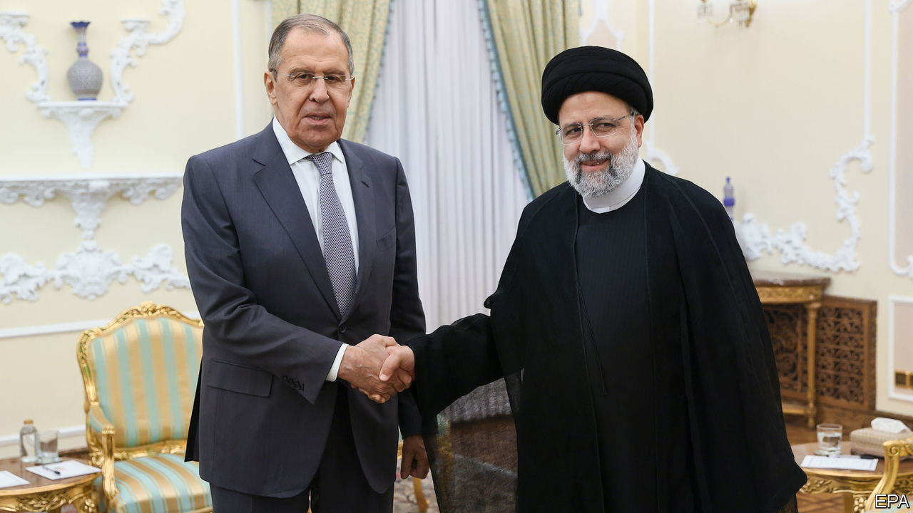

###### Crisis in the Middle East

# The Gaza war has deepened Joe Biden’s Iran nightmare 

##### For America, Iran is part of a new “axis of evil” with Russia and China 

 

> Nov 5th 2023 

WHEN PRESIDENT JOE BIDEN dispatched aircraft-carriers to the Middle East after Hamas’s attack on Israel last month, he had one word for Iran and allies: “Don’t”. Since then there have been rocket, drone and missile attacks on Israel and American troops from Iran’s network of allied militias across the region, but no escalation into a regional conflagration—so far. On November 3rd Hassan Nasrallah, the leader of Hizbullah, the most powerful Iran-backed militia, made a speech in Lebanon which was full of bombast, but which also appeared to . 

Yet amid the  in Gaza between Israel and Hamas, a broader and potentially more dangerous rivalry with Iran is growing. Having abandoned the Trump-era approach of “maximum pressure” on Iran, in recent months the Biden administration had sought quietly to reduce tensions. Today, however, not only has Iran celebrated Hamas’s attacks and through its proxies threatened American interests. It also appears to be acting with the tacit co-operation of Russia, and even China, in a loose grouping of autocracies. That raises grave questions about whether Mr Biden can refashion a new  for the Middle East.


Since October 7th Iran’s  has been to raise tensions without provoking an all-out confrontation. It says it had no direct involvement in planning or enacting Hamas’s atrocities, a claim that American and Israeli public statements mostly corroborate. Sporadic attacks against Israel from pro-Iran Houthi fighters in Yemen, and drone attacks on American bases in Iraq and Syria by local militias there, have raised the temperature without reaching boiling point. Mr Nasrallah noted that Hizbullah’s calibrated violence, mainly involving rocket attacks on northern Israel, had still hurt Israel’s economy by forcing the evacuation of its communities on the Lebanese border and causing military uncertainty.

Iran is now busy trying to maximise the diplomatic dividend, as the world turns from the horror of Hamas’s attack to the agony of Palestinians facing Israel’s retribution. Iran’s foreign minister, Hossein Amirabdollahian, has been as active as Mr Blinken in regional consultations. Many countries are urging Iran to intercede, whether to contain the conflict or help release hostages. Iran hopes to boost its own influence and spoil American-backed plans for closer links between America, Israel and the Gulf states under the . It is watching with glee as the pro-American camp comes under growing strain. Israel and Arab states are withdrawing ambassadors from each others’ capitals. Pro-Palestinian demonstrations are growing in the West. Tens of thousands marched in Washington, DC, to call for a ceasefire. 

Yet it is too soon for Iran to gloat. In America a rapid and potentially deep shift in policy towards Iran is under way. It has been a neuralgic problem since the overthrow of the Shah in 1979. Forty-four years ago this month, Islamist student activists took 52 people hostage at the American embassy in Tehran. Barack Obama sought to neutralise the most dangerous aspect of the US-Iran enmity—Iran’s growing nuclear programme—through the Joint Comprehensive Plan of Action, negotiated in 2015, which sought to control Iran’s weapons programme. The deal was abandoned in 2018 by Donald Trump, who instead began to apply sanctions. 

Having tried and failed to restore the nuclear deal, the Biden administration opted for low-key diplomacy. Before October 7th there were : Iran diluted the concentration of uranium being produced in its centrifuges, and America eased the enforcement of sanctions. Iranian oil exports have surged from about 380,000 barrels per day in 2020 to about 1.5m now, mostly to China via shadowy middlemen. A contentious  that secured the release of five Americans detained in Iran in September involved the unfreezing of $6bn in Iranian revenues in South Korea (which are now stranded in an escrow account in Qatar). 

That approach by the White House is now impossible to sustain. One reason is that Iran is increasingly co-operating with Russia, and has closer economic ties with China. As Antony Blinken, America’s secretary of state, told the Senate on October 31st, “To put it succinctly: for our adversaries, be they states or non-states, this is all one fight.” He urged Congress to pass a $106bn supplemental budget to help Israel, Ukraine and Taiwan. 

He added that there were “profound connections” between America’s autocratic foes. Iran supplies Russia with drones for use in Ukraine. The two co-operate in Syria, and Russia has hosted Hamas visitors in Moscow. The  reported that Wagner, the Russian mercenary group, may supply anti-aircraft weapons to Hizbullah. These ties could develop further. After the expiration of long-standing UN arms sanctions on Iran on October 18th, trade in ballistic-missile technology could increase, perhaps including Iranian supplies of missiles to Russia for use in Ukraine, according to Western officials. 

How might America respond to all this? Congressional Republicans want the administration to get tougher. Lindsey Graham, a senator, has said America should set a clear red line by declaring that the killing of an American soldier by Iran or its allies would invite a direct American attack on Iran. Marco Rubio, a Republican senator, asked if America has the will to use its deployed forces in the Middle East to hit Iran. “At this moment we do not have a credible deterrent,” he said. Lobbying groups are on the warpath, too: United Against a Nuclear Iran, a prominent one, has called for America to bomb Iran forthwith. “We have gone from maximum pressure to maximum deference to the regime,” complained Mark Dubowitz of the Foundation for the Defence of Democracies, another think-tank. 

So Mr Biden is on the defensive. He will probably impose further sanctions, even though Mr Trump’s “maximum pressure” did not markedly change Iran’s behaviour. The Iranian regime has survived years of economic isolation and, more recently, over 12 months of street protests. Yet he and his advisers also know that to pursue military action against Iran would be a huge gamble. Attacking its nuclear sites would at best delay the programme, and at worst push Iran to dash for the bomb—and probably ignite the regional war that America dreads.

As a result, diplomacy with Iran is the idea that will not die, if only because the alternatives seem even less palatable. “The nuclear issue seems immunised from all other pressures and all other considerations. I suspect this sort of arms-control approach will be with us for some time to come,” says Ray Takeyh of the Council on Foreign Relations, an American think-tank. Indeed, there is one thing that would make the war in Gaza even more terrifying: if a nuclear-armed Iran were standing behind its “axis of resistance”. Hamas’s onslaught makes a US-Iranian deal seem more necessary than ever—and yet also more difficult than ever to imagine.■

