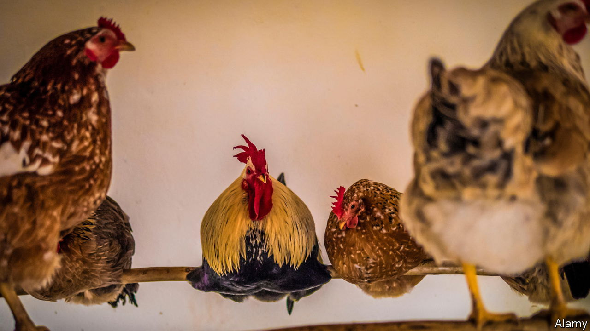

###### Chicken wars

# The battle over South Africa’s spicy-chicken market 

##### A fight between Pedros and Nando’s offers insights into concentrated markets 

 

> Nov 9th 2023 

Competition specialists tend to be a gloomy lot, even when markets seem to be working pretty well to ordinary folk. But they become especially glum when it comes to South Africa, sub-Saharan Africa’s biggest industrialised economy. 

Economists at the IMF blame a lack of competition and the high market power of many South African manufacturers for the country’s weak economic performance. Firms with big shares of the domestic market drive up prices while growing fat and lazy, holding back productivity growth. A tangle of red tape keeps out foreign firms and makes it harder for new ones to sprout at home. Yet a battle for the stomachs of those who love spicy chicken offers hope. It shows that when markets are open to new entrants, South African firms can be fiercely competitive.

Nando’s, the market leader, opened its first outlet in Johannesburg in 1987. Since then it has gone on to become one of the world’s most successful restaurant chains, with more than 1,200 branches across 22 countries. In the process, it has created a brand identity that is built around spicy chicken and even spicier advertising.

Now it is facing competition from Pedros, a plucky upstart that is taking it on at its own game—and in its home market. Visit one of its restaurants, and at first glance it looks a lot like Nando’s. The aesthetic is vaguely Afro-Portuguese, with a giant Rooster of Barcelos painted on the wall. A basket of sauces stands on every table—from “mild” to “extra hot”—and the smell of freshly-grilled peri-peri chicken wafts in from the busy kitchen. 

Last year, South Africa’s advertising-industry regulator said in a non-binding ruling that Pedros had traded on the name and reputation of its rival in its adverts. Though its brand identity may be strikingly similar to its larger competitor, its growth has been much faster. Launched five years ago, it has already opened no less than 125 stores, with another ten already in the pipeline. 

The CEO of Nando’s South Africa, Mike Cathie, claims to welcome the competition. “While Pedros may attempt to resemble us more than most,” he says, “they certainly aren’t the only ones.” And it doesn’t seem to be doing his business any harm. He says Nando’s has had its highest-ever sales and a record number of restaurants in South Africa this year. Both firms are privately owned and do not publicly release their financial results.

Cheap chips

Price is one differentiator. Pedros is much, much cheaper. It sells a quarter-chicken, chips and a roll for just under 45 rand ($2.45). The same meal at Nando’s costs 75 rand. Pedros says it has lower costs because of in-house marketing, manufacturing and distribution.

Lower prices ought to please South Africa’s competition regulator, which fretted earlier this year about the rising consumer price of chicken. The meat, along with eggs, accounts for up to 7% of total spending by the poorest decile of households. Chicken is by far the country’s most popular meat—the average South African gobbles down 38kg of it a year, compared with 16.9kg of beef—yet most of it comes from just five firms that have high levels of protection from imports. Regulators worry that such a concentrated market might allow companies to drive up prices. 

The lesson Pedros offers is that in industries where barriers to entry are low, such as restaurants, there is no shortage of innovative new firms willing to shake up markets. The IMF reckons that by making it easier for this to happen across the rest of the economy, among other reforms, South Africa could boost its GDP by about 2.5% over five years. These firms are able to compete not just at home, but also abroad. Nando’s has outlets across the world, from Australia to Zimbabwe. Pedros has a few in neighbouring Botswana.

Yet barriers to entry do not explain everything. Perhaps the secret sauce of both businesses is, quite literally, their spicy sauce—along with the insight that there is no such thing as too much flame-grilled peri-peri chicken on the market. ■

