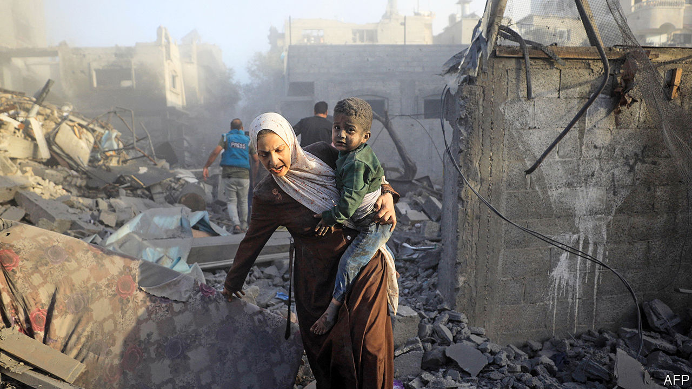

###### Israel’s window of legitimacy

# Will America pull the plug on Israel’s invasion of Gaza? 

##### Israel is racing to destroy Hamas as a global backlash grows 

 

> Nov 7th 2023 

Israel’s ground offensive is entering a dangerous new stage, nearly two weeks after it began. On November 5th the Israel Defence Forces (idf) unleashed a series of devastating air strikes in and around Gaza city. The goal was to damage Hamas’s tunnel networks. Israeli troops are now operating in the city’s centre, where they believe Hamas has its underground headquarters, having encircled it from three sides. The advance units on different axes are now so close to each other that one of their chief concerns is avoiding “friendly fire” incidents.


Israel’s forces have penetrated far farther into Gaza than in the ground campaigns of 2009 and 2014. They believe they are getting closer to their stated goal of destroying Hamas, in particular its leadership, which Israeli intelligence believes to be holed up under the Shifa hospital (Israel claims it has evidence that Hamas is using other hospitals in the city as cover too; Hamas says this is a “false narrative”). Yoav Gallant, the Israeli defence minister, said on November 7th that Israeli forces had Yahya Sinwar, the current head of Hamas in Gaza, surrounded (he did not specify where). But to get to Hamas’s headquarters, the idf must first get through the group’s defensive lines.

On November 4th  was invited by the idf to accompany troops to the front line. Over the course of several hours no civilians were seen. Officers and soldiers said they had sighted only a handful since entering Gaza city on October 27th. Around three-quarters of the 1m-strong civilian population is estimated to have heeded the idf’s warnings and fled south, away from the part of the city which Israeli troops are now encircling. 

But for the generals preparing the battle plans, the diplomatic clock is ticking. In horrific scenes over 10,000 Palestinians have already been killed, according to the Gaza health ministry, which is controlled by Hamas. More than 11% of Gaza’s buildings have been damaged or destroyed.

That explains why Antony Blinken, America’s secretary of state, received a chilly reception as he shuttled across the Middle East in recent days. Anger is mounting across the region. In Amman his Jordanian counterpart, Ayman Safadi, told Mr Blinken to “stop this madness”. The language he heard in private across the region was even tougher. His meeting with Mahmoud Abbas, the Palestinian president, lasted less than an hour and ended with no joint statement. Recep Tayyip Erdogan of Turkey did not bother to meet him at all.

Israeli generals still talk about waging a long campaign that will last up to a year. On November 7th Prime Minister Binyamin Netanyahu told abc News that Israel would be in charge of Gaza’s security for an “indefinite period”. In practice, though, what Israeli officers call their “window of legitimacy” is probably far shorter. How fast that window closes will depend largely on America, which is supplying Israel with munitions, diplomatic support and an aid package worth perhaps $14bn. If Joe Biden wants the war to end, Israel will be hard-pressed to ignore him.

So far, he does not. Although he now supports “humanitarian pauses” to allow more aid to enter Gaza, Mr Biden has rejected calls for an outright ceasefire. But administration officials have made clear, in a series of leaks, that they doubt Israel has a coherent exit strategy in Gaza. They complain that Mr Netanyahu is barely willing to discuss the topic, and say they want to put their concerns on the record now lest the war end badly.

They also have concerns about Israeli tactics. Asked about the IDF’s efforts to minimise civilian deaths, John Kirby, a spokesman for the National Security Council, practically tied himself in knots: “We have seen some indications that there are efforts being applied in certain scenarios to try to minimise [them],” he said. To think a war risks becoming a devastating quagmire but to support it nonetheless is an untenable position—especially when many American voters agree.

An Associated Press poll found that 58% of Democrats think Israel’s response has gone too far and 44% think America is too supportive of it. A Quinnipiac survey of registered voters found that 51% of independents and 66% of people aged 18-34 disapprove of Mr Biden’s policy. His ratings have plummeted among Arab-American voters, which could hurt him next year in crucial swing states like Michigan. Sources in Washington think it will still be several more weeks before Mr Biden pivots to talk of a truce—but do not doubt that he will make such a shift.

Arab states certainly hope so. Fears of a multi-front war, which were acute in the days after Hamas’s massacre, have eased. Hizbullah, a Lebanese Shia militia, is still firing rockets daily at Israel, but Hassan Nasrallah, the group’s leader, signalled in a speech on November 3rd that he was not yet keen on all-out war. The Houthis, a Shia militant group in Yemen, have lobbed drones and missiles at Israel but are too far away to pose a strategic threat.

Many regional autocrats would be happy to see Israel smash Hamas. But they are also nervous that the war will mobilise their subjects, many of whom are already restive about awful economic conditions. This adds to pressure on both America, which has heard their fears for weeks now, and Israel, which is keen to preserve its recent diplomatic gains in the Arab world.

So far, most countries have made do with symbolic rebukes of Israel. On November 2nd the lower house of Bahrain’s parliament announced that the country would recall its ambassador from Israel. The chamber has few powers; recalling ambassadors is not one of them. Envoys from both countries had gone home weeks earlier. Parliament, in a fit of populism, made it seem as if lawmakers had decreed their return. Officials in both Bahrain and Israel say diplomatic ties remain intact.

Four days later King Abdullah of Jordan announced that his air force had dropped a shipment of medical aid into Gaza. Jordan would not have taken such action without seeking Israel’s approval, which the Israeli army later confirmed it had indeed given. By omitting that detail from his announcement, though, the king could act as if he had challenged Israel’s blockade of Gaza. Such gestures do not earn much goodwill at home, however. 

Even the United Arab Emirates (uae), Israel’s closest Arab ally, has grown increasingly critical (at least in public). Anwar Gargash, a foreign-policy adviser to the uae’s president, said at a conference on November 4th that America should push for a ceasefire, “the quicker the better”.

Then there is Israel itself. Morale is high in the army and Israelis seem willing to accept far more casualties than normal (36 Israeli soldiers have been killed so far). But the public is furious with a prime minister more concerned with political survival than battlefield strategy. Protesters gathered at Mr Netanyahu’s house on November 4th to demand his resignation.

 


Another question is the economy. The month-long Lebanon war in 2006 cost around 9.5bn shekels ($2bn at the time, or 1.3% of GDP), whereas the last big Gaza conflict in 2014 cost 7bn shekels (0.6% of GDP). This one may be even costlier. The Bank of Israel thinks the government’s deficit will climb to 3% of gdp next year, compared with a 0.6% surplus in 2022; some outsiders put the estimate above 5%. Mobilising 360,000 reservists has left parts of Israel’s economy with a shortage of workers, even if some of them have now been sent home.

Israeli officials hope the next phase of the war will change these considerations. If the idf can destroy the facilities it has surrounded in Gaza city and kill large numbers of militants, it hopes Hamas’s chain of command will be broken. Some leaders may escape, either through tunnels or disguised among evacuees, to southern Gaza. But Israel believes that having them on the run will weaken Hamas. That could allow a shift in strategy. “We can change tactics, have fewer forces inside Gaza, and attack Hamas strongholds in a series of smaller raids,” says one general.

That in turn could ease international pressure, which spikes every time Israeli jets bomb a bakery or a refugee camp, and ease pressure on the economy by allowing the army to release some reservists. The Israelis also recognise that relieving the humanitarian crisis in Gaza could buy more time. On November 6th the UAE announced that it would set up a 150-bed field hospital in Gaza, a move co-ordinated with Israel. On November 8th Israel said 50,000 more people had fled north Gaza through a temporary civilian corridor. 

The buck stops here

Arguably, though, the biggest challenge to Israel’s international legitimacy is Mr Netanyahu himself. His government is stacked with radicals. Amichai Eliyahu, the heritage minister, recently suggested dropping a nuclear bomb on Gaza. Zvi Sukkot, the new head of a parliamentary committee that oversees the occupied West Bank, is a far-right ideologue who has been investigated by Israel’s Shin Bet for his alleged extremist activity.

When they met in Ramallah, Mr Abbas told Mr Blinken that the Palestinian Authority, which controls parts of the West Bank, could return to Gaza to govern the enclave after the war. Such an outcome would please both the Israeli army and the Americans. But Mr Abbas added that it would happen only “within the framework of a comprehensive political solution”—in other words, as a step towards a two-state solution, which Mr Netanyahu has spent his entire career fighting against.

On November 8th Mr Blinken offered a more pointed criticism of Israel’s post-war plans. There could be no permanent reoccupation of Gaza, he said, nor any forced displacement of Palestinians out of Gaza. He also ruled out any reduction in its territory (some Israeli officials have proposed creating a larger “buffer zone” around Gaza, on land carved out of the enclave). Mr Netanyahu has not ruled out any of these. If he stays in office, there will be no serious talk of an endgame. America’s patience will run out and Israel will find its room for manoeuvre increasingly limited. ■


