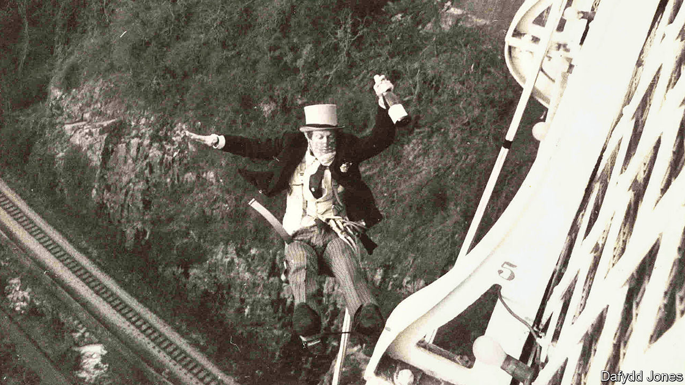

###### Elastic adventures

# David Kirke believed safe sport repressed people’s imaginations 

##### The world’s first bungee-jumper and founder of the Dangerous Sports Club died on October 21st, aged 78 

 

> Nov 9th 2023 

It nearly didn’t happen. The women, in this case two sisters of one of the would-be jumpers, had warned the police, and they had staked out the bridge. The jumpers themselves, who had partied all night and trashed a rather elegant Bristol flat, didn’t feel entirely in the pink either. But the stunt had to happen, because the invitations had been sent: “April Fools’ Day, 1979, Clifton Suspension Bridge, Bristol. Bungee-jumping at dawn. Morning dress”.

David Kirke was ready to go first. He was older than the others by a decade, heavily bearded—though on that day swathed in a scarf, in case his mother recognised him when it all hit the papers—and founder of the Dangerous Sports Club (DSC) to which they all belonged. He was therefore the leader, though ideas for stunts flowed generously between them as they caroused in the pubs and bars of Oxford. This particular one came from a TV documentary about young men jumping off bamboo platforms in Vanuatu, with only a vine tied round one ankle to break their fall. Why shouldn’t Oxford students prove their manhood in the same way? 

Some clever people belonged to the DSC, all proud to sport the club tie of a bloodied silver wheelchair on a black ground. One became a rocket scientist at NASA, another a Treasury minister. Apparently they had worked out the false extension curves of the elastic ropes they had tied to the bridge, 245 feet above the Avon, and felt confident. Their leader never bothered with a weight test, on the simple principle that, if he did, what he was about to do would not be dangerous. Whoopee! was his only thought. 

So he flung his morning-suited legs over the parapet, and dropped. He fell like a stone, and the wind took his top hat off, and he dropped his bottle of champagne, but he bounced back up; so the other three dropped after him. The police nabbed them all in their jubilant state, and extracted a promise not to do it again. They did it all over the place. So began a worldwide craze and, in New Zealand, a multi-million-dollar industry. 

Fame and fortune he dismissed, though. Fortune eluded him anyway, and he never held down a proper job; other people’s bank accounts propped him up, while he dedicated his life to the pursuit of danger, literature, red wine and the art of losing his wallet when restaurant bills arrived. (“Uncle Dodge”, his friends called him.) Adventuring was in his blood, with an Alpinist father who trained on the roofs and spires of Cambridge; recklessness was his character. He was driven, too, by sheer scorn for formal sports, so hamstrung by instructions that they were no longer fun. In bungee-jumping, there were no rules. It was pure artistry, a beautiful commitment of the body to air and space. He felt the same about hang-gliding and microlighting, other brand-new sports he could tailor to his wildest thoughts, such as drifting in a gorilla suit round the Houses of Parliament while playing the saxophone. 

Cluster ballooning was something else he pioneered, piloting across the Channel in 1986 a giant inflatable kangaroo held up by four helium balloons. He sat cosily in the pouch as he drifted over to some fine on the other side. At 10,000 feet, a jumbo jet had to take action to avoid him. As a  editorial remarked, “If [the pilot] hasn’t acquired a permanent cardiac murmur, a facial tic and a tendency to wake screaming from his sleep, airborne kangaroos must be much more common over the Channel than most of us had hitherto supposed.” The police fined him £100 for flying without a licence. 

Skiing was an especially boring sport, until he applied Surrealism to it. Each season from 1983 he encouraged DSC members to swoosh down the slopes of St Moritz on whatever might do for a conveyance: an ironing board, a grand piano (while playing a duet), a Louis XV dining suite (with wine waiter), a carousel horse (ridden by himself in full hunting pinks), a tandem bike and a fully crewed boat with oars. Federico Fellini was his inspiration. The Swiss authorities put up with everything until the appearance of a double-decker London bus. 

As the first bungee-jump showed, he liked to turn stunts into formal occasions. Not all DSC members were upper class, but enough were to make it a good branding device. Black-tie and tails were worn, and engraved invitations sent, for a cocktail party on the rim of an active volcano in St Vincent and for an all-night Beach Boys rave on Rockall, an uninhabitable chunk of granite 300 miles off the Scottish coast, to which they had sailed in their smart togs through Force 9 gales for five days. The romantic in him hoped to return one day with two Wagnerian , somehow recording them against the stormy ocean. The same romantic nursed a project to fly on a giant inflatable Pegasus from Mount Olympus into Libya, approaching the region where his great hero, Antoine de Saint-Exupéry, had flown and disappeared. He wanted to devise just one more flying machine.

Gradually the DSC fell victim to the middle-ageing of its members, who married and, most of them, got grand jobs. He did neither. In his mind the club was still going strong, helped, he told  mysteriously, by Jesuits in western China. He was still “an odd little...walkabout spider” in the middle of a great web of people and the huge piles of papers and photos, stacked in his council flat in Oxford, which were to be his memoir. His stunts, more than 80 of them, had never been an adrenalin fix. He had done them because they were new, fun to watch, and showed his contempt for bureaucracy and the grimness of Thatcherite Britain. They declared a philosophy of absolute freedom to experiment, at personal risk. Most people thought the DSC was a mad idea. Was it madder to jump off a bridge, or to live a humdrum life? 

During that night in the cells in Bristol, the police kindly brought them the half-drunk bottles of wine they had abandoned by the Clifton bridge. It was a nice addition to his euphoria. He had dreamed for a while of how it might be to jump from a bridge and, instead of dying, bounce back up. Now he had done it, he no longer feared meeting the Man Upstairs. He could bounce back. And bungee’s happy message was: anyone could. ■

