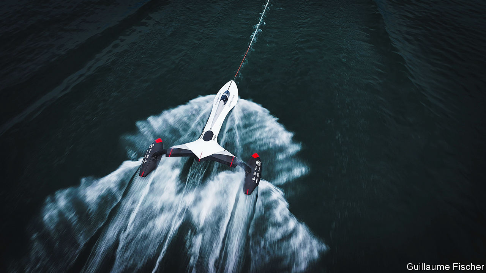

###### The wind in their sails

# How two teams plan to smash the world sailing-speed record 

##### Neither craft looks much like a sailing boat 

 

> Nov 8th 2023 

Launched in 1869, the  was the fastest sailing ship of its time. These days the clipper is a London tourist attraction. In its prime, when it dashed across the world carrying tea from China and wool from Australia, it could reach a heady 17 knots (31.5kph, or 19.6mph). Modern racing yachts, employing radical designs based on 150 years of advances in aerodynamics and hydromechanics, go much faster. And even stranger craft are hoving into view, as part of an attempt to break the speed record for a sail-powered craft, which was set, in 2012, at 65 knots. 

Speeds have been rising for years. In the 1970s, as hulls became narrower and slippier, racing yachts began to slice through water at more than 30 knots. In the 1980s daredevil windsurfers reached over 40 knots. They were overtaken in the 2000s by kitesurfers at more than 55 knots. The physical demands and risk of injury from balancing on a small board at such a pace, however, means that sailing vessels—of a sort—are back in the race.

The present record was set by Paul Larsen, an Australian. He used an odd-looking catamaran called which rose above the water on hydrofoils and was propelled by a wingsail. These rigid structures, which resemble a vertically mounted aircraft wing, harness the wind more efficiently than cloth sails. 

The record is set over a one-way run of 500 metres. To qualify, a craft has to be able to float, have at least one person on board, be propelled only by the wind and be in contact with the water. The new contenders comply with these rules, though, like Mr Larsen’s craft, neither looks much like an ordinary sailing boat. One, called , has its origins in the Swiss Federal Institute of Technology Lausanne. The other comes from Syroco, a marine-technology startup based in Marseille, in France. 

The (pictured) resembles a futuristic jet fighter. Rather than a sail or a wingsail, the vessel is propelled by a kite. At high speeds, only the front of the boat and the two pods on either side are in contact with the water, minimising drag. The pilot sits in the front of the cockpit and steers. The co-pilot, in the back seat, is in charge of the kite. “At these high speeds it’s best to be focused on only one crucial task,” says Laura Manon, one of the team. They have a set up base in Leucate, on the coast of southern France, to prepare for a record attempt next year. 

Syroco is also going for a two-seater, although its craft is even more unusual. It too is powered by a kite. The body of the boat is a torpedo-shaped compartment in which the crew sit. As the kite pulls the compartment faster, it rises out of the sea and into the air, reducing drag as much as possible. Only a small hydrofoil remains in the water, anchoring the craft and stopping it from flying away entirely.

Alexandre Caizergues, one of Syroco’s co-founders (and the holder of several kitesurfing records), will be the pilot in charge. “We have two wings, one in the air and one in the water,” he says. Exactly how each will be controlled is still being worked out using a scaled-down radio-controlled prototype before choosing a final design.

One problem both teams face is a phenomenon known as “cavitation”. This occurs because a fast moving surface—such as a hydrofoil or a propeller blade—creates an area of low pressure at its rear. That allows vapour bubbles to form, causing turbulence that can slow a boat and can even damage its structure. Part of both firms’ secret sauce will be designing hydrofoils that can cope with the problem.

If everything goes according to plan, the record might not only be broken, but smashed. Both teams have set their sights on a speed of 80 knots. And this go-faster technology might have other uses. Some experimental cargo ships are already being fitted with wingsails to cut fuel costs, and kite-towing is also being tried. A return to wind power in commercial shipping would mark a pleasing closing of the historical circle. But wingsails and kites are unlikely to look as magnificent as the  once did, with all 32 sails billowing. ■


