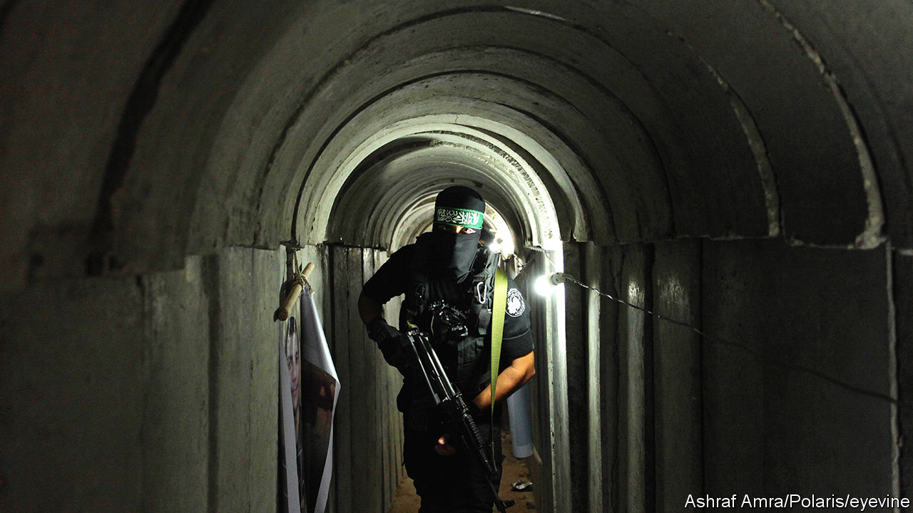

###### The war underground

# Israel hopes technology will help it fight in Hamas’s tunnels 

##### The “Gaza Metro” presents a big headache for the IDF 

 

> Nov 8th 2023 

The “Gaza metro” is nothing if not formidable. The network of tunnels built by Hamas beneath the enclave is hundreds of kilometres long. It houses command centres, weapons dumps and stores of food and fuel. It gives Hamas’s fighters the ability to ambush Israeli troops, and to shelter from bombs and artillery. 


Israel’s stated goal is to destroy Hamas. Its troops, which entered Gaza on October 27th, are therefore trying to attack and destroy the tunnels. On November 8th Israel said it had destroyed 130 already. But subterranean fighting is notoriously  work. The Israel Defence Forces (IDF) will be using a variety of technology to help its soldiers with the task.

The first job is to find the tunnels. Israel’s network of spies in Gaza has dwindled since it withdrew in 2005, says Michael Milshtein, a reservist IDF colonel. Surveillance drones are one alternative. They can detect “patterns of life” that give clues as to where the entrances are. Imagine, says Robert Cardillo, a former director of America’s National Geospatial-Intelligence Agency, if 20 people enter a small structure and no one comes out for 24 hours.

Satellites are useful, too. Modern satellite radar can detect surface-height variations on the order of millimetres. That is enough to spot the subtle surface disturbances caused by tunnelling—though Joel Roskin, a geomorphologist who analysed tunnel networks during his time in the IDF, notes that the rubble produced by Israel’s bombardment of Gaza will have made that sort of analysis harder.

Troops can also use ground-penetrating radar, which can detect voids up to 30 metres beneath the surface in ideal conditions. But Gaza’s coastal, saline soils are far from ideal. In practice, detection ranges are limited to a handful of metres. The technology, says Dr Roskin, has proved “unreliable” in the past. 

Acoustic detection can do better. Amir Avivi, a former deputy commander of the IDF’s Gaza Division, says vibration sensors can detect the digging of a new tunnel, though they are less useful at finding ones that already exist. Those can be spotted instead with ground-based sonar. Like its maritime counterpart, this involves sending out sound waves (often by hammering on a metal plate) and listening for echoes. Pinging the underworld in this way, says Carey Rappaport, a computer scientist at Northeastern University in Massachusetts, can reveal tunnels 100 metres down. 

Even fancier technologies exist. Buried fibre-optic networks can detect underground vibrations by the “backscatter” they cause in the photons travelling through the cables. Sintela, a British seller of such technology, is mum on the specifics, but its system, branded Onyx, is used on America’s southern border. Tunnels can even be revealed by detecting tiny decreases in gravitational pull caused by their voids. Silicon Microgravity, a British startup, aims to develop, by the end of next year, a gravimeter sensitive enough for the task.

Once a tunnel has been discovered, the next step is to disable or destroy it. With relatively shallow tunnels that can be done from the air, using “bunker-buster” bombs that penetrate the ground before detonating. But Hamas’s tactic of digging tunnels beneath civilian infrastructure means that such strikes can kill many civilian bystanders. The IDF, for instance, claims that some of Hamas’s leaders are holed up in a tunnel network beneath the al-Shifa hospital, Gaza’s biggest. 

Egypt, which controls Gaza’s southern border, has in the past flooded smuggling tunnels used by Hamas with sewage. Israel has poured concrete into tunnels during earlier conflicts. But hauling in enough is probably impractical in the present war, reckons one American military official. 

An Israeli security official says the idf will be making use of “sponge bombs”. These contain chemicals that, when mixed, expand into a dense, hard foam, blocking off the tunnel and buying time for a proper demolition with explosives later on. Sponge bombs are also used in a tactic known as “purple hair”. A smoke grenade is thrown into a tunnel before a sponge bomb seals the entrance. If the trapped smoke wafts out of a nearby building, that suggests it conceals another entrance. 

Sometimes, though, soldiers will need to enter the tunnels. Drilling rigs can make new entrances to avoid booby-traps set at existing ones. Elbit Systems, an Israeli firm, has developed an armed quadcopter that uses computer vision to fly in enclosed spaces. Other drones can roll through tunnels and climb stairs. 

Both sides are in for a brutal fight. Hamas will be hoping that its tunnels will help it compensate for the IDF’s overwhelming advantage in firepower. The Israelis, meanwhile, will hope their technology can transform those same tunnels from a refuge into a trap. ■


