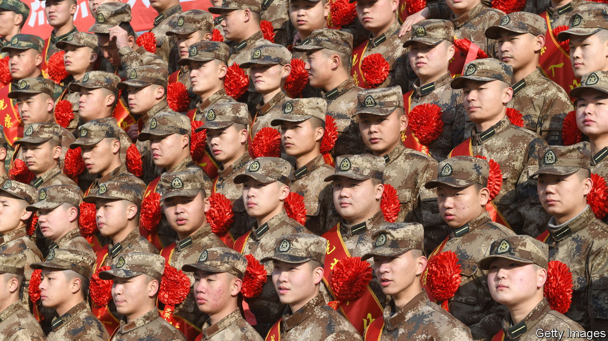

###### Rank indifference

# China is struggling to recruit enough highly skilled troops 

##### The PLA needs them to operate all its new weapons 

 

> Nov 6th 2023 

In February 2023 the PLA navy undertook an unusual mission. Its warships and aircraft were confronting their American counterparts in the South China Sea. Chinese forces were escalating operations around Taiwan too. But the PLA naval command’s new target was to be found in more placid surroundings, such as the leafy campus of elite Tsinghua University in Beijing.

For the first time, the Chinese navy was seeking fighter pilots for its aircraft-carriers among graduating students at Tsinghua and other leading civilian universities. Applicants should be unmarried and under 24 years old, with majors in science, technology and engineering, the navy said. They should “love the air and sea” and have “good vision and suitable nutritional condition”. In another first, women could apply too.

 


The PLA portrayed the move as yet another milestone on a march towards its official goal: to be a world-class fighting force by mid-century. Promotional videos showed strapping pilots in aviator shades aboard one of China’s two operational aircraft carriers (a third will soon begin sea trials). “These future pilots will play their part in building a world-class navy and realising the great rejuvenation of the Chinese nation,” the navy said.

Behind such razzmatazz lie some uncomfortable truths. The PLA is struggling to attract enough technologically skilled recruits to operate all its modern weaponry. Many of those with the requisite skills are choosing higher-paid jobs in industry or, worse, going abroad. Among those who do join up, the turnover rate is high.

Recruitment problems are not unique to China. America, Japan and some European countries face them too. But China’s are worsened by unique factors, not least the one-child policy in place from 1979 to 2016. It produced a generation of mostly only-children with overly coddling parents. Potential recruits, whose world revolves around smartphones and social media, are put off by the PLA’s austerity and increasing focus on political education.

The pace of military modernisation amplifies the challenge. In December the PLA’s official newspaper suggested that the navy did not have enough fully trained personnel to operate all of its new warships—dubbing the phenomenon “equipment awaiting talent”. The need for carrier pilots seems most urgent: in September the age limit for graduate applicants was raised from 24 to 26.

Senior PLA officers admit that recent recruitment drives have fallen short. “We need to do a lot more work, including changes to the recruitment system and making sure that people can develop after serving,” Major General Tang Yongsheng of the PLA’s National Defence University told this correspondent. “Salaries can’t be too low either”, he said, if the PLA is to attract the “outstanding, creative” young people it needs.

A paper published in a Chinese defence journal in April 2022 was more blunt. PLA recruitment was at a “rudimentary stage”, it said. “Young recruits don’t know what they’ll do after enlisting, military authorities don’t know what units need, and units don’t know what new recruits can do.”

China’s Communist Party had no such trouble when it built the Red Army (as it was then known) in the 1920s. It began as a volunteer force of workers, peasants and mutineers from the forces of the then-ruling Nationalists. After the Communist victory, it switched to conscription. In the late 1970s it adopted the current hybrid system of volunteers and conscripts.

The PLA now has about 2m personnel, including some 700,000 enlisted troops, 850,000 non-commissioned officers (NCOs) and 450,000 officers and civilian staff. Enlisted troops mostly volunteer (but can be forced to join to meet quotas) and serve two years. After that, they can do another two years, return to civilian life, volunteer as NCOs or take exams to become officers. NCOs, officers and civilian staff are all volunteers.

The PLA began trying to improve the calibre of its personnel in the 1990s, partly in response to America’s display of high-tech firepower in the first Gulf war. The Soviet collapse months later allowed China to start buying billions of dollars of Russian weapons. But to operate them the PLA needed better-skilled troops than the poor rural recruits on which it had previously relied.

Recruitment dive

It tried initiatives to recruit more graduates, but struggled to compete with the private sector. The PLA was also riddled with corruption. Poorer families bribed recruiters to enlist their children. Richer ones paid to avoid it. PLA personnel at every level bought promotions. So blatant was the rot that PLA licence plates were often seen on Porsches, Jaguars and other luxury cars.

After Xi Jinping took power in 2012, he made personnel quality central to the PLA’s biggest overhaul since the 1950s. An anti-corruption campaign bagged senior military figures. Quotas for rural recruits were largely scrapped. And the PLA began recruiting in summer, better to attract graduates before they found other work.

But the PLA’s problems ran deeper. One was the increasingly sedentary lifestyle of youngsters, which caused obesity and myopia. In 2013 one recruiting office found that 60% of college recruits failed physical tests for such reasons. Three years later, PLA medical experts found that infantry recruits suffered stress fractures almost twice as frequently as their American counterparts.

Mental health had deteriorated too. In a survey of PLA personnel in 2016, almost 30% reported psychological problems—almost double the rate a decade earlier. Worst affected was the missile force, whose members often worked in remote underground silos.


Mr Xi cut the PLA’s ranks by 300,000, or 13%, from 2015 to 2017 and promised better treatment for personnel and their families. Officers and NCOs were given a 40% pay rise and more home visits. A new ministry for veterans was created. And each PLA service began recruiting directly from universities.

Such changes have helped. So too has an upsurge in nationalism as tensions with America have escalated. The PLA has enhanced its image through operations like rescues of civilians from Yemen in 2015 and Sudan in 2023, and through military-themed action movies like “Wolf Warrior 2”, released in 2017.

A national census in 2020 showed the proportion of PLA personnel with higher education had increased to 57% from just over half in 2010. Still, that was well short of the PLA’s target of around 70%. And the proportion with postgraduate degrees had declined.

New incentives were part of the problem. College students were attracted by subsidies for their studies and preferential access to state-sector jobs after leaving the PLA. But many quit as soon as they qualified for such benefits. “There are more incentives to leave the PLA than to remain in it,” says Ken Allen, a former American air-force officer who studies PLA personnel issues.

Another alarming trend, noted in a study in 2020, was an apparent increase in the numbers refusing to serve after volunteering to join the roughly 400,000 troops enlisted annually. The PLA has stopped dealing with them internally and started drawing attention to them in state media—to shame culprits and advertise the harsh punishments they suffered. But desertions continue.

Since 2020 the PLA has made new tweaks. It started recruiting twice a year, instead of just once, to ensure a more steady flow of trained troops. It began crunching data on volunteers to find those with requisite skills. It also adopted more nuanced health checks, raising standards for some posts, such as special operations, while lowering them for others requiring more technological prowess.

Military pay has improved too. Basic annual salaries for college graduates start at around 12,000 yuan ($1,640) for enlisted troops (plus a sizeable bonus for their families) and 72,800 yuan for NCOs. Those from top universities get more. Peking University estimates that for two years’ service, its students earn as much as 314,300 yuan when educational and retirement benefits are included.

By comparison, the average annual salary for graduates in 2022 was 70,000 yuan. But tech grads can earn twice that (or quadruple for AI specialists). Tsinghua confers about 8,000 degrees each year. On average, according to the university, just 16 students a year have joined the PLA since 2005. Last year that number was 12. 

The PLA is also contending with a trend among young people to drop out, or “lie flat”, and seek an easier lifestyle. Even industrious youngsters can be put off by the PLA’s austerity. It tightly restricts internet access. All personnel need approval from superiors to marry or divorce. Enlisted troops live in barracks; most officers and NCOs can only live with spouses after serving ten years.

The PLA’s appeal may grow if youth unemployment gets worse. Still, it will be years before enough skilled recruits reach the upper ranks. Personnel problems would not stop Mr Xi from attacking Taiwan if he felt he had no option. But given a choice, he may prefer to wait—at least until he has enough carrier pilots. ■


