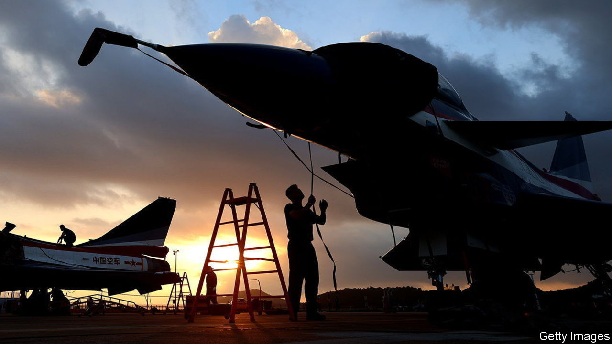
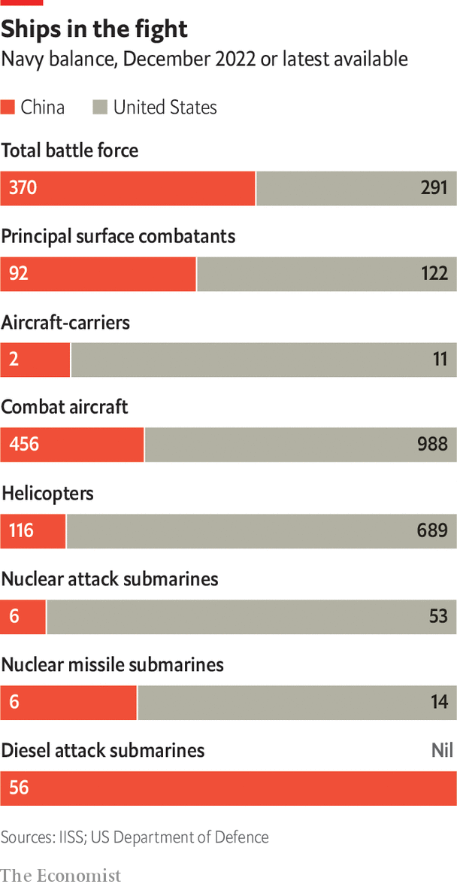

###### Weapons of woe

# From hypersonic missiles to undersea drones, the PLA is making leaps 

##### But China’s military tech still lags behind the West’s 

 

> Nov 6th 2023 

Xi Jinping learned a lot from his first job. As secretary to Geng Biao, a vice-premier and defence minister, from 1979 to 1982, he handled sensitive documents and joined top-level conclaves. He travelled abroad for the first time. And he spent countless hours listening to Geng—a former general and ambassador—as they shuttled between meetings in a chauffeur-driven Mercedes or unwound playing a game of , also known as Go.

More importantly, Mr Xi witnessed firsthand the parlous state of the PLA. It had just been fought to a stalemate by Vietnam. It was still using old Soviet weapons technology, some of it dating to the second world war. And despite China opening diplomatic ties with America, Geng had failed to persuade it to supply missiles and other lethal arms during a visit there in 1980 (although he did get a private White House screening of “The Empire Strikes Back”).

Four decades on, Mr Xi leads a country that can design and produce almost all of the modern weaponry that it needs. His mostly state-run defence industry manufactures nuclear-powered submarines, stealth fighters and a formidable arsenal of missiles. The Pentagon says that the PLA has deployed a medium-range hypersonic missile that can fly on the atmosphere’s edge and change course to evade defences. It also says that in 2021 China tested a longer-range version that could one day carry a nuclear bomb to America’s mainland (China says it was a space vehicle).

And yet Chinese armaments still suffer technical flaws, supply-chain problems and development delays. Its ten big state-owned arms-makers are overstaffed, poorly run and prone to conceal mistakes. A drive to involve the private sector has yet to bear fruit. And for some key components, China is still dependent on other countries whose reliability as suppliers is in doubt.

Corruption persists, too, despite Mr Xi’s efforts. The PLA revamp he started in 2016 included establishing a new Equipment Development Department and strict rules on ordering and testing weapons. But this July that department acknowledged graft had persisted. It called for tip-offs of violations since 2017 including favouritism, collusion, cover-ups and “actively leaking secrets”.

Some Western officials believe that may be linked to the disappearance since August of General Li Shangfu, who was sacked as defence minister in October after seven months in the job. He led the Equipment Development Department from 2017 to 2022.

Russian roulette

Even before the war in Ukraine, the PLA had suggested that it was falling short of its goals, with military publications often repeating Mr Xi’s assertion that it did not yet have the weapons to win a high-tech war. Those concerns have intensified as Ukrainian forces have exposed flaws in Russian arms, many of which China has bought and copied since being hit with Western arms embargoes after the PLA’s killing of pro-democracy protesters in 1989.

 


The vulnerability of Russian tanks, armoured vehicles and warships to portable missile systems and drones has been a particular concern. “We must promptly make corresponding improvements to the protection of relevant equipment to minimise combat losses,” said a defence industry journal in October 2022.

Mr Xi also appears unnerved by American curbs on exports to China of chips and other tech with military uses. Addressing PLA officers in March, he said China’s defence industry needed to focus more on innovation, self-reliance and “winning wars”.

Now an economic slowdown could squeeze military spending at the same time as more of it is being used to sweeten benefits for recruits. “We’re still far from matching America,” Senior Colonel Zhang Chi of the PLA National Defence University tells . “Our biggest problem is that China’s economy needs to develop more. We just don’t have the money.”

Take that with a fistful of salt. China’s 2023 military budget is $225bn (compared with America’s $817bn) but is thought to exclude key items such as arms imports. China gets more bang for its buck, too, with lower labour and other costs. Its spies have stolen lots of foreign military tech. And its universities produce many more doctorates in science, technology, engineering and mathematics than do America’s. 

That has helped China to take the lead in research into some high-tech areas, such as hypersonic weapons and underwater drones, some experts say. But it has yet to master design and mass production of some older technology which, as the war in Ukraine has shown, could still play a key role in any near-term conflict. Engines have been a particular problem.

Consider China’s J-20 stealth fighters, which first flew in 2011. For years most used a Russian engine. By 2022 that had been replaced with a Chinese one, the WS-10, which is less durable and has limited capacity for supersonic flight without using an afterburner. That makes the jet much less stealthy—a serious problem when anti-aircraft systems can make non-stealthy aircraft almost unusable, as Russia has found in Ukraine.

Then, in late June, video footage surfaced on Chinese social media appearing to show a test flight of the same stealth fighter with a more powerful, reliable and fuel-efficient Chinese engine, known as the WS-15. Chinese experts hailed it as a breakthrough. Some suggested it was already in mass production and could match the Pratt &amp; Whitney engine on America’s stealthy F-22.

Yet Zhang Yong of the Aero Engine Corporation of China, which makes military aircraft engines, sounded more cautious at a conference three months earlier. “Technological bottlenecks” on the WS-15 were resolved but supply chains for its components needed to be improved, he said. He also suggested that China still imported 2% of the roughly 90,000 components for the older WS-10.

Even if the J-20’s new engine really does rival the F-22’s, it is noteworthy that China took so long to match an engine that began development in the 1980s and stopped production in 2013. “It brings Chinese engines squarely into the late 20th century,” says Jeremiah Gertler, a military aviation specialist at America’s Centre for Strategic and International Studies. The gap is narrowing, he says, but “engine development in the West has moved on”.

Marine engines also have been a challenge. Many PLA ships use Ukrainian, French or German engines made under licence in China. Several Chinese diesel-electric submarines use German engines, too, while nuclear-powered models are thought to rely heavily on Russian technology.

Marine and aircraft engines accounted for more than 55% of China’s arms imports between 2017 and 2022, according to the Stockholm International Peace Research Institute, which monitors the global arms trade. That was a worry for the PLA even before the war in Ukraine. “In certain areas, we’re still dependent on foreign suppliers,” wrote Tang Guoyong, a PLA researcher, in 2020. “This poses significant risks in future warfare.”

It is fair to say Ukraine’s future as a supplier is in doubt. Russia might be willing to provide more advanced technology given its growing dependence on China. But its ability to fulfil orders could be impaired. European suppliers, meanwhile, are under increasing American pressure to stop supplying anything that the PLA could use.

That became apparent last year when Germany blocked the export of a German engine for a Chinese submarine sold to Thailand. China offered one of its own but Thailand refused, saying the engine was “not proven”, an indication that it had not yet been used on a submarine. Thailand did send experts to China to investigate but shelved the deal in October and proposed buying a Chinese frigate instead. The saga indicated a “puzzling bottleneck” in China’s technological capabilities, says Sarah Kirchberger, an expert on the PLA navy at the German Maritime Institute.

China’s reputation as an arms exporter has been damaged, too, by recent reports of defects in equipment sold to countries including Bangladesh, Myanmar, Pakistan and Nigeria. China does not export its best kit. But some recent problems affect the PLA’s own inventory. One Chinese study of its military UAVs in 2020 found that the drones “often fail to meet actual combat needs” due to technical faults.

Arms-makers the world over are notorious for cost overruns, delays and defects. But China’s problems are rooted in its politics and history. Its defence industry was modelled on the Soviet Union’s and retains many similar flaws, including a highly compartmentalised structure born of an obsession with secrecy, with strict divisions between research and production units.

China’s defence-research institutes are also deeply influenced by central planning, writes Ren Zhen of the China Academy of Engineering Physics, which helps develop nuclear weapons. Complex organisation and severe internal friction make the institutes “incompatible with the modern goal of achieving fast and high-quality project results”. He also cited insufficient pay in the sector.

None of that stopped China from making huge strides in defence technology in recent years. It will make more. But the pace of progress across the board is not as impressive as headlines suggest. And complex new challenges have emerged from the war in Ukraine. Mr Xi says he wants the PLA to be “basically” modernised by 2035. From where he’s sitting, that is still an ambitious target. ■

