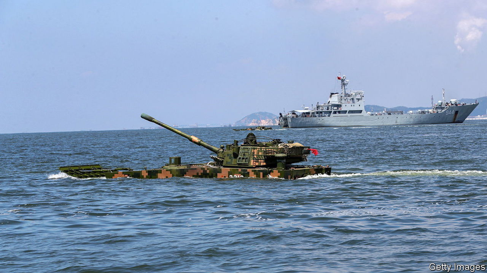

###### Operation overload

# Invading Taiwan would be a logistical minefield for China 

##### Russia’s problems in Ukraine make it look even more daunting 

 

> Nov 6th 2023 

The beaches of the tiny island of Kinmen are still dotted with reminders of the PLA’s first attempt to invade Taiwan. Rusted anti-landing spikes jut from the shallows. Beyond the dunes lie anti-aircraft batteries and old houses pockmarked with bullet holes. Inland, a small museum displays rifles and tanks used in the battle that would haunt the PLA for decades—and lay the ground for the present-day stand-off between China and America.

On October 25th 1949 an advance force of 9,000 PLA troops attempted to land in what was meant to be a decisive strike against the Nationalist forces who had fled to Taiwan and nearby islands (including Kinmen) at the end of China’s civil war. They reached Kinmen at high tide. But when their wooden fishing boats turned back to get more men, they were skewered by barricades in the shallows as the tide went out. A brutal battle ensued. The PLA force pushed inland but by day three, it was out of food and bullets. Almost the entire force was either killed or captured.

Nearly 75 years later, China has many of the capabilities it needs to enforce its claim to Taiwan. It has missiles to pummel the island’s defences and to target any forces sent by America. China’s ships and aircraft far outnumber and outgun Taiwan’s. Recently the PLA has escalated operations in the area, staging mock island assaults, simulating blockades and probing air defences.

Even so, the logistics of an amphibious invasion are still daunting enough to give Mr Xi pause. For years, military planners on all sides have focused on whether the PLA has enough ships and aircraft to transport an invasion force across the Taiwan Strait in time to prevail before America intervenes. Possibly, some now think, if the PLA uses ferries, cargo ships and other civilian vessels too (something it has practised recently).

Sea of worries

In the last 18 months, however, fresh questions have arisen as the war in Ukraine exposed unexpected flaws in Russia’s military logistics. In China and elsewhere, logisticians are now examining whether the PLA could provide the fuel, food, ammunition, medical services and other critical support it needs to sustain an invasion that could last weeks, if not months.

“This is their soft spot,” says Admiral Lee Hsi-min, who until 2019 was chief of the general staff of Taiwan’s armed forces. “If Taiwan doesn’t surrender, once you’ve landed, you still have to fight for a period of time, maybe one week or two weeks or whatever. Where are your logistics? Your logistics support needs to come in across the Strait but ours don’t have to. We fight in our own yard.”

The numbers involved would be staggering: One PLA study estimated that 3,000 military trains, 1m vehicles, 2,100 aircraft, and more than 8,000 ships would be needed to transport troops, equipment and supplies. Another suggested that a landing would need more than 30m tonnes of materiel. That is significantly more ships, vehicles and supplies than America and its allies used in the D-Day landings in June 1944.

PLA experts have spent years analysing the D-Day landings, as well as amphibious assaults in the Korean and Falklands wars. Ukraine is less relevant in some ways, as Russia invaded mostly by land and Taiwanese forces could not be easily supplied by sea in wartime. Chinese defence experts are nonetheless scrutinising Ukrainian and Russian logistics for lessons.

The deficiencies of Russian military logistics and supplies “deserve our close attention” especially in regard to future sea crossings and island seizures, a Chinese defence-industry journal said in October 2022. It called for bigger stockpiles of military supplies. “Modern warfare consumes a staggering amount of materiel, especially in a protracted war of attrition…The side that runs out of ammunition and provisions is bound to be the loser.”

The quickening pace of combat operations is making it ever harder to deliver ammunition and other supplies to the front, the  said in February. In future wars combat troops would be spread over bigger areas, making logistics even more complicated. The military mouthpiece said that current “logistics transportation capabilities” are not strong enough to meet the demands of “modern warfare conditions”.


Mr Xi has been trying to upgrade PLA logistics for some time. Before 2016 each of its seven military regions controlled its own logistics, fostering inefficiency and corruption. One scalp in Mr Xi’s corruption crackdown was Lieutenant-General Gu Junshan, a longtime PLA logistician. When investigators raided his villa (built in the style of the Forbidden City) they seized riches including three solid-gold items: a basin, a model ship and a bust of Mao.

Mr Xi replaced the military regions with five regional theatre commands, and created a Joint Logistics Support Force (JLSF) under the direct control of the Central Military Commission, which he heads. He also ordered the PLA to make better use of digital tech in managing logistics, and to work closely with the huge civilian logistics industry that serves China’s online shoppers.

Some of China’s biggest delivery companies, including SF Express and JD Logistics, have since signed agreements with the PLA to provide services such as warehouse management and goods transportation. Some have joined exercises to practise delivering military supplies by aerial drone to remote bases during wartime.

Testing positive

The first big test of the new system came at the start of the covid-19 pandemic, which began in the central Chinese city of Wuhan in December 2019. That is also where the JLSF has its base. The city of 11m people was thrown into chaos when it was suddenly subjected to a severe lockdown in January 2020. But over the next two months the JLSF pulled off a major relief effort, sending in doctors, nurses, vehicles, medicine, food and protective clothing.

Managing a similar feat during a war would be far harder, with command centres and supply lines under attack, front-line units competing for logistical support and civilian firms struggling to maintain operations under fire.

American and Taiwanese researchers who have studied PLA logistics think they have identified some weaknesses. They include a shortage of heavy-equipment transporters, over-reliance on roads and railways (which can be easily targeted) and small numbers of logistics personnel assigned to combat units, according to Joshua Arostegui and J.R. Sessions, two Pentagon analysts.

Having centralised military logistics since 2016, the PLA would also have to move much more materiel to front-line units in the run-up to an invasion, potentially tipping its hand. It is unclear if there is sufficient storage and other logistics infrastructure for that materiel in urban areas along the coast opposite Taiwan, says Chieh Chung of Taiwan’s National Policy Foundation think-tank.

The PLA air force might struggle to sustain combat operations longer than two weeks, says Lonnie Henley, a China specialist at America’s Defence Intelligence Agency until 2019. He doubts that it has sufficient maintenance capacity, spare engines or fully-trained pilots, noting that its biggest exercises usually involve about 200 sorties over five days. A major American air campaign entails 1,000 to 1,500 sorties per day over several weeks.

Mr Xi and senior PLA commanders have recently acknowledged that improvements are needed. At a military-logistics conference in 2021, General Zhang Youxia, a vice-chairman of the Central Military Commission, spoke of the need to address “shortcomings and weaknesses”. In October 2022, the defence ministry denounced “peace paralysis” among logistics personnel who had prioritised “daily life” over combat readiness.

Taiwan is not the only logistical challenge. There is potential for instability on China’s land borders, too, including the disputed frontier with India, site of deadly clashes in 2020. “Our biggest challenge is versatility,” says Senior Colonel Zhao Xiaozhuo of the PLA Academy of Military Science. “Operating around Taiwan is not the same as in other areas, like the Tibetan plateau.”

And that is before one considers operations further beyond China’s borders. The PLA has had one foreign base, in Djibouti, since 2017 and has been trying to establish others in Africa, the Middle East and the Pacific. Chinese firms operate several foreign ports that could be useful naval stopovers. But China is a long way from establishing the kind of network of substantial foreign bases that it would need to sustain major overseas operations.

Mr Xi’s ambitions for the PLA are clear. For now, though, China remains a regional military power. And as this special report has argued, despite huge advances in many areas, it still does not have the troops, equipment, experience, command structures or logistics necessary to be confident of victory in a war over Taiwan.

Back in 2013, Mr Xi said: “What I think about most is this: when the party and the people need it, will our armed forces always adhere to the party’s absolute leadership, can they mobilise to fight and win, and will commanders at every level be able to lead their troops in battle?” A decade later, he is still looking for answers. ■

