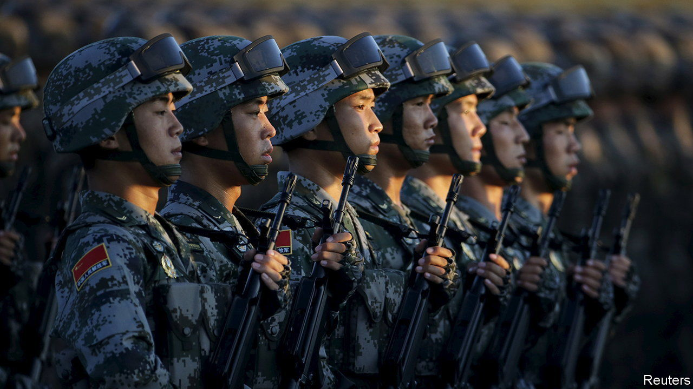

###### Unknown soldiers

# The People’s Liberation Army is not yet as formidable as the West fears 

##### Overestimating China’s armed forces would be dangerous, argues Jeremy Page 

 

> Nov 6th 2023 

In 1957 America was gripped by fears of a “missile gap” with the Soviet Union. The Kremlin had stunned the world with a test flight of an intercontinental ballistic missile (ICBM) and the launch of Sputnik. An American intelligence report predicted that by 1962, the Soviets could have 500 ICBMs, outstripping America’s arsenal. When word of that leaked, a political furore erupted. Eyeing the presidency from his Senate seat, John F. Kennedy demanded action to prevent a Soviet “shortcut to world domination”.

It was bunkum. By his 1961 inauguration, spooks had new satellite images. The Soviets actually had about six ICBMs late that year, to America’s 60. But Kennedy stayed the course; his rhetoric and continued atomic buildup stoked tensions with the Kremlin that erupted in the Cuban missile crisis. As for the prior years, Lyndon Johnson would observe in 1967: “We were doing things we didn’t need to do. We were building things we didn’t need to build.”

Military history is rich with tales of a similar cautionary ilk: overestimating an adversary can be as risky as underrating one. Aerial drones, cyber-espionage and high-resolution satellite imagery promised better results. And yet egregious miscalculation continues. Recently Western governments were stunned by the poor performance of Russian forces in Ukraine. All of which raises a high-stakes question for America and the rest of the world: how accurate is their appraisal of ?

China’s armed forces, known as the  (PLA), have undergone an extraordinary transformation. When China normalised relations with America and began opening its economy in 1979, the PLA was an ill-equipped force designed to fight on its land borders. Even that was not something it did well, as Vietnam showed that year when it repelled a Chinese invasion. 

Today, China boasts the world’s biggest army and navy, its third-largest air force and one of its most potent arsenals of conventional missiles, including some that can hit America’s Pacific bases. And though America and Russia each have more than ten times as many nuclear warheads, China is modernising its stockpile, which the Pentagon believes could double to 1,000 by 2030.

The PLA has grown more active, too. It has built artificial islands in the South China Sea and regularly sends ships and planes to enforce maritime claims there. Its troops have clashed with India’s on a disputed Himalayan border. It has opened its first overseas base, in Djibouti, and wants more. And it has significantly expanded operations around Taiwan, the self-governed island that China claims and America pledges to help defend. Alarmed by China’s build-up, senior American military commanders have warned that an attack on Taiwan could be imminent.

And yet, seen from Beijing, the PLA is still far from being ready for war with America. To feel assured of victory in a conflict such as one over Taiwan, it must overcome several old problems, including a convoluted command structure, inadequate logistics and a lack of combat experience, having not fought a war since the one with Vietnam. It must also confront new challenges, including lessons from the war in Ukraine, American curbs on high-tech exports to China and a dearth of technologically skilled recruits.

The PLA must also battle what President Xi Jinping has called “peace disease”, a lax internal culture bred from decades without fighting. For much of that time the armed forces grew notorious for their far-reaching and often corrupt business dealings. Their most deadly engagement in the last 44 years was with their own countrymen, in the massacre of protesters in Beijing in 1989. 

All this must be done in an authoritarian system that discourages reporting problems to the top, impeding reform efforts. Since 2016 Mr Xi has tried to modernise the PLA with its biggest overhaul in six decades, streamlining its ossified Soviet-era structures and trying to enable joint operations among all services. But that is taking longer than hoped. A crackdown on indiscipline has fallen short, judging by the sacking in July of the two top generals in the PLA Rocket Force, which handles nuclear and conventional missiles. They are believed to be under investigation for corruption or leaking secrets. American officials think General Li Shangfu, who was sacked as defence minister in October, is also in custody.

This  will examine the PLA’s vulnerabilities, rather than its strengths, and explore their implications for America and its allies. The aim is not to portray the PLA as a “paper tiger”: the threat it poses is real. The goal rather is to provide balance to a public debate that has at times resembled the more paranoid periods of the cold war, and risks replicating that era’s errors.

Guessing game

Like their cold-war forebears, intelligence officers assessing the PLA often focus on hardware. Much of it is visible from space, in parades or during exercises. Hardware is also easy to represent in war games. But gauging a country’s capacity to use such equipment in war is far harder. So too is assessing China’s strategic intent. That often involves parsing ambiguous public remarks.


A case in point is the discussion around when China might attack Taiwan. Soon after taking power in 2012, Mr Xi linked Taiwan’s unification with the mainland to his broader goal of “national rejuvenation” by 2049, the centenary of Communist rule. In 2017 he set the PLA a new target of being “basically” modernised by 2035. Then, three years later, he ordered it to speed progress towards modernisation by its own centenary in 2027.

American officials say they have intelligence suggesting that Mr Xi has ordered the PLA to have the capability to invade Taiwan by 2027. That does not mean he has decided to attack by then, says William Burns, the CIA chief. But such distinctions are often lost in media coverage, political debate and remarks from military leaders. Take, for example, Air Force General Mike Minihan’s recent warning to his officers: “My gut tells me we will fight in 2025.”

The lack of nuance is, to an extent, understandable. Mr Xi could miscalculate, as Russia’s leader, Vladimir Putin, did on Ukraine. And even if Mr Xi does not plan to attack Taiwan by 2027, it makes sense for America to prepare. For its military chiefs that means motivating troops, seeking congressional funding and battling over resources between services and regional commands.

But some China hawks say America must do much more: cut down on visas for Chinese tech students; double defence spending (and the size of the navy); deploy a surge of forces to Asia; and explicitly end more than 40 years of “strategic ambiguity” about whether America would directly defend Taiwan. Many Republicans cite focusing on China as a reason to cut support for Ukraine. And in perhaps the most direct echo of the late 1950s, some are demanding a significant expansion of America’s nuclear arsenal. 

Many academic, military and intelligence experts on the PLA—in the West and among China’s neighbours—fear that such measures could backfire. If America escalates support for Taiwan too far, it could convince Mr Xi that he has to strike, ready or not. An American defence splurge now might be hard to sustain and could cause vulnerabilities later when that equipment is retired and new types of arms are needed. Attracting China’s tech talent helps to undermine its military ambitions. Cutting support for Ukraine could hand the Kremlin a victory that would ultimately strengthen Mr Xi. And a big American nuclear build-up could push the world further into a new nuclear arms race.

As for 2027, some PLA-watchers note that Mr Xi’s predecessor, Hu Jintao, also set a deadline. He instructed the PLA to achieve “major progress” by 2020 towards being able to “win local wars” in high-tech conditions. That soon became the year by which many American defence officials thought China wanted to be able to take Taiwan. Yet the deadline passed quietly.

Opinion among PLA specialists is by no means uniform. Many worry that American plans to defend Taiwan are woefully inadequate. Some fear that a presidential election in Taiwan in January 2024 could prompt Mr Xi to act, perhaps by seizing one of its outlying islands or imposing a blockade. Others see a potential window of vulnerability in the four or five years after 2027 when Mr Xi, who by then is likely to be in a fourth term in office, could demand action on Taiwan before the island’s current military modernisation efforts have fully borne fruit.

But such hawkish views have lately dominated Western public discourse, shaped in part by headlines about China’s latest military capabilities and by America’s febrile pre-election politics. There has also been a lot of new research on the PLA, much of it by think-tanks ultimately funded by the Pentagon. They tend to focus on what China can do, rather than what it cannot. Less funding—and public attention—goes to research on the PLA’s weak points.

Underestimating the PLA would be dangerous. But overestimating it would be too. As in the cold war, that can breed mutual insecurity and unnecessary confrontation. Amplifying Mr Xi’s threats could also discourage some leaders from confronting him when they should. That’s in part what allowed Russia to annex much of Ukraine with impunity in 2014. A ruthlessly balanced view of the PLA is essential both to avoid war and, if necessary, to win one. ■


