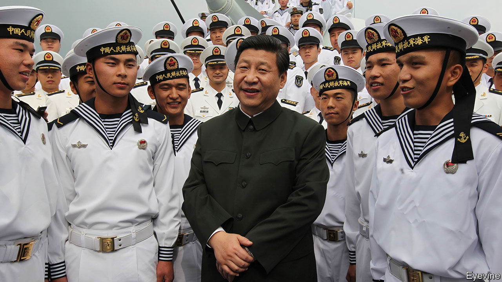

###### Command or control

# Xi Jinping is obsessed with political loyalty in the PLA 

##### Ideology is undermining China’s drive to prepare forces for combat 

 

> Nov 6th 2023 

In a scene halfway through “Skyfighters”, produced in 2011 by the PLA’s August First Film Studio, an air-force division commander wants to conduct a night exercise to simulate combat conditions. His young deputy disagrees, citing bad visibility. Besides, the pilots are getting some rest (mostly at a bar shaped like a fighter jet where no one seems to drink anything but coffee and fruit juice).

As tempers flare, a third officer intervenes. This is the political commissar, whose job it is to maintain the Communist Party’s control of the PLA. “Don’t quarrel!” he barks. Then he orders a compromise: They should practise getting ready to take off but should not actually fly. The division commander defers with a slight bow. “What an excellent troop,” he says after the drill. “It really has the invincible spirit of rejoicing at war and daring to fight and win.”

The dialogue really is that bad, not to mention the romantic subplot involving a bashful pilot and a chirpy ornithologist. But the scene is notable. To the PLA, this is how leadership works.

Founded in 1927 as the armed wing of China’s Communist Party, the PLA has retained that role ever since. And because civilian party leaders have never quite trusted their uniformed comrades, key decisions have always been made by party committees in the PLA, each led by a political officer (often called a commissar).


Most individual units (as well as navy vessels) have political officers. They indoctrinate troops, keep watch on morale and supervise promotions. But they can also intervene in operations and replace a commander who is killed or injured. Political officers technically have equal authority to commanders, but often have greater clout because they lead the party committees.

Such convolution would seem to cry out for reform. Instead Xi Jinping has sought to revitalise it. In 2014, he hosted a conference in Gutian county in the southern province of Fujian, where Mao Zedong enshrined political control of the armed forces in party doctrine 85 years earlier. Mr Xi identified ten “outstanding problems” in the PLA, citing a lack of ideals and revolutionary spirit. The solution? “Political work should only be strengthened.”

Mr Xi appears to see no conflict between “political work” and his demand for the PLA to focus on combat. In fact, his recent pronouncements suggest that he sees such indoctrination as vital to defending against the kind of information warfare that has played a critical role in the war in Ukraine.

In practice, however, China’s system is fraught with problems. Most egregious is the tension between commanders and political officers. The latter usually specialise in political work for their entire careers and have limited understanding of operational issues.

On Mr Xi’s watch PLA-linked publications have acknowledged this issue in at times scathing terms. Some political officers “sit in conference halls more than war rooms, hold pens more than guns, and read texts more than maps,” said the  in 2016. “They’re becoming observers in training and amateurs in battle.”

The PLA air-force newspaper recounted a parachute jump in an exercise in 2018. The unit suffered several casualties on landing, including the battalion commander. The commissar took over but prioritised co-ordination with fellow political officers, instead of the mission in hand. The opposing force in the exercise prevailed.

The PLA updated guidelines for political officers in 2020, reasserting their equal status with commanders while demanding more focus on combat. But problems endure. There was still too much emphasis on political officers’ speaking and writing skills and not enough on their ability to fight, wrote Fan Jing of the PLA Academy of Military Science in 2021.

The confused command system poses a particular challenge on China’s nuclear-missile submarines, which recently began regular patrols. Since they must be able to make nuclear strikes from hidden locations, they spend months submerged and rarely contact headquarters. Such are the communication challenges that Mr Xi may empower these submarines’ commanders in advance to launch an attack in certain conditions. But if a dispute arises, it is unclear if the captain or the commissar has the final word.

The Soviet Union also had political commissars in its armed forces (including on its nuclear-missile subs) but usually gave commanding officers ultimate authority. Still, commissars on those submarines were empowered to ensure that orders were executed. And confusion aboard Soviet navy vessels was not uncommon.

One of the cold war’s diciest moments came when American forces surrounded a Soviet submarine in the Sargasso Sea during the Cuban missile crisis. Unable to reach Soviet command, and not knowing if a war had started, the submarine’s top three officers argued over whether to fire its nuclear-tipped torpedo. They decided not to, and surrendered to the Americans.

Another problem for the PLA is the increasing focus on political education. That can include reading official texts and speeches, writing essays on them, watching videos and doing online courses, mostly focused on “Xi Jinping Thought on Socialism with Chinese Characteristics for a New Era”—the Chinese leader’s turgid ideological doctrine–and its subset “Xi Jinping Thought on Strengthening the Military”.

Consider one officer’s account of his unit studying a major speech by Mr Xi. “Some officers and soldiers,” he told the , “carefully read the original text of the speech and wrote down their reflections; some sorted out key points and prepared for systematic in-depth study; some created literary and artistic works.”

Phillip Saunders at America’s National Defence University estimates that troops spend a quarter of their time on political work. “Obviously Xi Jinping thinks that’s a good or a necessary trade-off,” he says. “But it’s time that’s taken away from training, and that’s got to have some adverse impact on your operational readiness.”

Even on its own terms, Mr Xi’s emphasis on political work has not had the desired effect. It was supposed to help root out the indiscipline that pervaded the PLA under Xu Caihou and Guo Boxiong, who ran a massive bribes-for-promotion scheme before retiring in 2012 as the armed forces’ two most-senior generals.

The nuclear option

But in July the sudden dismissal of the two top generals in the rocket force, which handles China’s conventional and nuclear missiles, exposed continuing indiscipline in the upper ranks. Sacking both its commander, Li Yuchao, and its political commissar, Xu Zhongbo, at once was unusual. Some believe that they are under investigation for corruption or leaking military secrets.

One possibility is that their problems are linked to Mr Xi’s nuclear upgrade, which may involve being ready to mount warheads on missiles much faster. Some think he wants to switch from a nuclear posture of “no first use” (only launching an atomic strike after suffering one) to one of “launch on warning” (doing so as soon as incoming nuclear missiles are detected). Since that might require advance authorisations for rocket force commanders, Mr Xi may have re-examined their political reliability.

But his purge seems to go beyond the rocket force. In September another general was dismissed as head of the PLA military court. Then, in October, General Li Shangfu was sacked as defence minister, just seven months after being appointed to the post. He had not been seen in public since August and American officials think he has been detained, possibly on suspicion of corruption.

The generals’ problems reflect badly on Mr Xi, under whom they were promoted. They also speak to deeper issues. Buying promotions and other such misdeeds were so rife in the PLA before Mr Xi took power that few senior officers have clean hands. But he cannot sack them all without seriously depleting the PLA’s top ranks—and making many more enemies in the military elite.

Nor can he abandon the commissar system, because he needs to maintain party control of the PLA. As the son of a noted military commander (and political commissar), he understands that better than most. He grew up among military families who competed for top party posts. He knows that the most serious challenges to Mao came from military figures. And as secretary to a defence minister he saw the PLA’s role in power struggles after Mao’s death.

He is haunted, too, by the Soviet collapse, which he has blamed on the Kremlin’s failure to control the armed forces. He knows that when PLA units crushed protests in Beijing in 1989, some refused to take part. A world-class military may be central to Mr Xi’s “China Dream”. But what keeps him up at night is the fear of a PLA that doesn’t come to the party’s defence. ■

