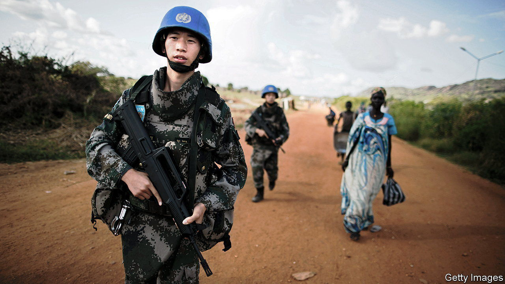

###### Peace disease

# Xi Jinping worries that China’s troops are not ready to fight 

##### Now the war in Ukraine has revealed new challenges for the PLA 

 

> Nov 6th 2023 

The last time Chinese troops were caught in a major firefight, they learned a painful lesson. A PLA unit was in South Sudan in 2016 on UN peacekeeping duty, tasked with protecting two camps of civilians. When rebels and government forces clashed, the camps came under fire. As the Chinese troops took refuge, a rocket-propelled grenade hit one of their vehicles, killing two of them.

Back home, China’s government portrayed the tragedy as evidence that the country was emerging as a great world power, ready to shoulder weighty responsibilities. But to the PLA’s commanders, the episode was a debacle that exposed one of their greatest vulnerabilities: an almost complete lack of combat experience.

China has not fought a war since the one with Vietnam in 1979 that lasted a month (though minor skirmishes continued for another decade). Back then the PLA was still using “human wave” mass-infantry assaults of the sort that Mao Zedong had adopted during the Korean war. They proved ineffective against Soviet-armed Vietnamese forces hardened by fighting with America.

The PLA has suffered casualties since, but they have mostly been from illness, accident or suicide. A recent exception was the border clash with India in 2020 that killed at least four Chinese soldiers and 20 Indian ones. That was nothing like modern warfare, though. It was fought with fists, clubs and rocks.

Even among the PLA’s top generals, only a handful can actually claim to have seen action. “I’ve been a soldier for more than 50 years and I’ve never been to war,” Lieutenant-General He Lei, who once led a PLA regional command and was deputy head of the Academy of Military Science, tells . “But we can’t go to war to increase our combat experience, right?”

Since taking power, Xi Jinping has tried to address this problem with the boldest overhaul of the PLA in more than 60 years. In addition to toppling dozens of generals in a corruption probe, he has revamped training to focus on “real combat” and set the PLA new goals, including to be “basically” modernised by 2035 and a “world class” fighting force by 2049, the centenary of Communist rule.

Mr Xi, whose father was a renowned military commander, has been unsparing in his assessment of the PLA’s weak points, spelling them out in two oft-repeated slogans. One, known as the “Two Inabilities”, states that the PLA’s ability to fight a modern war and its officers’ ability to command are both lacking. Another, the “Five Incapables”, says that some commanders cannot judge situations, understand superiors’ intent, make operational calls, deploy troops or deal with the unexpected.

He has accused the PLA of ailing from “peace disease”. In 2018 the , the official military newspaper, warned that this was “more dangerous than rusting guns”; it accused some officers and soldiers of being too negligent, proud, scared or incompetent to fight. “Some are quite accomplished in antiques, calligraphy and painting, but neglect the study of combat methods and tactics.”

Central to Mr Xi’s plan has been a complete redo of PLA structures, which had been designed primarily for land wars, following the old Soviet model. The new structures, unveiled in 2016, are meant to break down silos and to enable the PLA to conduct “joint” operations, combining all services, as America’s armed forces do. Those reforms were supposed to be finished by 2020.

But that deadline was optimistic. America undertook similar reforms with the Goldwater-Nichols Act of 1986 to address an inter-services rivalry and insufficient civilian control exposed by the Vietnam war and the invasion of Grenada. That transition took longer than five years. And the PLA began from a far lower base. Its services and regional commands had been run like fiefdoms for years, a problem compounded by the lack of combat experience.

What’s more, Mr Xi’s restructuring borrowed from similar reforms to the Russian armed forces. PLA commanders must now reckon with the poor performance of Russia’s troops in Ukraine, as well as the surprising effectiveness of portable weapons systems, drones and other equipment used by Ukrainian forces.

One of the PLA’s concerns is the fate of Russia’s battalion tactical groups, or BTGs. They typically include 800 or so men, equipped with armour, artillery and air defences, and are designed to deploy at short notice, to move fast and to inflict casualties rather than hold territory. Formed ad hoc during Russia’s wars in Chechnya in the 1990s and in Georgia in 2008, they were formalised from 2013 as part of Russia’s “New Look” military reforms.

Battalion tactical goof

When Mr Xi’s overhaul began, China saw the BTG as a model to emulate. It was “a self-sufficient unit that can perform tasks at any time”, wrote Li Shuyin of the Academy of Military Science in 2017. That year the PLA dissolved many bigger units and introduced a new structure that featured hundreds of combined arms battalions, closely resembling BTGs, as its basic combat units.


By early 2023, however, the PLA had changed its tune. “Deficiencies of Russia’s battalion tactical groups have been exposed one after another, such as poor self-sufficiency in combat and inadequate logistical support,” the  said in January. 

That is a particular worry for the PLA’s amphibious battalions, which would spearhead an attack on Taiwan. They may be better equipped than Russia’s BTGs. (They’ve copied elements of American combat units too.) But the logistics of an amphibious assault will be more complex. And Chinese commanders have scant experience co-ordinating among services—and only in peacetime.

During wartime “you find out that your peacetime officers are not necessarily good combat leaders”, says Dennis Wilder, a former CIA expert on China’s armed forces. He notes that Chinese officers, unlike American counterparts, do not do routine joint-duty assignments outside their original services, so have limited understanding of how other parts of the PLA work.

America also makes more effective use than does China of non-commissioned officers (NCOs). The PLA has plenty of NCOs—they outnumber the enlisted men and women below them—but they are not as well-trained as in America and are not empowered to make decisions during engagements. And Chinese combat units still rely heavily on enlisted troops who serve only two years.

Then there are the technological takeaways from Ukraine. One is an urgent need to figure out how to protect Chinese forces from the portable weapons systems such as Stinger and Javelin missiles that have wrought havoc on Russian tanks, armoured vehicles and even warships, wrote Huang Bin, a former Chinese defence-industry official, in October 2022. Taiwan has both types of missile and is getting more, along with HIMARS rocket launchers.

Another challenge is Starlink, the satellite network developed by Elon Musk’s SpaceX. It has been used by Ukraine to maintain contact with its own forces and to target Russian ones. Although it is unclear whether Mr Musk would allow Taiwan to use it in a war (his electric-vehicle business, Tesla, has its biggest factory in Shanghai), Chinese experts say the PLA must develop countermeasures—and accelerate the production of its own equivalent.

Analysts in the PLA have also argued that China needs to learn from the public release of intelligence by Western governments and the proliferation of open-source intelligence. These have helped Ukrainian forces in combat and driven support for them abroad. “This highlights our shortcomings” in international cognitive warfare, wrote two PLA researchers in January. Other PLA-linked scholars cite America’s recent efforts to bolster alliances in Europe and Asia as a challenge for China, which has no explicit military allies and, despite defence ties with Pakistan, Russia and North Korea, cannot count on anyone else in a war over Taiwan.

Compounding these problems is a lack of effective combat training. Exercises often used to be designed to impress superiors and achieve predetermined outcomes. Since Mr Xi demanded focus on “real combat”, exercises have become more realistic, pitting PLA troops against others simulating American or NATO tactics.

But a tendency to box-tick and avoid criticism endured after Mr Xi launched his military reforms, according to PLA publications. And doubts persist among Western analysts about how realistic the exercises are, especially in replicating electromagnetic interference by enemy forces. Tellingly, Mr Xi and senior PLA commanders continue to call regularly for more realistic training for joint operations and real combat.

Inexperience does not necessarily mean the PLA could not fight well. American, Japanese and Taiwanese analysts believe it has some highly proficient troops. And it has shown progress in drills around Taiwan, practising joint-combat operations, simulating a partial blockade and sending ships and planes across the median line of the Taiwan Strait almost daily. Still, some elements of those drills—such as deploying an aircraft-carrier east of Taiwan where it could be easily hit by American forces—seem designed for their political and psychological impact, not for military effectiveness.

Incorporating the lessons of Ukraine into PLA doctrine will take time, not least because those lessons are still evolving. Adapting equipment and rotating troops through new exercises will take even longer. But the biggest challenge for the PLA may be the one that it began grappling with in 2016—the transition to a truly joint force in which all services operate seamlessly together. ■


