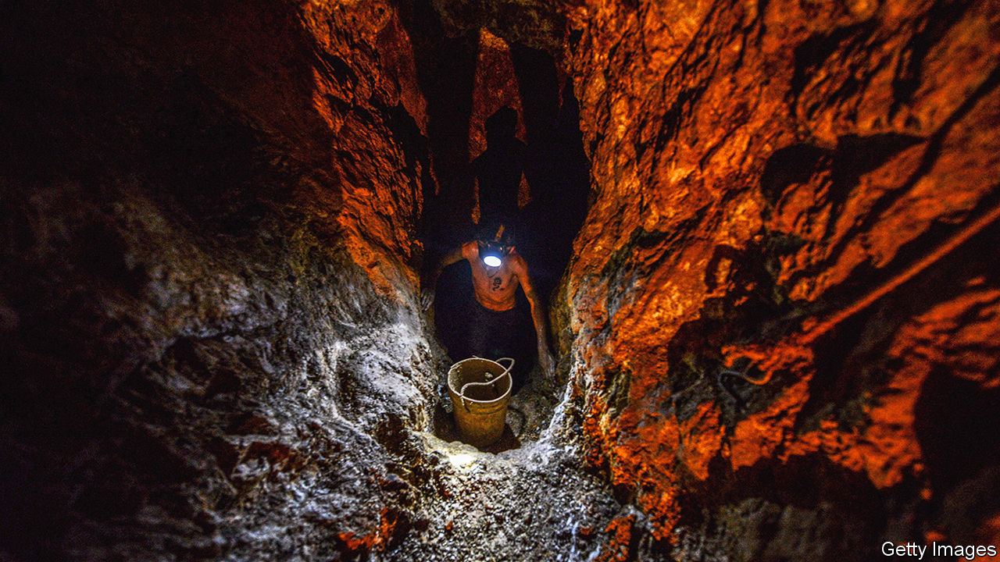
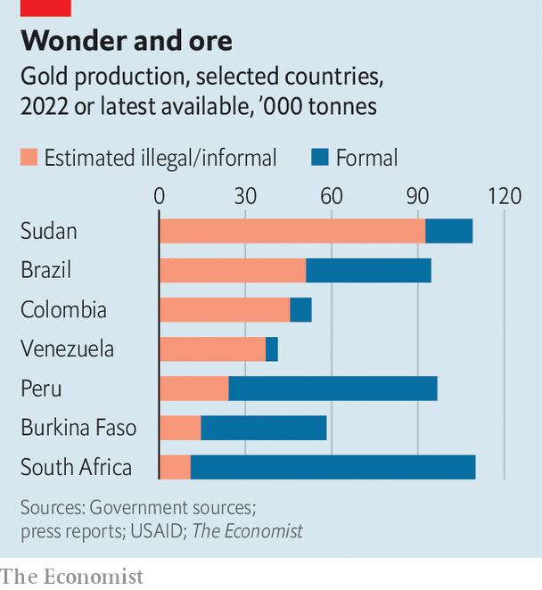

###### All that glitters

# Illegal gold is booming in South America 

##### Blame geopolitical tensions and the Indian marriage market 

 

> Nov 9th 2023 

Deep in Venezuela’s southern savannah, Las Rajas is a textbook example of an illegal gold mine. When your correspondent visited it last year, miners stood around a muddy crater in flip-flops and shorts. Workers blasted its walls with high-pressure hoses to dislodge specks of minerals, and used mercury to separate metal from ore. In 2016 Nicolás Maduro, the country’s autocrat, decreed that swathes of forest should be turned into the Orinoco Mining Arc, a territory larger than Portugal. Since then, illegal “wildcat” mining has surged. Dirty gold makes up between 70-90% of nationwide output, according to the local branch of Transparency International, an anti-corruption monitor. 

The flow could increase. On October 18th the United States lifted sanctions on Venezuela’s state-run mining company, among others, in exchange for Mr Maduro’s pledge to hold freer elections next year. “This decision is going to boost a criminal bonanza,” says Cristina Burelli of SOS Orinoco, an environmental pressure group. She argues that the regime has no incentive to reduce illegal gold-mining. Mr Maduro’s military cronies are thought to oversee most illegal mining. One local estimate reported by the International Crisis Group, a Brussels-based think-tank, suggested that in 2019 senior officers in the state of Amazonas got 20kg of gold a month, then worth $800,000.

Venezuela is only the most extreme example of a boom in illegal gold. Demand for it often rises during periods of tumult. It rocketed after the financial crisis in 2008, and has risen in recent years as a result of tension between the United States and China and turmoil in Ukraine and the Middle East. A growing middle class in China and India is also fuelling demand. 

Between 2021 and 2022 central banks more than doubled their gold purchases, to 1,136 tonnes. That is the highest since records began in 1950. In India a wave of weddings since the covid-19 pandemic has buoyed the jewellery sector, which globally absorbs half of all gold production. By May, the price of bullion reached $66,000 per kilogram, the second-highest figure ever.

 


This has sparked a gold rush. South America ostensibly supplies a tenth of global needs. However, there is a large gap between exports and imports declared abroad. This suggests the continent’s share could be much higher, making South America one of the leading regions for dirty gold (see chart). 

Illegal gold-miners have powerful allies. Besides Mr Maduro, Luis Arce, the president of Bolivia, and Jair Bolsonaro, Brazil’s former president, have encouraged or turned a blind eye to informal mining. This has helped the sector to industrialise. Informal miners used to pan for gold in rivers or hit it with pickaxes on dry land. Today gold-mining runs on dangerous chemicals and heavy machinery. Russian mercury radiates from Bolivia across the continent. Peruvian dynamite is trafficked in bulk to Ecuador. South Korean excavators carve up the forest in Brazil. 

Mining sites that used to take one month to open can now take as little as one week, says Larissa Rodrigues of Instituto Escolhas, an NGO in São Paulo. Workers who hiked for days with a few nuggets of gold now fly out their earnings by plane. The sector is highly lucrative. In Brazil it costs around $280,000 to set up an illegal gold mine, according to Instituto Escolhas. Monthly output is about 3kg and monthly profits are on average around $70,000.

Even so, a few grams of gold requires moving several tonnes of rock and debris. Many illegal miners use old mines, as they are easiest, says Bruno Manzolli of the Federal University of Minas Gerais. But as gold prices rise, lower-grade ores have become worthwhile. Globally most mines generate five to eight grams of gold per tonne of rock. In Bolivia, where diesel is subsidised and mercury is unregulated, even one gram a tonne is still profitable. 

This has attracted organised crime. South America is currently undergoing a cocaine glut, with the wholesale price plummeting. As such, drug gangs want to diversify. , or wildcat miners, in northern Brazil are backed by the First Capital Command (PCC), the continent’s largest criminal gang. Having long laundered drug money with dirty gold, the PCC now acts like an “illegal mining union,” said Flávio Dino, the justice minister.

The PCC is not the only criminal group leaping into the gold rush. In February Colombia’s largest gang, the Clan del Golfo, backed a month-long miners’ strike that paralysed the state of Antioquia. In June it invaded the country’s biggest legal gold mine, stealing several tonnes of metal. Colombian authorities say armed groups make $2bn-3bn per year from illegal gold—around the same figure as the country’s annual legal gold exports. 

Governments are trying to fight back. Luiz Inácio Lula da Silva, Mr Bolsonaro’s successor, has deployed the army to stop mining in protected areas. In February his government expelled 20,000  from the territory of the Yanomami people, an indigenous group, and destroyed hundreds of camps. The government and the central bank have also passed legislation to prevent illegal gold entering supply chains. They are calling for international regulation of the gold trade more generally, too. “What is being exported is not just illegal gold, but the lives of indigenous people,” says Marina Silva, Brazil’s environment minister. 

In Colombia, Gustavo Petro’s left-wing administration is having less success. In the first six months of Mr Petro’s term the armed forces shut down 900 illegal mines, according to the latest data. During the previous three years the total was 9,200. Part of the problem is that Mr Petro, who was a guerrilla, has a fraught relationship with the armed forces. His government has also irritated legal foreign mining companies by threatening to review their permits. “The problem is not illegal mining,” says Francia Márquez, the vice-president. “The problem is a model of economic development based on extractivism.” In 2014-16 Ms Márquez was an activist who helped shut down an illegal gold mine. But in government she and her colleagues seem to have lost that clarity of purpose. ■

