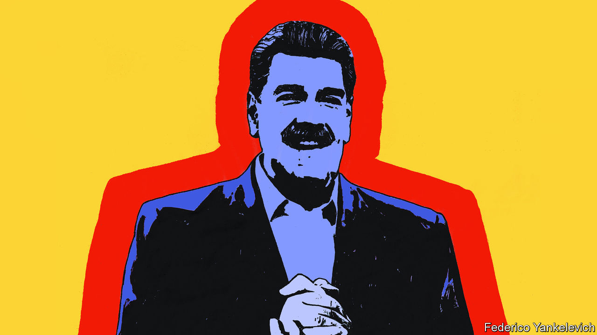
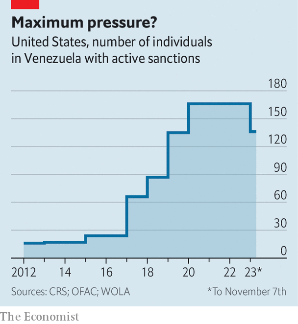
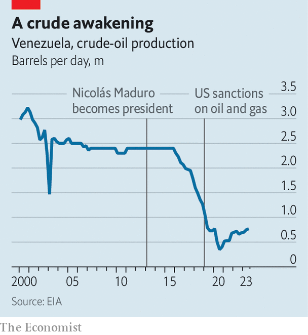

###### Bonanza or bust?

# Oil traders are flocking to sanctions-free Venezuela 

##### But how long will that last, given Nicolás Maduro’s disregard for democracy? 

 

> Nov 9th 2023 

The cocktail bar in one of the most expensive hotels in Caracas, the capital of Venezuela, is abuzz. A huddle of businessmen, speaking English, are in animated conversation at one table. Across the lobby, another group of visitors from India has just arrived. “It’s been a good week,” says a waiter. “The oilmen are back in town.” 

It was last month’s sudden lifting of American sanctions on Venezuela, the country which boasts the world’s largest proven oil reserves, that has lured the dealmakers there. On October 18th the US Treasury Department announced that it was immediately removing almost all the restrictions it had imposed on Venezuela’s oil, banking and mining sectors for years. The easing, initially for six months, was in recognition of an agreement which representatives of the regime of Nicolás Maduro had sealed the previous day, in Barbados, with the political opposition. The deal set out some conditions over how free and fair elections might be held next year.

 


Removing most of its sanctions in one go marks the end of the American administration’s previous strategy, which involved an incremental loosening of restrictions. “Priorities have shifted for us all,” explains a Western diplomat in Caracas. The conflicts in Ukraine and the Middle East have sparked renewed interest in Venezuela’s potential to become an important supplier of world energy again. In September some 50,000 Venezuelans arrived at the Mexican border with the United States, a record number. Both factors pushed President Joe Biden’s government to take action. 

As a result, American citizens and entities, and almost anyone else—with the exception of Russia’s government and its citizens—have been liberated to do business with Venezuela’s state oil company, Petróleos de Venezuela SA (PDVSA). Sanctions on Venezuela’s central bank have been lifted. A ban on secondary trading in Venezuelan government bonds has also been removed, causing their price to soar. The state-owned mining company, Minerven, is no longer blacklisted. Embargoes on individuals, including Mr Maduro and more than 110 others, remain in place, though.

The regime has long blamed the disastrous state of the Venezuelan economy on American sanctions—a distortion of the truth. Although the United States began imposing sanctions on Venezuela in the 2000s, when Mr Maduro’s predecessor, Hugo Chávez, was in charge, the measures were initially very limited, with around two dozen people affected. In 2017 the administration of Donald Trump, which by then had labelled the Maduro regime, along with Cuba and Nicaragua, as part of a socialist “troika of tyranny”, barred Americans from trading in new debt issued by both the state and PDVSA.

But the most effective sanctions were not imposed until 2019. They were applied shortly after Mr Maduro was inaugurated for a second six-year term, following a rigged election in which most of his serious opponents were barred from running. Hundreds of people and dozens of companies were put under embargoes. The aim of the measures, which came at the same time as the United States recognised the leader of the elected national assembly, Juan Guaidó, as Venezuela’s rightful president, was to topple Mr Maduro.

The plan failed. Mr Maduro remains firmly in power. Mr Guaidó’s claim to the presidency petered out. He was voted out of office by many of his own former colleagues in December last year, and now lives in exile in the United States. The reasons why the effort failed are myriad. One is that the Venezuelan army, whose leadership has long been a beneficiary of the regime’s cronyism, stayed loyal to the president it knew. Another is that the sanctions regime, although seemingly fierce, was in fact relatively easily bypassed. Since 2019 middlemen from Mexico to the Middle East have helped trade Venezuelan oil, usually to independent refineries in China, via resellers in Malaysia. Ships would load oil on and off at sea and switch off their tracking transponders, or even change their names to avoid detection. The oil was sold on the black market at a discount of up to 50% of the global price. 

Such an arrangement brought the regime closer to other anti-American governments, notably Iran, which in 2020 began supplying Venezuela with petrol and sent its technicians to repair decrepit refineries. That support, it is believed, was largely paid for in . 

The architect of much of the sanctions-busting was a former oil minister, Tareck El Aissami. Once the golden boy of the regime, he has not been heard of since March, when he said on social media that he supported a corruption inquiry which revealed that PDVSA had not been paid for more than 80% of the oil it had shipped, to the tune of $21bn. He is rumoured to be under house arrest in Caracas.

The recent return to relative normality has been welcomed by long-term traders. One Venezuelan businessman recounts the byzantine payment scheme set up to avoid sanctions, which he describes as like a  system, a reference to a moneyless trading system built on trust that originated in the eighth century. “You send some money to some guy abroad and some guy in Venezuela gives you cash or crypto. They usually pay, but they use your money in the meantime,” he says.

 


Now that PDVSA will be able to operate inside the law, a windfall for the regime beckons, says Francisco Monaldi of Rice University in Houston, Texas. One of the first deals to be hammered out was with PetroChina, China’s second-largest state oil company, which is thought to be close to agreeing to a contract to buy 265,000 barrels of Venezuelan oil per day, around two-thirds the amount that PDVSA was previously exporting to the black market. Those barrels will now be sold for an open-market price. On the American side, a licence issued last year by the Biden administration to the American oil giant Chevron, which has maintained a foothold in Venezuela, has led to 100,000 barrels a day going to the United States. Under the new sanctions-free environment that could rise by 50% by the end of the year. 

Analysts, however, stress that reintroducing Venezuelan oil to the world market will not have a serious repercussion in terms of either supply or price. The productivity of PDVSA is still exceptionally low. It cannot be ramped up in the short term, especially given that sanctions have only initially been lifted for a six-month period. Currently PDVSA is producing just over a fifth of what it did before Chávez took office in 1999 (see chart). After years of underinvestment and bad management, the company has fallen far from its heyday in the 1980s and 1990s, when it was one of the world’s most productive oil firms.

This does not necessarily matter to Mr Maduro, who during a decade in power has shown his uncanny ability for survival. What he seeks now, ahead of elections which he has agreed will be held in the second half of 2024, is cash to shore up support. An economy free of sanctions, and a doubling of the value of its main export, delivers that. It was his reason for accepting the Barbados deal. 

But there is a catch. The opposition primary held on October 22nd provided a very clear winner. María Corina Machado, a conservative free-marketeer, won with a landslide 92% backing. Ms Machado has been banned from political office by the regime since 2015. Turnout, at over 2.2m, was far higher than even the opposition expected. That creates a quandary. The regime might be prepared to go forward with purportedly fair elections against a weak and divided opposition. But facing a high-profile, popular candidate who has asserted that Mr Maduro and others should “face justice” is another matter.

Mr Biden’s administration has given Mr Maduro until November 30th to start “a process” of rehabilitating Ms Machado, and all other disqualified candidates, in return for lifting sanctions. Regime heavyweights, meanwhile, have declared the whole primary as fraudulent and have threatened to prosecute those who organised it. A full reimposition of American sanctions in December seems unlikely. Some fudging of the issue of Mr Maduro’s predictable non-compliance is more probable. But the businessmen flocking to Caracas should remember that, alongside the opportunity, big risks remain. ■

