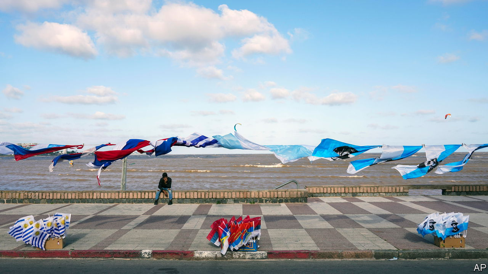

###### No country for old men

# Why are there so many suicides in rich, stable Uruguay? 

##### Despite being South America’s happiest country, it has a high suicide rate 

 

> Nov 9th 2023 

Uruguay is rich, stable and egalitarian. According to international rankings, it is South America’s happiest country. Yet its suicide rate—the annual number of suicides per 100,000 people—is more than double the average for Latin America and the Caribbean. Last year in the country of 3.4m, 823 people killed themselves, the highest number on record and an increase of nearly 50% since 2010. Why?

On the surface, this situation is puzzling. Unemployment is only slightly above the regional average, and has fallen since 2020. Violent crime, which can be linked to suicides, has risen sharply in recent years. But it remains less prevalent than in many neighbouring states—and suicide was already unusually common before the murder rate ticked up. 

Dig a bit deeper, however, and Uruguay starts to resemble an extreme example of a familiar pattern. Globally, the people who have the greatest risk factors for suicide are older men who live in rural areas. This group is particularly under strain in Uruguay. The country has one of Latin America’s oldest populations, with 15% of its inhabitants aged 65 or over. Youngsters spend much less time caring for elderly relatives than elsewhere in the region, says Ana Machado of the University of the Republic in Montevideo, the capital. Many older people suffer from loneliness. Access to palliative health care can also be patchy. 

Combined with this, cultural taboos make Uruguayans tight-lipped when it comes to mental health. Men, in particular, are expected to be stoical. They account for nearly 80% of suicides in the country, with those older than 60 disproportionately at risk. The suicide rate for Uruguayan men is triple the regional average. 

All this has proved fatal in the context of rural depopulation. The suicide rate in Montevideo was 18 per 100,000 inhabitants last year. But it rose to 38 per 100,000 people in Treinta y Tres, 36 in Lavalleja and 34 in Soriano. All three are agrarian backwaters whose rural populations have halved over the past three decades. The government wants to dole out free antidepressants through the public health system. But pills alone may not do the trick when the provinces themselves are dying.■

