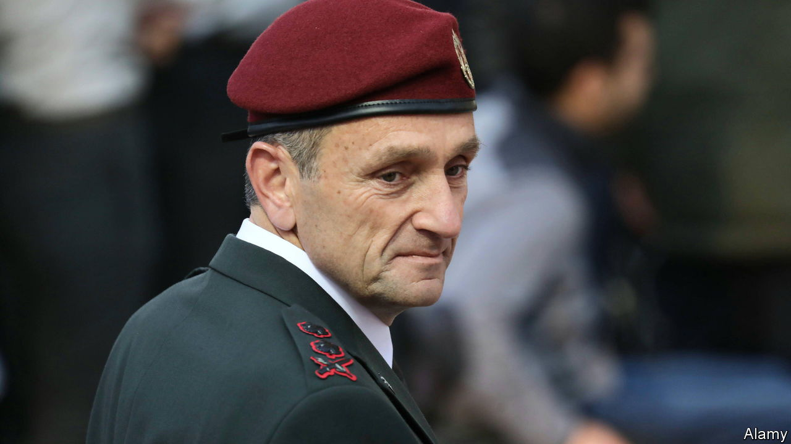

###### The Economist explains

# Who is Herzi Halevi, the chief of staff of the Israel Defence Forces? 

##### The lieutenant general is leading Israel’s war in Gaza—but may resign after it 

 

> Nov 7th 2023 

EVEN BEFORE Hamas, the militant group that runs Gaza, attacked Israel on October 7th, Lieutenant General Herzi Halevi was in a difficult position. In January 2023, when he became chief of general staff of the Israel Defence Forces (IDF), the most senior position in Israel’s army, the officer and reserve corps were rent by  over proposed reforms to the country’s . Some reservists threatened not to serve if the divisive prime minister, Binyamin Netanyahu, and his far-right coalition passed laws weakening the powers of the court. It was one of the army’s most turbulent periods in recent times. 

Hamas’s murder of 1,400 Israelis, and capture of more than 200 hostages, eclipsed all that. General Halevi is now commanding an aerial and  against the militant group in Gaza, in which more than 10,000 Palestinians have died, according to the enclave’s health ministry.  at the way Israel is conducting the war has inspired protests in many countries. The UN human-rights office says that Israel may have committed a  when it struck the . A minister in the Netanyahu government raised the possibility of using nuclear weapons against Gaza (he was suspended for his remarks). 

But in General Halevi Israel has a commander with a strong reputation for upholding legal and ethical standards in the conduct of warfare. What is his background and how might it influence how he prosecutes the war? He was born in 1967 in Jerusalem and named after his uncle, who had been killed in action a few months earlier in the . His mother’s family had lived in the city for 14 generations; his paternal grandparents emigrated from Russia. His father’s father was a member of Irgun, a Zionist paramilitary group active in the years leading up to the establishment of Israel. 

The general began his regular army service at the age of 18, as a paratrooper, and started training to be an officer two years later. During the early years of his career he skirmished with , a Shia militant group in southern Lebanon that is now exchanging shellfire with Israel, and joined Sayeret Matkal, a special-forces unit that conducts secret operations deep in Arab countries, which he eventually commanded. He next headed a brigade in the occupied . In 2009, he led paratroopers in Gaza, in a ground offensive in the towns north of Gaza city where the IDF is fighting once again. 

As commander of the Galilee Division from 2011 General Halevi led the IDF on the border with Lebanon. He became head of military intelligence in 2014 and of the Southern Command from 2018, with responsibility for deterring Hamas. 

It was after his experience in the  of 2008-09, in which hundreds of Palestinian civilians died, that he became an outspoken advocate of the legal and ethical conduct of warfare. In a lecture in 2009 he criticised other Israeli field commanders for failing to set “moral standards” for soldiers fighting in urban areas with many civilians present. “A soldier cannot go into battle with a law book,” he said, but commanders have a responsibility to ensure that moral and legal standards are upheld. 

General Halevi’s views belong to an Israeli military tradition. Yitzhak Sadeh, a leader of the Haganah, a Zionist militia that was the forerunner of the IDF, coined the term “purity of arms” and warned fighters against acts of wanton retribution. But the IDF also had commanders who ignored such principles. As a young commando officer in 1953 , who was prime minister between 2001 and 2006, led a reprisal in Qibya, a village in the West Bank, then controlled by Jordan, that killed 69 Palestinians. Three decades later an Israeli commission found that Sharon, then defence minister, had not acted to prevent the massacre by Israel’s allies of Palestinians in refugee camps in Lebanon. 

General Halevi is leading the IDF at a time when the ethics of Sadeh are under challenge from the vengeful spirit of Sharon. The IDF has gone deeper into Gaza city than it did in 2009 and 2014 and Hamas is better prepared with more  and tunnels. With civilian casualties spiralling, intense bombardments and close-quarters fighting under way, the concept of an ethical and legal war is being tested to the brink. 

After the current fighting in Gaza is over, General Halevi’s roles as head of the Southern Command and of the IDF overall will come under scrutiny. Hamas’s surprise attack in October showed an extraordinary lapse in intelligence gathering. General Halevi was the first senior official to accept responsibility, saying on October 12th that “the IDF is responsible for the security of the state and its citizens” and that on the morning of the attack “we failed”. People close to him believe that he intends to resign in the not-too-distant future. But first he has his last war to fight. ■

