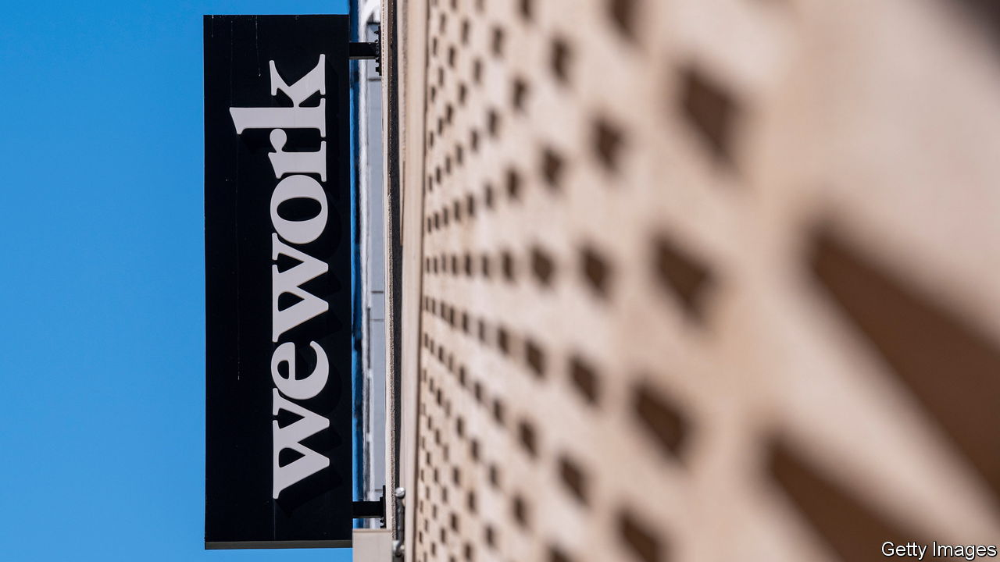
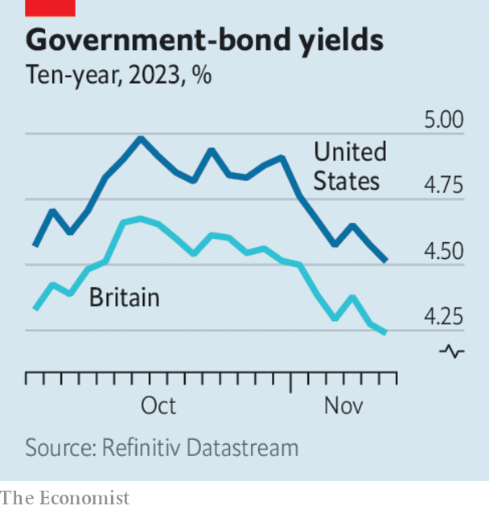

###### The world this week

# Business 

#####  

 

> Nov 9th 2023 

 filed a long-awaited bankruptcy petition, completing its dramatic fall from grace. In January 2019 the office-sharing company was valued at $47bn; it is now worth roughly 0.1% of that. The petition is limited to the firm’s locations in America and Canada, and its franchisees will continue to operate.

American employers created 150,000  in October, fewer than the market had expected and barely half the number for the previous month. Despite hawkish talk from officials at the  and other central banks, investors took that as a signal that interest rates may fall sooner than they had previously thought.

 


Lower interest-rate expectations led  to fall. That was true not just in America, where the ten-year Treasury yield recently touched 5% and is now 4.5%, but also in Britain, Japan and much of Europe. After a miserable few months,  ended their losing streak and surged, with the benchmark S&amp;P 500 index posting its best week since November 2022.

The IMF raised its forecasts for  to 5.4% in 2023 and 4.6% in 2024, up from 5% and 4.2% respectively. The fund cited unexpectedly good third-quarter growth and government stimulus.

Nevertheless, China’s economy faces a multitude of threats. Falling , which weigh heavily on its consumer-price index, have pushed the economy back into . And not all the government’s actions are supportive. Reports suggest it has two more businessmen: Zhao Bingxian, a prominent investor, and Chen Shaojie, a tech founder. 

Back on the market

 borrowed $2.5bn on the dollar bond market, in its first such deal since April. Investors are more inclined to lend to a government that has shaken up its economic team and begun to ditch unorthodox policies, such as keeping interest rates low despite extreme inflation. The five-year “sukuk” bond was sold with a yield of 8.5%.

, a private-equity giant, reported a disappointing set of results for the third quarter. Investors have committed less capital than it had hoped to its new buy-out funds. In the three months to September they attracted $6.3bn of new assets, an 11% decline from the previous quarter. The firm is shedding jobs and has warned staff that “every single expense is on the table.”

, a competitor of Carlyle, was much more upbeat. It reported an improvement in fundraising during the third quarter, to more than $14bn, and announced the launch of new buy-out funds in America and Asia. KKR’s share price finished results day 5% higher than it started. 

Going by its share price,  also recorded good results, despite reporting its first quarterly loss since 2017. Investors were in a forgiving mood because the loss derived from the costs of integrating , another Swiss bank that UBS bought earlier this year. (Without these, the bank would have made a pre-tax profit of $844m.) The deal is nonetheless likely to provide a big fillip to UBS’s wealth-management business in the long run. Its investment-banking division, meanwhile, joined many of its European peers in reporting a disappointing quarter. It lost $230m. 

 followed several other big oil companies by reporting bumper earnings. It made $32.6bn in net profit in the three months to September, exceeding analysts’ forecasts. That was more than it made in the previous quarter, but 23% less than in the third quarter of 2022, after energy prices rocketed in response to Russia’s invasion of Ukraine. Saudi Arabia, like other OPEC countries, is currently cutting crude-oil production in an attempt to boost its price.

announced that it will cut a further $2bn from its annual expenses, having already committed to $5.5bn of cuts and 8,000 job losses earlier this year. Under pressure from Nelson Peltz, an activist investor, it expects to start paying a dividend by the end of 2023 for the first time in years, and for its streaming business to become profitable in the second half of 2024.

Give me warp speed, Mr Sulu

For only the second time since it was founded in 2009, made an operating profit, of $394m. In the same quarter last year, the ride-hailing company made a loss of $495m. Since then, the average number of trips customers have booked per day has risen by 25%, to 27m, and the firm’s revenue has grown by 11%, to $9.3bn. Uber’s share price has doubled since the start of 2023.

SAG-AFTRA, the , voted to end its 118-day strike after agreeing on a tentative deal with producers. Together with another strike, by screenwriters, the shutdown has delayed the release of major films such as “Avengers: The Kang Dynasty”, “Dune: Part Two” and “Paddington in Peru”.

